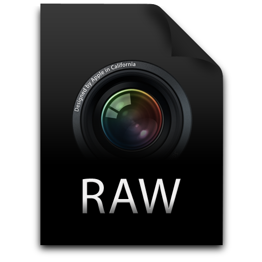
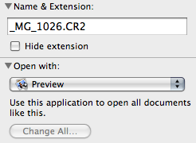
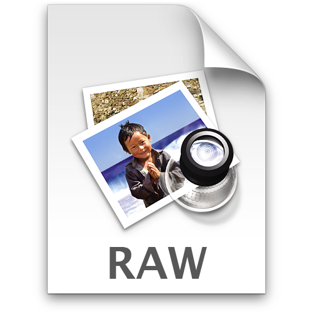

After i released my [Aperture File Types icon set](http://www.kremalicious.com/goodies) many of you asked how they can really use these icons for displaying the icons of images on your Mac system.

Sadly this isn't as easy as dropping them in [Candybar](http://www.panic.com/candybar) into a well for image icons cause there isn't any well for them. So using other icons as standard file type icons for images is a bit tricky. I discovered two ways of doing it, which involves overwriting resources of Preview.app and Photoshop. So before doing anything I mention in this post, you should make a backup copy of them.

## Changing Preview.app icons

Image icons in Mac OS X don't really belong to the system icons. Instead they come from [Preview.app](http://www.apple.com/macosx/features/300.html%23preview) which is the factory default application for viewing images on Mac OS X.

And since Preview.app is used to show the icons we can find all file type icons for images in Preview.app > Contents > Resources. You get there by right clicking on Preview in your Applications folder and choosing Show Package Contents from the context menu. There you'll find icons in icns-format for bmp, dng, eps, fax, fpx, gif, icns, ico,jp2, jpeg, openexr, pdf, pict, png, pntg, ps, psd, qtif, radiance, raw, sgi, tga, tiff, xbm.

You can just rename the desired icons from my icon pack in icns-format and replace them in the contents > resources of Preview.app.

But, as you can see, Preview doesn’t have an unique icon for all RAW file types. Instead it uses just a generic RAW-icon named RAW.icns.

So here’s what you can do: Grab your desired RAW-file icon from my icon package in icns-format. Rename it as RAW.icns. Copy it over to Preview.app > Contents > Resources and overwrite the standard icon. Making a backup copy of Preview.app before doing that is a wise thing here.

The problem is that from now on every RAW-file is represented by this icon, which is ok if you just use one RAW-format. But it's a problem if you use more than one RAW format.

## Changing the file type icons of Photoshop

A solution to this mess is Photoshop. So this solution just works if you have Photoshop installed. Photoshop does have a unique icon for every RAW-format out there. To confirm that you can choose Adobe Photoshop as Standard Application in the Get Info window and the icon of the file should change instantly.

So here's the trick: The icons from Photoshop are stored in Adobe Photoshop CS3.app > Contents > Resources. the icon e.g. for .cr2-icons is named PS_CR2FileIcon.icns. Just rename the icons in my pack in the naming scheme used in the Photoshop Resources and replace them.

Hope this helps you although it's very tricky. But changing icons for images in Mac OS X is a bit out of my control since i don't develop Mac OS X.

By the way, this should also work in Tiger...
