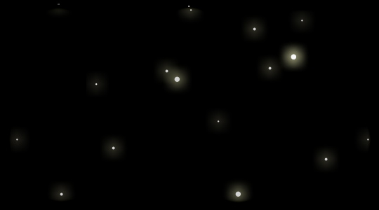
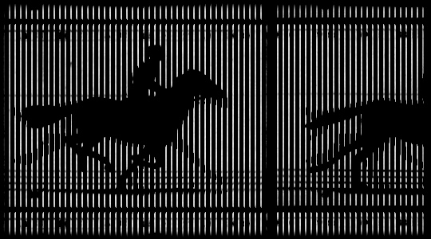
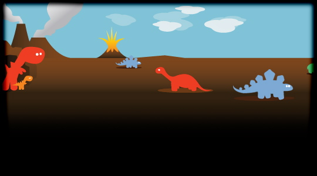
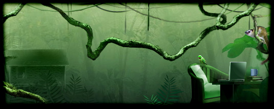
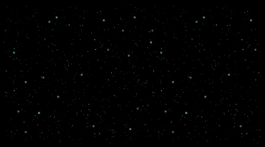
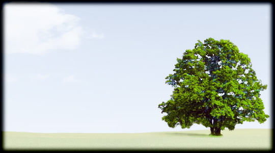
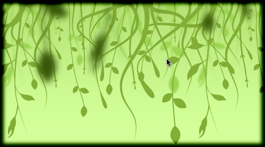
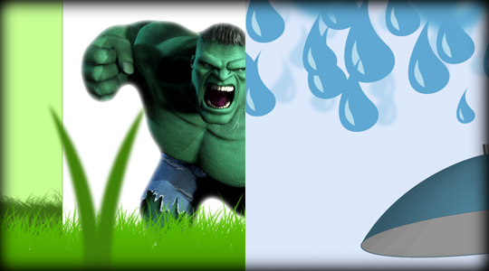
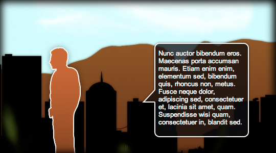

Been so in love with the parallax effect that I have to post another article about it. It's time for a first showcase of websites using this effect. At the end of this article you'll find some tutorials for making this effect too.

For the non-geeks: I don't mean [measuring distances between objects in space](http://en.wikipedia.org/wiki/Parallax), the [parallax error in photography](http://en.wikipedia.org/wiki/Parallax#Parallax_error_in_photography), any [StarTrek episode](http://www.startrek.com/startrek/view/series/VOY/episode/68824.html), the [movie Parallax View](http://www.imdb.com/title/tt0071970/) and definitely not [DC Comic's Parallax monster](<http://scifipedia.scifi.com/index.php/Parallax_(DC)>).

I mean [Parallax Scrolling](http://en.wikipedia.org/wiki/Parallax_scrolling) which is a technique often used in good ol' arcade and video games like [Moon Patrol](http://en.wikipedia.org/wiki/Moon_Patrol) or [Sonic the Hedgehog](http://en.wikipedia.org/wiki/Sonic_the_Hedgehog_%28video_game%29). In such 2D games parallax scrolling was used to create an illusion of three dimensional depth.

Since our operating systems are mainly 2D too we can use this pseudo 3D technique to create the same illusion in our web browsers. Of course this was first done by flash designers and it's a popular effect used in flash based websites or [parts of it](http://a.viary.com/).

But with the rise of CSS this technique can now be done without the use of flash as [Alex Walker](http://www.sitepoint.com/blogs/2008/01/18/in-the-lab-doing-strange-things-to-css-backgrounds/) and [Paul Annett](http://www.thinkvitamin.com/features/design/how-to-recreate-silverbacks-parallax) discovered. You see we are now very close to the [Atari](http://en.wikipedia.org/wiki/Atari) with Web-Design.

So here are the examples. Just start clicking, resizing and goggling!

## Examples

[Clearleft's Silverback Teaser page](http://www.silverbackapp.com/)

The undeniable Kings of the Parallax, designed by Paul Annett. The Silverback guys made the effect so popular and inspired me too:

[Starry Night](http://css-tricks.com/examples/StarryNight/)

An example by Chris Coyier from css-tricks.com. This one works vertically too and he made a [tutorial out of it](http://css-tricks.com/3d-parralax-background-effect/):

[Percentage Backgrounds](http://www.sitepoint.com/examples/stretchy/test.php)

Probably the first css-based usage of this effect by Alex Walker over at Sitepoint. And probably the funniest one:

[The Horse in Motion](http://demo.marcofolio.net/a_parallax_illusion_with_css/)

Marco Kuiper created a cool optical illusion with just plain css/html and some pictures. Head over to the demo and resize your browser window. You should articulate something like "whoooot!" now. You can read [here how he made it](http://www.marcofolio.net/css/a_parallax_illusion_with_css_the_horse_in_motion.html).

[We all hate Quickbooks, Do You?](http://weallhatequickbooks.com/)

Nice fire parallax on this sort of aggregating website. It displays all Tweets with the word "quickbooks" in it:

[Dumago](http://dumago.net/)

More mysterious (Oh my god, what is it??) than the Silverback app and with frosty stars instead of jungle leaves:

[Dromaeo](http://dromaeo.com/)

Another funky name and a nice parallax too. This one uses little dinosaurs. Something like "Oh, so cute" or "How adorable!" should come to your mind:

[cdev.ru](http://www.cdev.ru/)

A russian site with an awesome making-webdesign-in-jungle parallax (thanks [egot](http://www.kremalicious.com/2008/05/showcasing-the-css-parallax-effect-12-creative-usages/#comment-104)!). They even have different parallax headers on every page. Just click through the top menu:

## More Scripts and Interaction, please

All the showcased sites above need to be resized in the browser to see the effect. This fact makes those effects nice easter eggs but they are rather useless for most users. But with some JavaScript we can bypass this limitation.

[Parallax Backgrounds - a multi–layered javascript experiment](http://inner.geek.nz/javascript/parallax/)

Very cool cloud effect which becomes visible just by scrolling down the page. I think this is the future and next step of the parallax effect in Web-Design since scrolling is way more common than resizing the browser window:

[Fly + Parallax Scrolling Effect](http://www.esqsoft.com/examples/fly_parallax/fly_parallax.htm)

Similar to the Starry Night example from css-tricks. But this example uses JavaScript to achieve this effect without resizing your browser window. It almost looks like it's done with Flash:

[40 Jaar Sire](http://www.umaghetzeggen.nl/)

Whatever this site is about (Help me dutch speaking folks! edit: [anna knows it!](http://www.kremalicious.com/2008/05/showcasing-the-css-parallax-effect-12-creative-usages/#comment-102)) it creates a shaky effect controlled by your mouse pointer:

[CSS combined with Scriptaculous's Morph effect](http://offtheline.net/examples/parallax/)

Same graphics as on Silverback but with a Morph effect assembled with Scriptaculous. The parallax effect becomes visible by shrinking and unshrinking which is controlled by your mouse clicks:

[WeblogR demo](http://www.weblogr.fr/demo/09052008/)

Same graphics as on Silverback too but this Parallax follows your mouse pointer. This is done with jQuery:

## How-Tos and Tutorials

- [How to recreate Silverback's Parallax Effect](http://www.thinkvitamin.com/features/design/how-to-recreate-silverbacks-parallax)

- [In the Lab: Doing strange things to CSS Backgrounds](http://www.sitepoint.com/blogs/2008/01/18/in-the-lab-doing-strange-things-to-css-backgrounds/)

- [Starry Night: Incredible 3D Background Effect with Parallax](http://css-tricks.com/3d-parralax-background-effect/)

- [Your own CSS parallax illusion 3d image](http://www.marcofolio.net/photoshop/your_own_css_parallax_illusion_3d_image.html)

- [Parallax Backgrounds - a multi–layered javascript experiment](http://inner.geek.nz/javascript/parallax/)

- [How to Make the Parallax Effect](http://www.dylanbathurst.com/2008/05/27/how-to-make-the-parallax-effect/)

Hope you enjoyed this little showcase. Please share it on your favorite social website or vote for it. Your vote is always highly appreciated! And if you know any other websites using this effect (the non-flash versions) feel free to post them in the comments beneath this article.

**Update 05/29/2008:** [Dylan Bathurst](http://www.dylanbathurst.com/) wrote an article [How to make the Parallax effect](http://www.dylanbathurst.com/2008/05/27/how-to-make-the-parallax-effect/) which includes his own "Keep out of the Rain" example and a sticky, Hulk style Parallax footer:

And he has found another Parallax effect on the [website of the Rissington Podcast](http://therissingtonpodcast.co.uk/). Cool!

**Update 2 06/02/2008:** Nice commentators [routine](http://www.weaintplastic.com/) and [Jorge Epuñan](http://www.csslab.cl/) made some more interactive Parallax examples:

[Sonus:portals](http://www.sonus-game.com/)

A star parallax which follows your mouse pointer. Done with jQuery and with heavy CPU load.

[Parallax con Mootools](http://www.csslab.cl/ejemplos/parallax_mootools/)

My personal favorite for now in terms of usability. If you are able to understand spanish, [read his explanation](http://www.csslab.cl/2008/05/29/parallax-en-uso-real/).

