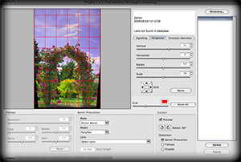

Last week two new image editing plug-ins were announced for Aperture 2.1: The PTLens plug-in for correcting barrel distortion, vignetting, chromatic aberration, and perspective and the Jade plug-in for automatic correction of color, levels and exposure.

<!-- more -->

The [PTLens plug-in](http://epaperpress.com/ptlens/) from [ePaperPress](http://epaperpress.com/) was available as a Photoshop plug-in in the past and is well known for its lens pincushion, barrel distortion, vignetting, chromatic aberration, and perspective correction abilities based on a lens model database similiar to [Kekus' LensFix CI plug-in](http://www.kekus.com/software/plugin.html).

While I love the plug-ins ability to correct perspectives the Aperture plug-in doesn't work with RAW files(!), just with tiff and jpeg files which is one more way to compromise the way Aperture works (In my opinion the whole plug-in architecture of Aperture does that). And while I would love to show you the plug-ins user interface in Aperture PTLens refused to open either JPEG or TIFF files. So here's just a screenshot of the standalone application:

So to me the PTLens plug-in for Aperture isn't finished yet. But you can download a [trial version from the plug-ins website](http://epaperpress.com/ptlens/media.html).

The second plug-in recently released is the [Jade plug-in](http://jade.datamind.biz/) from Datamind. Because of its speed also on consumer Macs, Aperture 2 became popular among amateur photographers too. [Datamind](http://datamind.biz) targets it's first Aperture plug-in [Jade](http://jade.datamind.biz/) at this group. The former standalone application for Mac and Windows is now an Aperture adjustment plug-in for correcting your pictures colors, levels and exposure automatically with Dataminds own algorithm. And its user interface is very clean and uncluttered:

While I have to say Jade produces very reasonable results it lacks a lot of controls and fails with complicated pictures where Aperture's adjustment controls wouldn't. So I would say this plug-in would be better as an iPhoto plug-in. Do you really want a blown up photoshop or tiff file for every photo you're going to correct in Aperture?

Nevertheless you can download a [trial version of the plug-in from Dataminds website](http://jade.datamind.biz/media/) and you would have to pay either 19.99€ for home use or 49.99€ for Pro use. You can have alook at [Dataminds very interesting explanation o the different license models](http://jade.datamind.biz/faq#licence).

Interested in more Aperture plug-ins? Just have a look at my article [First overview: Aperture 2.1 adjustment plugins have arrived](http://www.kremalicious.com/2008/05/first-aperture-adjustment-plugins-have-arrived/) to get an overview about what's available at the moment.
