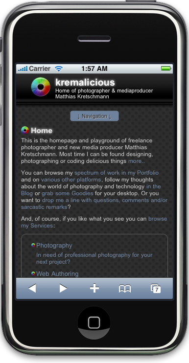

I'm thrilled to announce that kremalicious.com now uses an iPhone optimized theme. When you browse this website with your iPhone everything will automagically switch to the new kremalicious iPhone theme which is simply called kremalicious{iPhone}. See those hip brackets?



When the website detects an iPhone or iPod Touch it will automatically switch to another freshly created theme which is absolutely seamless to the user. This detection is done by the wonderful slim iPhone Wordpress plug-in from ContentRobot which was slightly modified by me.

The theme itself makes heavy use of the `-webkit-border-radius` css option to display all the round corners. That's why there are just four images at work in the whole theme which makes it load in no time even on EDGE connections. And because just the theme is switching all the content remain the same so you don't have just a shortened mobile version of this website.

Beside that I've used some special html and css properties which are essential for the iPhone:

## The Viewport

While Safari on iPhone will display all websites just fine it can happen that the initial viewport is too big so the text is too small to read. By setting a viewport meta tag you can exactly define the viewable dimensions of your website. Apple has [some nice examples](http://developer.apple.com/documentation/AppleApplications/Reference/SafariWebContent/UsingtheViewport/chapter_4_section_3.html#//apple_ref/doc/uid/TP40006509-SW33) for understanding the importance of setting the Viewport in iPhone optimized websites.

The viewport can be larger or smaller than the visible area but I wanted my content to exactly fit the width of the iPhone and the goal was to make the text legible on first load. So here's what I use for kremalicious{iPhone}:

```html
<meta name="Viewport" content="maximum-scale=1.6,width=device-width" />
```

This code will let the user scale the content up to 1.6 times to the default view and the default width of the content is set to the width of the (iPhone) device.

## Tap Color

There's neither an active nor a hover state for links on the iPhone which makes sense on a touch interface although it would be much easier to just use a:active for the tap highlighting. Safari on the iPhone uses a special webkit property for that:

```css
-webkit-tap-highlight-color: rgba(234, 234, 234, 0.5);
```

## Home Screen Icon


I've used a 147x147px icon so the icon looks crisp and sharp on the iPhone screen (because it's a 160dpi screen). You really should use a bigger size than [Apple's recommendation in their iPhone HIG](https://developer.apple.com/iphone/library/documentation/UserExperience/Conceptual/MobileHIG/IconsImages/chapter_14_section_2.html). You have to provide a png icon without rounded corners and without the highlight shine since the iPhone will render that automatically on the icon. The icon has to be named apple-touch-icon.png and gets automatically detected when put in the root of your website. Additionally you can tell the iPhone the place where the icon is with this link tag in your head section:

```html
<link rel="apple-touch-icon" href="/i/apple-touch-icon.png" />
```

And finally many thanks to [cschock](http://www.cschock.de) for continuously testing my code voodoo soup even at late hours.

## Resources for you to do the same and even more

- [iWPhone by ContentRobot](http://iwphone.contentrobot.com/): The plug-in I use for kremalicious.iPhone. It detects an iPhone or iPod Touch and switches to another simple theme. You can easily adjust the plugin to point it to your own theme.

- [WPTouch - Wordpress iPhonified](http://www.bravenewcode.com/wptouch/): If you don't want to digg into html, css and iPhone specific properties this plug-in will help you. Once activated it automatically switches to an iPhone like theme with lots of eyecandy. You can customize some colors and a lot of different icons all from the Wordpress admin panel

- [Tutorial: Building a website for the iPhone](http://www.engageinteractive.co.uk/blog/2008/06/19/tutorial-building-a-website-for-the-iphone/): Amazing tutorial for changing content based on the orientation of the iPhone or iPod Touch. Just browse their website with your iPhone or iPod Touch to see it in action.

- [iPhone Native Looking Skin](http://ajaxian.com/archives/iphone-native-looking-skin): Sort of a template based on css and javascript which simulates the iPhone UI. ([Final look](http://joehewitt.com/files/iphone/navigation.html))

- [Touching and Gesturing on the iPhone](http://ajaxian.com/archives/iphone-native-looking-skin): Build your websites with some touch gesture features! Here's the javascript code for it.

## THE Apple resources for iPhone & Web Content

- [Safari Web Content Guide for iPhone](http://developer.apple.com/documentation/AppleApplications/Reference/SafariWebContent/Introduction/chapter_1_section_1.html)

- [iPhone Human Interface Guidelines for Web Applications](http://developer.apple.com/documentation/iPhone/Conceptual/iPhoneHIG/Introduction/chapter_1_section_1.html)

- [iPhone Human Interface Guidelines](https://developer.apple.com/iphone/library/documentation/UserExperience/Conceptual/MobileHIG/Introduction/chapter_1_section_1.html) (free developer account required)
