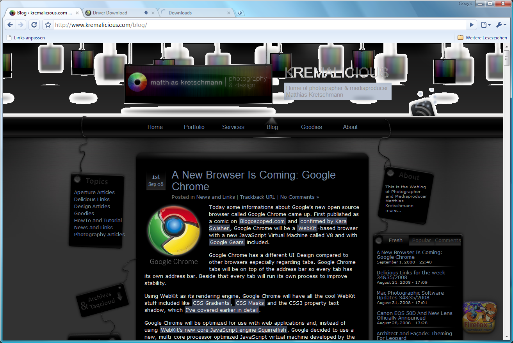

Today some information about Google's new open source browser called Google Chrome came up.

First published as a comic on [Blogoscoped.com](http://blogoscoped.com/google-chrome/) and [confirmed by Kara Swisher](http://kara.allthingsd.com/20080901/google-ignites-a-new-browser-war-with-microsoft-by-unveiling-one-of-its-own/), Google Chrome will be a [WebKit](http://webkit.org/)-based browser with a new JavaScript Virtual Machine called V8 and with [Google Gears](http://gears.google.com/) included.

Google Chrome has a different UI-Design compared to other browsers especially regarding tabs. Google Chrome tabs will be on top of the address bar so every tab has its own address bar. Beside that every tab will run its own process to improve stability.

Using WebKit as its rendering engine, Google Chrome will have all the cool WebKit stuff included like [CSS Gradients](/webkit-team-introduced-css-based-gradients/), [CSS Masks](/more-awesomeness-from-the-webkit-team-css-masks/) and the CSS3 property text-shadow, which [I've covered earlier in detail](/make-cool-and-clever-text-effects-with-css-text-shadow/).

Google Chrome will be optimized for use with web applications and, instead of using [WebKit's new core JavaScript engine Squirrelfish](http://webkit.org/blog/189/announcing-squirrelfish/), Google decided to use a new, multi-core processor optimized JavaScript virtual machine developed by the V8-team in Denmark.

More information on the features leaked can be found in the [Google Blogoscoped article](http://blogoscoped.com/archive/2008-09-01-n47.html) or in the [corresponding scanned comic](http://blogoscoped.com/google-chrome/).

Update: Google's official blog was updated [with informations about the new browser project](http://googleblog.blogspot.com/2008/09/fresh-take-on-browser.html). They say the first beta of Google Chrome will be released tomorrow just for Windows while versions for Mac OS X and Linux will follow soon.

Update 2: Google Chrome can now be downloaded for Windows from [google.com/chrome](http://www.google.com/chrome). Google also posted [a feature page for Chrome](http://www.google.com/chrome/intl/en/features.html).

Update 3: Google Chrome seems to have problems with some of my transparent PNGs:

Update 4: There are some nice articles about various aspects of Chrome available in the web:

- Matt Cutts tries to prevent paranoia and [explains when Google Chrome talks home](http://www.mattcutts.com/blog/google-chrome-communication/).
- Gina from lifehacker.com dissects [Google Chrome's Full List of Special about: Pages](http://lifehacker.com/5045164/).
- Google [explains their priorities regarding different Platforms](http://googlemac.blogspot.com/2008/09/platforms-and-priorities.html).
- The [Chromium Developer Documentation](http://dev.chromium.org/Home) is available too.
- And it seems Google [cut out some features of WebKit like text-shadow](http://www.flickr.com/photos/kurafire/2822606444/).
