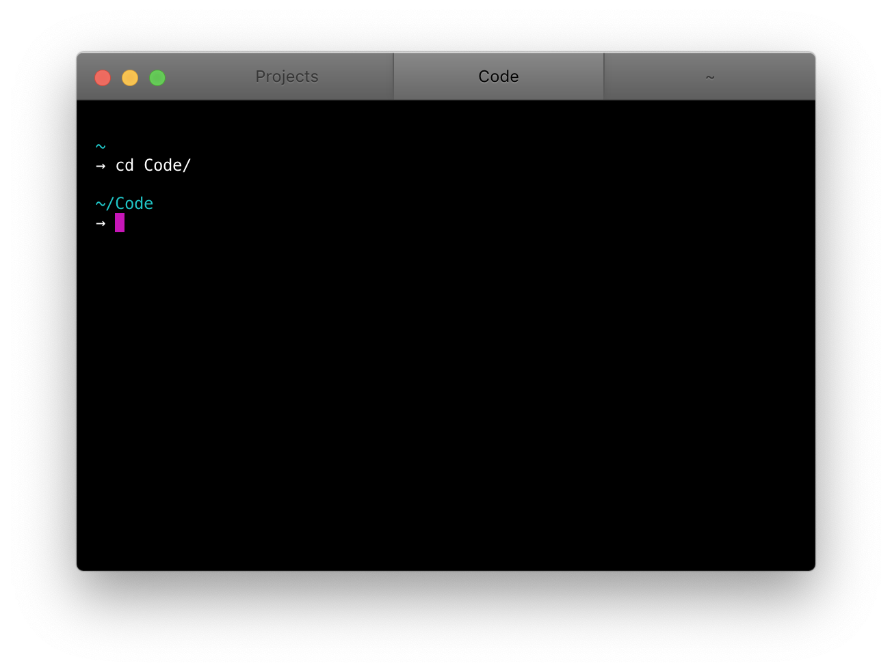

Tab style for [Hyper](https://hyper.is/) inspired by Apple's pro apps on macOS, like Final Cut Pro or Logic.

If you use Hyper along with those apps, this theme is for you. It is purely a tab style theme, it won't affect the rest of your chosen theme.

## Installation

Install by adding `hyper-mac-pro` to the plugins property in your `~/.hyper.js`:

```js
plugins: ['hyper-mac-pro']
```

If you're using `hpm`, from the command line:

```bash
hpm install hyper-mac-pro
```



## Check out & contribute

Head over to GitHub to take a peek into the code or report some issues.

<p class="content-download">
    <a class="icon-github btn btn-primary" href="https://github.com/kremalicious/hyper-mac-pro">GitHub</a>
</p>
