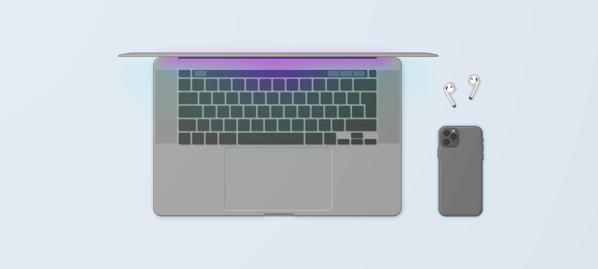
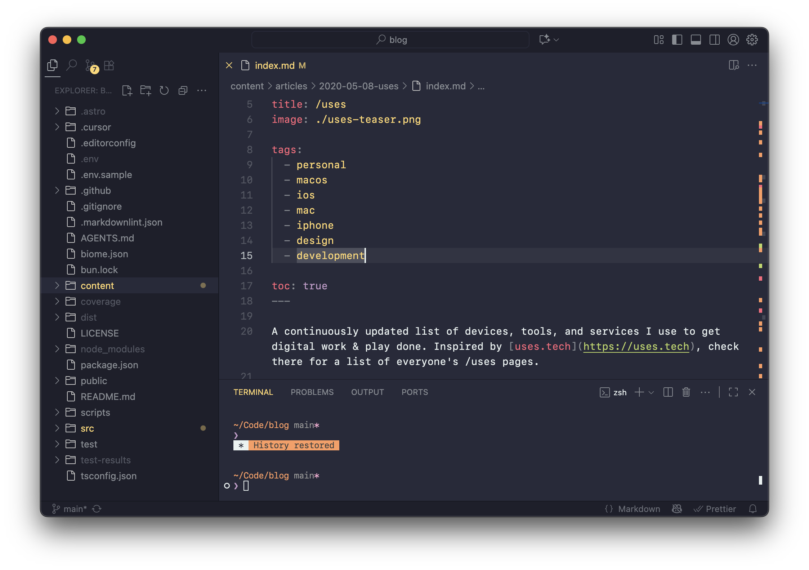
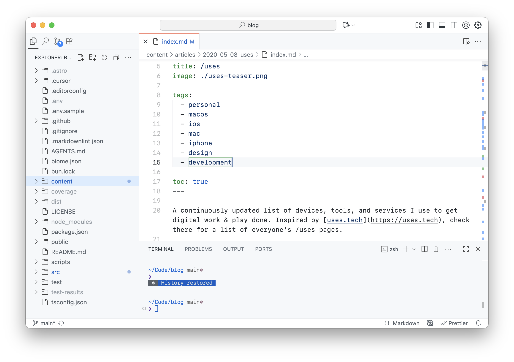
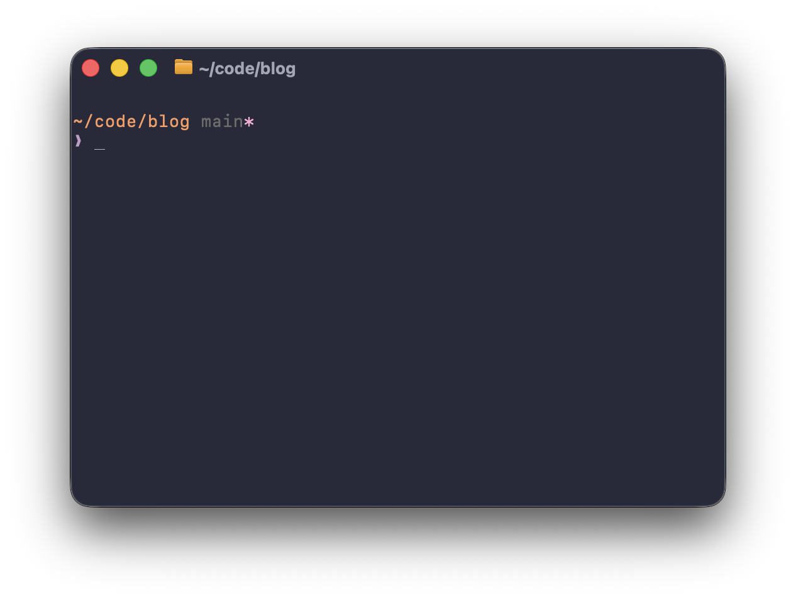
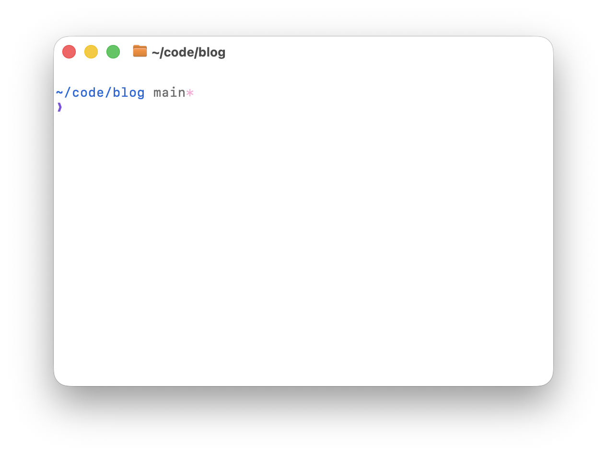

A continuously updated list of devices, tools, and services I use to get digital work & play done. Inspired by [uses.tech](https://uses.tech), check there for a list of everyone's /uses pages.

## Hardware

My office is where my MacBook is, all these devices go wherever I travel to:

- **[MacBook Air M2 (13-inch, 2022)](https://www.apple.com/macbook-air-13-and-15-m2/)**
  _Midnight, M2 with 8-core CPU and 10-core GPU, 16 GB RAM, 1TB SSD, US International keyboard_

- **[iPhone 16 Pro](https://www.apple.com/iphone-16-pro/)**
  _Black Titanium, 256GB_

- **[AirPods Pro](https://www.apple.com/airpods-pro/)**

- **[Powerbeats Pro 2](https://www.beatsbydre.com/earbuds/powerbeats-pro-2)**

- **[iPad Pro (12.9-inch) 2021](https://www.apple.com/ipad-pro/)**
  _Space Gray, 512GB, WiFi + Cellular_

- **[Apple Watch Series 10](https://www.apple.com/watch/)**
  _46mm, Space Gray, Aluminum_

Additionally, using the following devices in my homebase, those leave my desk for longer trips:

- **[Logitech MX Master 3 for Mac](https://www.logitech.com/en-us/products/mice/mx-master-3-mac-wireless-mouse.910-005693.html)**
  _Black & Space Gray_

- **[Satechi Slim X1 Bluetooth Backlit Keyboard](https://satechi.net/products/slim-x1-bluetooth-backlit-keyboard)**
  _US, Space Gray_

- **[Raspberry Pi 5](https://www.raspberrypi.com/products/raspberry-pi-5/)**
  _8GB RAM_

## Software

In general, it's [macOS](https://www.apple.com/macos/) & [iOS](https://www.apple.com/ios/) & [iPadOS](https://www.apple.com/ipados/) & [watchOS](https://www.apple.com/watchos/) all around. The majority of my work is done on macOS.

I keep it simple and use the default Apple apps across devices for all basic computing needs: **Mail**, **Calendar**, **Notes**, **Reminders**, **Contacts**, **Messages**, **Photos**, **Music**. The additional apps I use have versions for macOS & iOS.

Living a cloud-first life where all my files are stored in some cloud service and are selectively synced to any device.

Mail, Calendar, and Contacts are hooked up to personal and work **[Fastmail](https://www.fastmail.com)** accounts.

I live with **automatic dark mode** where all my devices and apps have a light theme during the day, and a dark theme after sunset.

### File Storage & Sync

- **Finder & Files**
  Simple, yet powerful. I use Finder & the iOS Files app to access all my files from multiple sources: iCloud, SSH servers through [Secure ShellFish](https://secureshellfish.app), local [network drives attached to my Raspberry Pi](/raspberry-pi-file-and-screen-sharing-macos-ios), or version controlled projects in WorkingCopy.

- **[iCloud Drive, 2 TB](https://www.icloud.com)**
  I have used Dropbox Pro for many years but it became too clunky and Apple's version turned into what I wanted Dropbox to be. My non-code related files live there and are happily synced.

- **[Scanner Pro](https://readdle.com/scannerpro)**
  Listed here because this app on my iPhone makes every piece of paper coming across my desk into a digital file helping me maintain a **paperless office**. Works like a charm with any document in multiple languages making them searchable with OCR. Scanned paper documents are then destroyed and put into recycling.

### Browsing

- **[Safari](https://www.apple.com/safari/)**
  My main browser on every device. I stay for best typography rendering of any browser, the feature & UI minimalism, and the privacy and content blocking features. No extensions at all except for 1Blocker.

- **[DuckDuckGo](https://duckduckgo.com)**
  My search engine on all devices in all browsers.

- **[1Blocker](https://1blocker.com)**
  My content blocker of choice for Safari so I rarely see any ad tech bullshit. Fast, effective, and unobtrusive on every device.

- **[Ungoogled Chromium](https://github.com/ungoogled-software/ungoogled-chromium-macos)**
  My secondary browser on macOS mainly used for all things crypto. Sadly Firefox stopped support for connecting hardware wallets and they refuse to fix their [broken pinned tabs feature](https://connect.mozilla.org/t5/ideas/make-pinned-tabs-persist-between-windows-by-default/idi-p/8059), so I had to switch to a browser based on Chromium. Switching between [Zerion](https://zerion.io) & [Rainbow](https://rainbow.me) & [MetaMask](https://metamask.io) as daily drivers for web3 stuff.

### Development

- **[VS Code](https://code.visualstudio.com) & [Cursor](https://cursor.com/)**
  From Notepad, to Dreamweaver, to CSS Edit, to Coda, to Espresso, to TextMate, to Atom, and now I arrived at VS Code. Its feature set, coding experience, and ecosystem far outweigh the Electron drawbacks, and at least it is the most performant Electron app I know.

  Using a small set of extensions for automatic code formatting with either ESLint/Prettier combo or Biome in both editors.

  I miss [Espresso](https://www.espressoapp.com) as my personal gold standard for how a code editor UI on macOS should look and behave. For that reason occasionally dropping into Panic's [Nova](https://nova.app) but it does not fit my development workflow for larger projects anymore.

- **[Monokai Pro Octagon](https://monokai.pro)**
  My go to syntax color theme for everything displaying code. Used with a bunch of my own style customizations in VSCode and Cursor.

- **[SF Mono](https://developer.apple.com/fonts/)** or **[Fira Code](https://github.com/tonsky/FiraCode)**
  I can never decide and switch between them for everything which displays code.

- **[Ghostty](https://ghostty.org)**
  Switching between Ghostty and the integrated terminal in VS Code all the time. My default shell is [Zsh](https://www.zsh.org). Configured with my own [dotfiles](https://github.com/kremalicious/dotfiles) and styled with [Pure](https://github.com/sindresorhus/pure).

- **[Git](https://git-scm.com)**
  My projects are under version control and are synced as Git repositories. Using Git on command line, within VS Code, and occasionally with [GitHub Desktop](https://desktop.github.com). Everything I do for work is embedded in a Git-based workflow. Every commit I create on any device is signed with one of my GPG keys.

- **[OrbStack](https://orbstack.dev)**
  Lots of work projects are Dockerized so there's always a bunch of Docker containers running on my machine. OrbStack is amazingly performant compared to the official Docker Desktop.

- **[Kaleidoscope](https://www.kaleidoscopeapp.com)**
  I'm a senior developer and still don't know how to properly resolve a merge conflict without this app.

- **[Transmit](https://www.panic.com/transmit/)**
  Use it since like forever on macOS. Gives me file access to pretty much everything within my network and remote resources, including S3 & Wasabi on both, macOS & iOS.

- **[Secure ShellFish](https://secureshellfish.app)**
  Like Transmit, gives me file access to network and remote resources over SSH & SFTP on iOS, making them available in Files.app. Has a great terminal on top.

- **[Working Copy](https://workingcopyapp.com)**
  One of the most powerful development tools on iOS making version-controlled, on-device development possible. In my workflow it is the basis for doing quick code or copy edits. Because it is a document provider on iOS, I can directly access my cloned Git repositories from any other app.

- **[GitHub for mobile](https://github.com/mobile/)**
  The iOS app is crazy good for quickly managing issues and code reviews. Rarely use the [desktop version](https://desktop.github.com).

- **[Homebrew](https://brew.sh)**
  The trusty package manager for the Unix side of macOS, for all the stuff which is not Dockerized.

- **[nvm](https://github.com/nvm-sh/nvm)**
  I need to switch between multiple Node.js versions throughout the day and nvm has always been perfect for that.

- **[Bun](https://bun.com)**
  Really nice Node.js replacement I prefer to use over Node.js.

### Design

- **[Sketch](https://www.sketch.com)** & **[Figma](https://www.figma.com)**
  I mostly design in the browser but when required, all my UI wireframing, prototyping, and design needs are met with either Sketch or Figma. Prefer Sketch for the perfectly native UI, but Figma for its collaboration features.

- **[Polypane](https://polypane.app)**
  Essential for designing in the browser with great handy features all around.

- **[xScope](https://xscopeapp.com)**
  When stuff on screen just has to be pixel-perfect. Always used to check for accessible colors in all UIs I create.

- **[Typeface](https://typefaceapp.com)**
  My font manager of choice. Nice and simple.

- **[Sip](https://sipapp.io)**
  Using this to pick colors from everywhere on the screen.

- **[Pixave](http://www.littlehj.com/mac/)**
  Storing full page screenshots of every site or other visual work I create in here. Feels dated and buggy by now so in dire need of replacement.

### Photos

- **iCloud Photos**
  All my master photos live in iCloud, and are selectively synced to devices in Photos.app. I make sure every photo ending up in here has the correct location and capturing date in its metadata, like for a lot of scanned analog photos from the last century.

- **[Photos](https://www.apple.com/ios/photos/)**
  Using it on all devices, most edits happen on my iPhone with it. Metadata editing often happens in the [macOS version](https://www.apple.com/macos/photos/). Has everything I need since iOS 13. Originally, my library moved from folders, to iPhoto, to Aperture, to Lightroom, and from there back to Photos.

- **[Halide](https://halide.cam)**
  For capturing everything the image sensors of my iPhone can deliver. Gorgeous interaction & UI design.

- **[Darkroom](https://darkroom.co)**
  For more refined editing on iOS.

### Music

- **Music**
  Used iTunes to manage my music library since I use a Mac. Digitalized my CD library in Apple Lossless into it in the 2000s, first synced to mobile devices (iPod, then iPhone) via cable, then "synced" with iTunes Match without any cables. Now this library is running with Music, in a mix with Apple Music. This library with the lossless files is living on a network drive in my home network and is accessed from there when sitting at a Mac.

- **[Apple Music](https://www.apple.com/apple-music/)**
  Used for discovering new music and its excellent playlist curation.

### Messaging

- **Mail**
  Apple's default email app has always worked for me, on all devices, so I just stick to it.

- **[GnuPG](https://gnupg.org)**
  Use it since I use email but it's clunky and rarely anyone uses it. Interacting with it only in Terminal.app for decrypting and encrypting, and use it to sign Git commits. Yes, I'm aware of [GPG Suite](https://gpgtools.org) but the instability it introduces into the whole operating system is not worth the usage to me.

- **[Messages](https://support.apple.com/explore/messages) & [WhatsApp](https://whatsapp.com)**
  The only messengers I use every day for personal stuff, mostly on my iPhone.

- **[Signal](https://www.signal.org)**
  In an ideal world everybody would use this so all our private messaging is not controlled by a single, closed-source entity with varying degrees of ad tech evilness.

### Writing

Except within Notes.app, everything I write is composed as [GitHub Flavored Markdown](https://github.github.com/gfm/).

- **[iA Writer](https://ia.net/writer)**
  Every longer text I write starts and lives here first.

- **[VS Code](https://code.visualstudio.com)**
  Development-related writing ends up in VS Code, side-by-side with its Markdown preview.

### Password Management

- **[1Password](https://1password.com)**
  Actively store every password in here.

- **[iCloud Keychain & Passwords.app](https://support.apple.com/en-us/HT204085)**
  Replaces 1Password a lot for me during daily browsing because of its perfect integration into Safari.

### Reading

- **[Reeder](https://www.reederapp.com)**
  Never stopped using RSS for my news reading and Reeder has always been a joy to use. Have it on all my devices but prefer reading on the iPad with it. Keeping it simple and using its native iCloud integration to manage and sync my subscriptions in the background.

- **[Instapaper](https://www.instapaper.com)**
  My read-later service, mostly reading articles through the Instapaper app on iPhone or iPad, but also have it setup in Reeder.

- **[Books](https://www.apple.com/apple-books/)**
  I prefer buying ePub files directly from book authors which then end up in Books. Pretty much all my technical books live here and are synced via iCloud.

### Health & Fitness

- **[Health](https://www.apple.com/ios/health/)** & **[Fitness](https://www.apple.com/watch/close-your-rings/)**
  Any health and fitness-related app I use feeds data into these apps, making them my main health data dashboard.

- **[Workout](https://support.apple.com/en-us/HT204523)**
  Everything I need from an app to track workouts, which only happens on watchOS these days. It is pretty much perfect and replaced [Runkeeper](https://runkeeper.com) for me.

### Backup

- **The Cloud™**
  Everything I create is either stored in iCloud or a pushed Git repository, making this my first line of defense for data loss.

- **[Arq](https://www.arqbackup.com)**
  My second line of defense, the snapshot backup tool used for all Macs I had in the last years. Encrypts everything locally before uploading. The same backups are sent every hour to a [Wasabi](https://wasabi.com) bucket, and in my local network to a hard drive connected to the Raspberry Pi via Samba. I have kept all my former Mac snapshots within the same bucket on Wasabi, so I can always jump back to any of their snapshots. Always super stable and happy with it.

- **[iCloud Backup](https://support.apple.com/en-us/HT203977)**
  All mobile devices simply use this to create their backups.

## Self Hosted

- I host my **[blog](https://kremalicious.com)** (which also includes my photo stream) and **[portfolio](https://matthiaskretschmann.com)** on **[AWS S3](https://aws.amazon.com/s3/)**, with **[Cloudflare](https://www.cloudflare.com)** in front of it.

- I run my own **analytics server** with **[Umami](https://umami.is)**.

- I run my own **Git repository hosting** with **[Gitea](https://gitea.com)** for private projects, and for automatically mirroring every GitHub repository I touch. A VPS running within **[Amazon Lightsail](https://aws.amazon.com/lightsail/)**.

- I run a public **[IPFS](https://ipfs.io)** node & gateway, powered by a VPS on **[Amazon Lightsail](https://aws.amazon.com/lightsail/)**, and the frontend delivered via **[Vercel](https://vercel.com)**.

- I run multiple **[Tor](https://www.torproject.org)** exit relays, VPS distributed between **[Scaleway](https://www.scaleway.com)** & **[OVH](https://www.ovh.com)**.

- For serverless and JAMstack need I prefer **[Vercel](https://vercel.com)** for its simplicity.

- For more complex apps I prefer **[Railway](https://railway.com?referralCode=Yee5pL)** for its simplicity.
