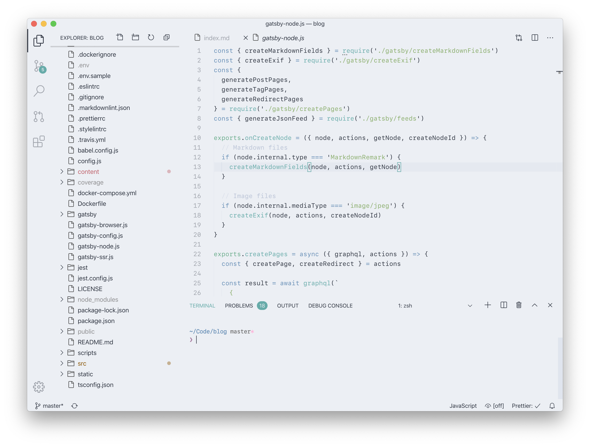

A continuously updated list of devices, tools, and services I use to get digital work & play done. Inspired by [uses.tech](https://uses.tech), check there for a list of everyone's /uses pages.

## Hardware

My office is where my MacBook is, all these devices go wherever I travel to:

- **[MacBook Pro (16-inch, 2019)](https://www.apple.com/macbook-pro-16/)**  
  _Space Gray, 2.6GHz 6-Core Intel Core i7, 16 GB RAM, 512GB SSD, AMD Radeon Pro 5300M 4GB, US International keyboard_  
  My main workhorse powering my daily work & play. Everything is pretty much amazing and it handles everything I throw at it. Love the screen, keyboard, and speakers. Still miss the SD card slot which Apple deemed not Pro enough.

- **[iPhone 11 Pro](https://www.apple.com/iphone-11-pro/)**  
  _Space Gray, 256GB_  
  My main camera and used for everything when I'm not on my Mac. I try to keep it only for personal communication and reading. I'm never quite sure what to do with all its unbelievable power, but the screen is the best display I ever looked at. Because of that, replaces a lot the iPad for reading.

- **[iPad Pro (12.9-inch) 2021](https://www.apple.com/ipad-pro/)**  
  _Space Gray, 512GB, WiFi + Cellular_  
  My 4th iPad after the original iPad. Since that time used it as a paper document replacement for reading and research and it became my favorite device to browse and edit photos on. Until I can run a local web development environment on iPadOS it is rarely useful for me to get coding work done but still intrigued by the possibilities and cleanliness of iPadOS compared to macOS.

- **[AirPods Pro](https://www.apple.com/airpods-pro/)**  
  Rocked the original AirPods since their introduction, one of the best products Apple has ever made. By now using the Pro variant pretty much all the time when talking into my devices and participating in online meetings, or listening to music on the go.

- **[Apple Watch Series 5](https://www.apple.com/apple-watch-series-5/)**  
  _40mm Space Gray Aluminum Case, Black Solo Loop_  
  Mainly used for its health & fitness features so I can go on a run without my iPhone, and track the shit out of me. I like to keep it unobtrusive, all notifications are turned off, except for calendar event & Activity.app notifications.

- **[Kindle Voyage](https://www.amazon.com/Amazon-Kindle-Voyage-6-Inch-4GB-eReader/dp/B00IOY8XWQ)**  
  The best experience for long time reading. Almost all my non-technical books are Kindle books.

### Home Office Setup

- **[Desk](/office-desk)**  
  _East Indian rosewood, 200cm x 80cm_  
  Massive wood dining table turned into a desk. Yearly bee wax polishing keeps it looking like new for more than a decade. [The monolith](/basically-the-monolith-is-on-my-desk) might had an effect on that too. Leaves more than enough space to run big display and MacBook screen side-by-side.

- **[LG 32UL950](https://www.lg.com/de/monitore/lg-32UL950-W)**  
  _32" UltraFine 4K external display with Thunderbolt 3/USB-C_  
  My main display being used when working from home. 4k and one cable to deliver power, video, audio, and further connectivity is the minimum. The image quality is bearable and on-par with the more Mac-optimized LG 5K UltraFine versions, but bigger, cheaper, more slim, and uses less energy. Still no Pro Display XDR image quality though.

- **[Logitech MX Master 3 for Mac](https://www.logitech.com/en-us/products/mice/mx-master-3-mac-wireless-mouse.910-005693.html)**  
  _Black & Space Gray_  
  Still a fan of the simplicity and gestures of the Magic Mouse 2, but it's just no fit for working precisely, or for gaming. Logitech's MX Master 3 provides both, and has great macOS support, unlike the people over at Razer.

- **[Satechi Slim X1 Bluetooth Backlit Keyboard](https://satechi.net/products/slim-x1-bluetooth-backlit-keyboard)**  
  _US, Space Gray_  
  Great compact keyboard with black keys which have a great key travel. Packed with other welcome features over Apple's keyboards like backlit keys and easy switching between 3 paired devices.

- **[HomePod mini](https://www.apple.com/homepod-mini/)**  
  _2x Space Gray_  
  Used as desktop speakers connected as stereo pair, and setup as a HomeHub to automate home devices.

- **[Logitech BRIO 4K Webcam](https://www.logitech.com/en-us/products/webcams/brio-4k-hdr-webcam.960-001105.html)**  
  Since Apple has not yet figured out how to put cameras capable of a better picture quality than a 720p potato camera into any of their MacBooks, an external one has to do it.

- **[Bose QuietComfort 35 II](https://www.bose.de/de_de/products/headphones/over_ear_headphones/quietcomfort-35-wireless-ii.html#v=qc35_ii_black)**  
  _Black_  
  The headphones for blocking out my whole environment, and for better music quality than any AirPods.

- **[Raspberry Pi 4 Model B](https://www.raspberrypi.org/products/raspberry-pi-4-model-b/)**  
  _4GB RAM_  
  The little Linux and local home server playground performing some serious tasks for all devices within my home network: [Pi-Hole](https://pi-hole.net) keeps all browsing adventures clean, and every network device's DNS traffic is routed through the Raspberry Pi. [Plex](https://www.plex.tv) is delivering a video library, capable of playing 4K content. It runs a [Tor](https://www.torproject.org) non-exit relay. Has two 4 TB hard drives attached for [storage for all network devices](/raspberry-pi-file-and-screen-sharing-macos-ios).

- **[Urbanears Baggen](https://www.amazon.com/Urbanears-Multi-Room-Bluetooth-Connected-04091756/dp/B0742HFQRD/)**  
  _Concrete Grey_  
  The most versatile, stand-alone wireless speaker I could find. Connects with pretty much everything no matter the OS: AirPlay, Chromecast, Spotify Connect, Bluetooth, USB-A, AUX. Looks and sounds great, albeit hard to justify its size after the [HomePod](https://www.apple.com/homepod/) had been released.

- **[IKEA HEKTAR](https://www.ikea.com/de/de/p/hektar-arbeitsleuchte-mit-ladefunktion-dunkelgrau-60323436/)**  
  _Dark Gray_  
  My LED desk lamp with integrated Qi and USB-A charging in its base. Perfect merge of form and function so I don't need any other dedicated device or cable on my desk to charge my mobile devices.

## Software

It's [macOS](https://www.apple.com/macos/) & [iOS](https://www.apple.com/ios/) & [iPadOS](https://www.apple.com/ipados/) & [watchOS](https://www.apple.com/watchos/) all around. The majority of my work is done on macOS. My main web and development server is a droplet on [DigitalOcean](https://m.do.co/c/9882a054acf6) running [Ubuntu](https://ubuntu.com), allowing me to work from the iPad, among other things.

I keep it simple and use most of the default Apple apps across devices for all basic computing needs: **Mail**, **Calendar**, **Notes**, **Reminders**, **Contacts**, **Messages**, **Photos**, **Music**. Most of the additional apps I use have versions for macOS & iOS.

Living a cloud-first life where all my files are stored in some cloud service and are selectively synced to any device. Mail, Calendar, and Contacts are hooked up to personal and work **[Google G Suite](https://gsuite.google.com)** accounts.

I live with **automatic dark mode** where all my devices and apps have a light theme during the day, and a dark theme after sunset.

### File Storage & Sync

- **Finder & Files**  
  So simple, yet powerful. I use Finder & the iOS Files app to access all my files from multiple sources: iCloud, Tresorit, SSH servers through [Secure ShellFish](https://secureshellfish.app), local [network drives attached to my Raspberry Pi](/raspberry-pi-file-and-screen-sharing-macos-ios).

- **[iCloud Drive, 2 TB](https://www.icloud.com)**  
  I have used Dropbox Pro for many years but it became too clunky and Apple's version turned into what I wanted Dropbox to be. Most of my non-code related files live there and are happily synced.

- **[Tresorit Premium, 500 GB](https://tresorit.com)**  
  Holds all the personal and sensitive documents. Works like Dropbox or iCloud Drive but with end-to-end encryption with my own private keys, and some nicely paranoid sharing features.

- **[Scanner Pro](https://readdle.com/scannerpro)**  
  Listed here because this app on my iPhone makes every piece of paper coming across my desk into a digital file helping me maintain a **paperless office**. Works like a charm with any document in multiple languages making them searchable with OCR. Every scan I do with it produces a high quality black & white PDF file, ready for digital filing. This gives me quick access to every official document I might need to give to someone no matter where I am in the world. Scanned paper documents are then destroyed and put into recycling.

- **[Google Drive](https://www.google.com/drive/) & [Google Docs](https://docs.google.com)**  
  Only used for work accounts, and only within the browser. It still deeply confuses me and never use it for personal stuff.

### Browsing

- **[Safari](https://www.apple.com/safari/)**  
  My main browser on every device. I stay for best typography rendering of any browser, the feature & UI minimalism, and the privacy and content blocking features. No extensions at all except for 1Blocker.

- **[DuckDuckGo](https://duckduckgo.com)**  
  My search engine on all devices in all browsers.

- **[1Blocker](https://1blocker.com)**  
  My content blocker of choice for Safari so I rarely see any ad tech bullshit even outside of my network without Pi-Hole. Fast, effective, and completely unobtrusive on every device.

- **[Firefox Developer Edition](https://www.mozilla.org/en-US/firefox/developer/)**  
  My secondary browser on macOS mainly used for development and debugging. Running with those extensions:

  - [React Developer Tools](https://addons.mozilla.org/en-US/firefox/addon/react-devtools/)
  - [MetaMask](https://metamask.io): my browser wallet for all Web3 and Dapp testing.
  - [Privacy Badger](https://privacybadger.org/): I wish Safari content blockers could also be used in Firefox but Privacy Badger from EFF does a good job too.

- Test browsers: **Chrome**, **Edge**, **Brave**, **Opera**

### Development

- **[VS Code](https://code.visualstudio.com)**  
  From Notepad, to Dreamweaver, to CSS Edit, to Coda, to Espresso, to TextMate, to Atom, and now I arrived at VS Code. Its feature set, coding experience, and ecosystem far outweigh the Electron drawbacks, and at least it is the most performant Electron app I know. I still miss [Espresso](https://www.espressoapp.com) as my personal gold standard for how a code editor UI on macOS should look and behave. Using only a small set of extensions mostly for automatic code formatting based on various tools:

  - [Nord](https://marketplace.visualstudio.com/items?itemName=arcticicestudio.nord-visual-studio-code): patiently awaiting a light version of it, until then [Polar](https://marketplace.visualstudio.com/items?itemName=merithayan.polar) does the job.
  - [ESLint](https://marketplace.visualstudio.com/items?itemName=dbaeumer.vscode-eslint)
  - [GitHub Pull Requests and Issues](https://marketplace.visualstudio.com/items?itemName=GitHub.vscode-pull-request-github)
  - [Import Cost](https://marketplace.visualstudio.com/items?itemName=wix.vscode-import-cost)
  - [Markdown All in One](https://marketplace.visualstudio.com/items?itemName=yzhang.markdown-all-in-one)
  - [npm Intellisense](https://marketplace.visualstudio.com/items?itemName=christian-kohler.npm-intellisense)
  - [Prettier](https://marketplace.visualstudio.com/items?itemName=esbenp.prettier-vscode)
  - [Spell Right](https://marketplace.visualstudio.com/items?itemName=ban.spellright)
  - [stylelint](https://marketplace.visualstudio.com/items?itemName=stylelint.vscode-stylelint)

- **[Nord](https://www.nordtheme.com)**  
  My go to syntax color theme for everything displaying code, including code snippets displayed on this blog.

- **[SF Mono](https://developer.apple.com/fonts/)** or **[Fira Code](https://github.com/tonsky/FiraCode)**  
  I can never decide and switch between them for everything which displays code.

- **Terminal.app**
  Switching between Terminal.app and the integrated terminal in VS Code all the time.

  - my default shell is **[Zsh](https://www.zsh.org)**
  - configured with my own **[dotfiles](https://github.com/kremalicious/dotfiles)**
  - styled with **[Pure](https://github.com/sindresorhus/pure)**.

- **[Git](https://git-scm.com)**  
  Most of my projects are under version control and are synced as Git repositories. Using Git in Terminal.app, within VS Code, and occasionally with [GitHub Desktop](https://desktop.github.com). Almost everything I do for work is embedded in a Git-based workflow. Every commit I create on any device is signed with one of my GPG keys.

- **[Kaleidoscope](https://www.kaleidoscopeapp.com)**  
  I'm a senior developer and still don't know how to properly resolve a merge conflict without this app.

- **[Docker Desktop](https://www.docker.com/products/docker-desktop)**  
  Lots of work projects are Dockerized so there's always a bunch of Docker containers running on my machine. Still prefer to directly use my local development environment for everything JavaScript/Node.js based.

- **[Transmit](https://www.panic.com/transmit/)**  
  Use it since like forever on macOS. Gives me file access to pretty much everything within my network and remote resources, including S3 & Wasabi on both, macOS & iOS.

- **[Prompt](https://www.panic.com/prompt/)**  
  Truly the best SSH client for iOS. Using it for occasional server maintenance on the go.

- **[Working Copy](https://workingcopyapp.com)**  
  One of the most powerful development tools on iOS making version-controlled, on-device development actually possible. In my workflow it is the basis for doing quick code or copy edits. Because it is a document provider on iOS, I can directly access my cloned Git repositories from any other app.

- **[GitHub for mobile](https://github.com/mobile/)**  
  The iOS app is crazy good for quickly managing issues and code reviews. Rarely use the [desktop version](https://desktop.github.com).

- **[Homebrew](https://brew.sh)**  
  The trusty package manager for the Unix side of macOS, for all the stuff which is not Dockerized.

- **[nvm](https://github.com/nvm-sh/nvm)**  
  I need to switch between multiple Node.js versions throughout the day and nvm has always been perfect for that.

### Design

- **[Sketch](https://www.sketch.com)** & **[Figma](https://www.figma.com)**  
  I mostly design in the browser but when required, all my UI wireframing, prototyping, and design needs are met with either Sketch or Figma. Prefer Sketch for the perfectly native UI, but Figma for drawing performance and its collaboration features.

- **[Pixave](http://www.littlehj.com/mac/)**  
  Storing full page screenshots of every site or other visual work I create in here. Feels dated and buggy by now so in dire need of replacement.

- **[xScope](https://xscopeapp.com)**  
  When stuff on screen just has to be pixel-perfect. Always used to check for accessible colors in all UIs I create.

- **[Typeface](https://typefaceapp.com)**  
  My font manager of choice. Nice and simple.

- **[Sip](https://sipapp.io)**  
  Use this to pick colors from everywhere on the screen.

- **[ImageOptim](https://imageoptim.com)**  
  Every bitmap asset I create goes through this app to keep file size small.

### Photos

- **iCloud Photos**  
  All my master photos live in iCloud, and are selectively synced to devices in Photos.app. I make sure every photo ending up in here has the correct location and capturing date in its metadata, like for a lot of scanned analog photos from the last century.

- **[Photos](https://www.apple.com/ios/photos/)**  
  Using it on all devices, most edits happen on my iPhone with it. Metadata editing often happens in the [macOS version](https://www.apple.com/macos/photos/). Has everything I need since iOS 13. Originally, my library moved from folders, to iPhoto, to Aperture, to Lightroom, and from there back to Photos.

- **[Metaphoto](https://zininworks.com/metapho/)**  
  Excellent metadata editing on iOS for single photos, or bulk editing. Directly accesses and modifies the originals from Photos.app and writes modified location & date back to them.

- **[Halide](https://halide.cam)**  
  For capturing everything the image sensors of my iPhone can deliver. Gorgeous interaction & UI design.

- **[Darkroom](https://darkroom.co)**  
  For more refined editing on iOS.

- **[Affinity Photo](https://affinity.serif.com/en-gb/photo/)**  
  When a photo needs even more refined editing, primarily used on macOS.

### Music

- **Music**  
  Used iTunes to manage my music library since I use a Mac. Digitalized my CD library in Apple Lossless into it in the 2000s, first synced to mobile devices (iPod, then iPhone) via cable, then "synced" with iTunes Match without any cables. Now this library is running with Music, in a mix with Apple Music. This library with the lossless files is living on a network drive in my home network and is accessed from there when sitting at a Mac.

- **[iTunes Match](https://support.apple.com/en-us/HT204146)**  
  Yup, still using that. I try to buy music I like from the artist in a lossless format and store it in my Music library, and iTunes Match gives me access to its compressed version from the Apple Music catalogue on all mobile devices.

- **[Apple Music](https://www.apple.com/apple-music/)**  
  Used for discovering new music and its excellent playlist curation.

### Messaging

- **Mail**  
  Apple's default email app has always worked for me, on all devices, so I just stick to it.

- **[GnuPG](https://gnupg.org)**  
  Use it since I use email but its clunky and rarely anyone uses it. Interacting with it only in Terminal.app for decrypting and encrypting, and use it to sign Git commits. Yes, I'm aware of [GPG Suite](https://gpgtools.org) but the instability it introduces into the whole operating system is not worth the usage to me.

- **[Messages](https://support.apple.com/explore/messages) & [Telegram](https://telegram.org)**  
  The only messengers I use every day for personal stuff, mostly on my iPhone.

- **[Signal](https://www.signal.org)**  
  In an ideal world everybody would use this so all our private messaging is not controlled by some single, closed-source entity with varying degrees of ad tech evilness.

- **[Slack](https://slack.com)**  
  The main work communication tool, mostly used on macOS. Loved and hated in equal parts.

### Writing

Except within Notes.app, everything I write is composed as [GitHub Flavored Markdown](https://github.github.com/gfm/).

- **[iA Writer](https://ia.net/writer)**  
  Every longer text I write starts and lives here first.

- **[VS Code](https://code.visualstudio.com)**  
  Most development-related writing ends up in VS Code, side-by-side with its Markdown preview.

### Password Management

- **[1Password](https://1password.com)**  
  Actively store pretty much every sensitive credential and infos in here. The 1Password keychain is only synced locally via WiFi to my other devices.

- **[iCloud Keychain](https://support.apple.com/en-us/HT204085)**  
  Replaces 1Password a lot for me during daily browsing because of its perfect integration into Safari.

### Reading

- **[Reeder](https://www.reederapp.com)**  
  Never stopped using RSS for my news reading and Reeder has always been a joy to use. Have it on all my devices but prefer reading on the iPad with it. I use [Feedly](https://feedly.com) to manage and sync my subscriptions in the background.

- **[Instapaper](https://www.instapaper.com)**  
  My read-later service, mostly reading articles through the Instapaper app on iPhone or iPad, but also have it setup in Reeder.

- **[Books](https://www.apple.com/apple-books/)**  
  I prefer buying ePub files directly from book authors which then end up in Books. Pretty much all my technical books live here and are synced via iCloud.

### Social Media

- **Twitter: [Twitterific](https://twitterrific.com/ios/)**  
  Using it since the first macOS version, now primarily used on the iPhone and the only way I interact with Twitter.

- **Reddit: [Apollo](https://apolloapp.io)**

### Health & Fitness

- **[Health](https://www.apple.com/ios/health/)** & **[Activity](https://www.apple.com/watch/close-your-rings/)**  
  Any health and fitness-related app I use feeds data into these apps, making them my main health data dashboard.

- **[Workout](https://support.apple.com/en-us/HT204523)**  
  Everything I need from an app to track workouts, which only happens on watchOS these days. It is pretty much perfect and replaced [Runkeeper](https://runkeeper.com) for me.

- **[Pillow](https://neybox.com/pillow-sleep-tracker-en)**  
  Nice and simple automatic sleep tracking through Apple Watch and great visual reports on my iPhone.

### Backup

- **The Cloud™**  
  Everything I create is either stored in iCloud, Tresorit, or a pushed Git repository, making this my first line of defense for data loss.

- **[Arq](https://www.arqbackup.com)**  
  My second line of defense, the snapshot backup tool used for all Macs I had in the last years. Encrypts everything locally before uploading. The same backups are sent every hour to a [Wasabi](https://wasabi.com) bucket, and in my local network to a hard drive connected to the Raspberry Pi via Samba. I have kept all my former Mac snapshots within the same bucket on Wasabi, so I can always jump back to any of their snapshots. Always super stable and happy with it.

- **[iCloud Backup](https://support.apple.com/en-us/HT203977)**  
  All mobile devices simply use this to create their backups.

- **[Rclone](https://rclone.org)**  
  For moving large cloud data around within and between online storage services. Usually run from my remote web server.

## Self Hosted

- I host my **[blog](https://kremalicious.com)** (which also includes my photo stream) and **[portfolio](https://matthiaskretschmann.com)** on **[AWS S3](https://aws.amazon.com/s3/)**, with **[Cloudflare](https://www.cloudflare.com)** in front of it.

- I run my own **web and development server**, a droplet on **[DigitalOcean](https://m.do.co/c/9882a054acf6)**, running **[Nginx](https://nginx.org)**.

- I run my own **analytics server** with **[Matomo](https://matomo.org)**.

- I run my own **Git repository hosting** with **[Gitea](https://gitea.com)** for private projects, and for automatically mirroring every GitHub repository I touch into it. A VPS running within **[Amazon Lightsail](https://aws.amazon.com/lightsail/)**.

- I run a public **[IPFS](https://ipfs.io)** node & gateway, powered by a VPS on **[Amazon Lightsail](https://aws.amazon.com/lightsail/)**, and the frontend delivered via **[Vercel](https://vercel.com)**.

- I run multiple **[Tor](https://www.torproject.org)** exit relays, VPS distributed between **[Scaleway](https://www.scaleway.com)** & **[OVH](https://www.ovh.com)**.

- For every other serverless and JAMstack need I prefer **[Vercel](https://vercel.com)**.
