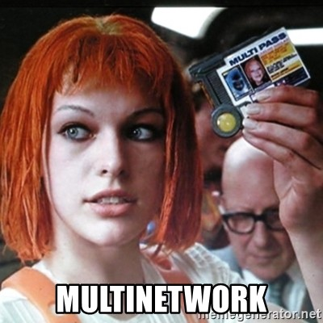
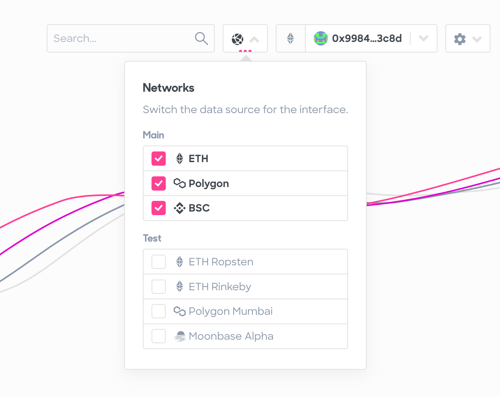
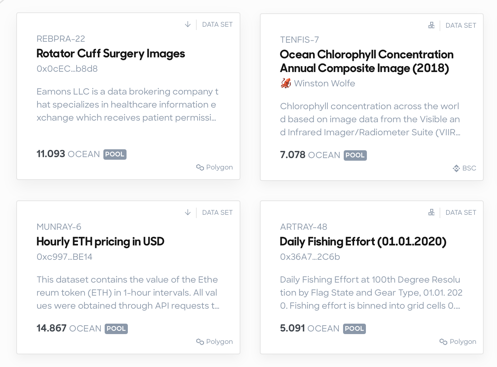
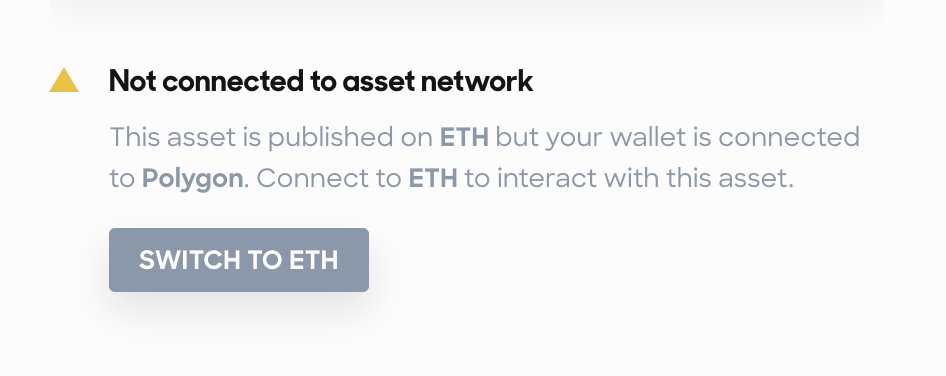
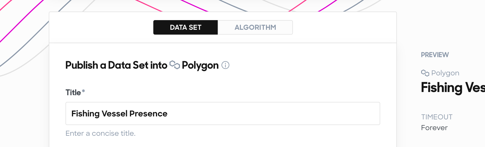
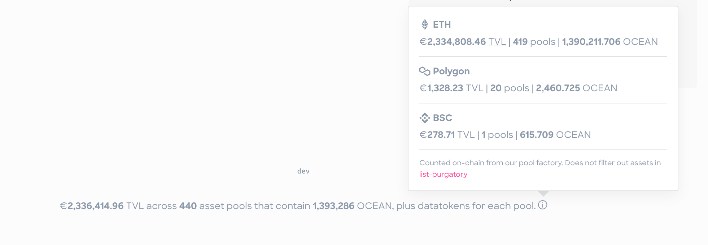
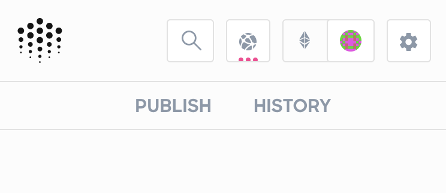

Simplifying Multi-Network on Ocean with a Unified Interface.

---

> This article was originally posted [on Medium in the Ocean Protocol blog](https://blog.oceanprotocol.com/ocean-makes-multinetwork-even-simpler-c3ec6c0cbd50).

---

## 🦑 The New Reality

When we launched the Ocean Market as part of v3 we had [just moved onto ETH Mainnet](https://blog.oceanprotocol.com/oceans-on-ethereum-mainnet-ba9be1aee0ce) from our own custom PoA Mainnet, so all focus for the user interface went into working against that one production network. As we deployed the Ocean Protocol contracts to more chains to escape rapidly rising transaction fees, the main interface paradigm, of basing the displayed metadata on the user’s connected network quickly became a pain to use. Hello, _Could not retrieve asset_. 🙃

So we sat down and figured out the best patterns to solve these main pain points, focusing solely on the end user perspective:

- Reduce friction when following links to assets outside of ETH Mainnet
- Retain the DID and existing URLs as the unique identifier for an asset, regardless of network
- Increase discoverability of assets outside of ETH Mainnet
- Increase discoverability of all networks Ocean Protocol is deployed to
- Encourage usage of networks beyond just ETH Mainnet
- Reduce need to switch wallet networks as much as possible when browsing the market
- Any possible solution needs to scale easily as we continue deploying to more networks

## 🧜‍♀️ Multi-Network Market



Ultimately, we arrived at a solution tackling all this, where the main new paradigm is an interface showing assets mixed from multiple networks. All the time and on every screen where assets are listed. This detaches the metadata and financial data source from the user’s wallet network as it was before.

The displayed networks are now controlled by the new network selector.



By default, we auto-select all production networks Ocean Protocol is deployed to. As soon as you interact with this new network switcher, your selection takes over and is saved in your browser so it will be the same the next time you come to the market.

Selecting or de-selecting networks then modifies all Elasticsearch queries going to our new Aquarius, resulting in mixed assets on screen.



All assets now indicate which network they belong to, and you are prompted to switch to the asset’s network when we detect your wallet being connected to another network.



And in the case of using MetaMask, we added actions to switch your wallet network directly from the UI, which, as of right now, is pretty much the most streamlined user flow possible to switch networks with MetaMask from a Dapp.

With all this, wallet network switching is now only needed once you want to interact with an asset, like downloading or adding liquidity to its pool.

User wallet network also stays important for publishing an asset, so we based the whole publish form on the currently connected network to define onto which network an asset is published.



As for our key market statistics in the footer, we switched it to show consolidated numbers as a sum of all production networks. In its tooltip, you can find the values split up by network.



More assets on screen and more controls also led to further UI tweaks to get more space available to the actual main content. We completely refactored the main menu layout, added a global search box to it, and moved some warnings around. And, while we were at it, improved the mobile experience for it. ✨✨



And finally, we also automatically migrate all your existing bookmarks from all the networks and combine them into one list.

### Developer Changes

For developers, there are new values in `app.config.js` controlling the networks which are displayed in the network selection popover:

- `chainIdsSupported`: List of all supported chainIds. Used to populate the Networks user preferences list.
- `chainIds`: List of chainIds which metadata cache queries will return by default. This preselects the Networks user preferences.

In the background, the code base changed drastically. We now have only one Aquarius but still multiple providers and especially subgraphs, and we had to also technically detach the wallet network from the data source. E.g. for showing prices and financial data, main refactoring work went into correlating the assets based on `ddo.chainId` with the respective subgraph and querying multiple subgraphs at the same time as needed. For this, we also simplified our GraphQL setup and switched from [Apollo Client](https://www.apollographql.com/docs/react/) to [urql](https://github.com/FormidableLabs/urql).

If you’re interested in all the detailed code changes, you can follow along with the [main Pull Request](https://github.com/oceanprotocol/market/pull/628) which has references and screenshots for all other changes done against it. This is also the best place to start if you run your own fork of the market and want to integrate the latest multi-network changes without looking at just one big change in `main`.

### Check it out!

Head to [market.oceanprotocol.com](https://market.oceanprotocol.com) and see assets currently mixed from 3 networks by default.

- [market.oceanprotocol.com](https://market.oceanprotocol.com)

You can find all the values required to connect your wallet to the networks Ocean Protocol is deployed to in our [supported networks](https://docs.oceanprotocol.com/concepts/networks/) documentation, along with a guide on how to [set up a custom network in MetaMask](https://docs.oceanprotocol.com/tutorials/metamask-setup/#set-up-custom-network).

## 🐋 Multi-Network Aquarius

Aquarius got a complete refactor. Besides numerous optimizations and stabilization, this new Aquarius indexes assets from multiple chains and delivers them all together in its API responses, with a new `ddo.chainId` value as part of each asset’s metadata.

In addition to making an interface with mixed assets possible, this also brings a huge maintainability advantage as now only one Aquarius instance has to be deployed and maintained instead of one for each supported network.

So multiple Aquarius instances are now reduced to one instance, where for every network a specific indexer is started. The [Aquarius API](https://docs.oceanprotocol.com/references/aquarius/) got a new endpoint exposing which chains are indexed under `/api/v1/aquarius/chains/list`.


### Migration to Multi-Network Aquarius

Aquarius `v3.0.0+` is the one.

If you use our remote Aquarius instances, all you have to do is point your app against the new `aquarius.oceanprotocol.com` and then in your interface do things based on `ddo.chainId`, like modifying your Elasticsearch queries to include assets from specific networks.

We will keep the old dedicated network instances like `aquarius.mainnet.oceanprotocol.com` running until September 1st, 2021, and we encourage everybody to migrate to `aquarius.oceanprotocol.com` instead.

With one Aquarius indexing multiple chains it is rarely useful to return all the assets, as most likely you are only interested in production network assets when listing them in an app. So we will also remove the `GET /assets/ddo` endpoint and suggest to replace it with a specific search query to `POST /assets/ddo/query`, and include the chainId you want, like:

```js
{
  page: 1,
  offset: 1000,
  query: {
    query_string: {
      query: 'chainId:1 AND -isInPurgatory:true'
    }
  }
}
```

If you have your own instances deployed we suggest to deploy a new one with `v3.0.0+` to have everything reindex, and finally switch your URLs in your app to this new deployment and adapt your app interface accordingly. The readme has further information on how to exactly deploy this new Aquarius.

- [oceanprotocol/aquarius](https://github.com/oceanprotocol/aquarius)

---

> This article was originally posted [on Medium in the Ocean Protocol blog](https://blog.oceanprotocol.com/ocean-makes-multinetwork-even-simpler-c3ec6c0cbd50).

---
