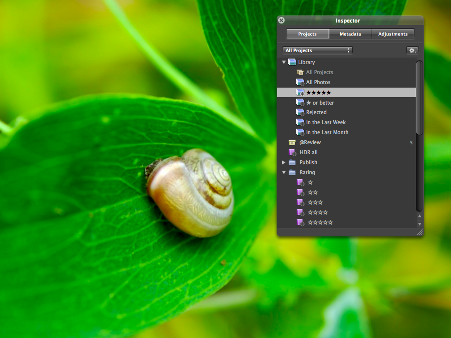

There are already some lists like this available on the web and they are always very subjective so I thought I should add my subjective list too. While Aperture was released I was coding this website and had not much time for writing about it. So although a bit late here is my absolutely biased list of my favorite 15 new features included in Apple's Aperture since version 2.0. It's in a nice countdown order ending with the best new feature (to me) at the bottom. Just click on the little screenshots to smoothly zoom to the full version of them.

## 15. The "New" toolbar icon

A handy dropdown icon with the most common create tasks you can do in Aperture 2. This causes Aperture 2 to have a delightful clean toolbar by default.

## 14. Skimming through your projects

The Library item has a new child item: All Photos. Clicking on it displays all your projects like the Event view known from iPhoto 08. By hovering the mouse over the key photo (which you can define for yourself too) you "skim" through the project and quickly see all images contained in this project. Perfect for visually finding that non-keyworded photo you remember you've taken it but don't know where it is.

## 13. Search for adjustments

With Aperture 2 you can define a search query based on the adjustments you've made to an image in your library. So you can quickly identify all your images which have the monochrome mixer applied to them or maybe all your images which have _no_ edge sharpening applied and so on.

## 12. The Retouch tool

No more fiddling around with the poor results of the spot & patch tool when you just want to remove some sensor dust from your image. The repair mode of this tool is just perfect for that kind of task. The clone mode pretty much functions the same way as the clone tool in Photoshop. You define a clone source in your image by pressing option + click in your image and then pasting that source onto the imperfection by clicking on it.

## 11. Double click behavior

The behavior of double clicking on images can now be set in Aperture's preferences. Either you can make Aperture show or hide the Viewer or set it to enter full screen mode with the double clicked image in focus.

## 10. Book Layout

The photobook layout capabilities of Aperture became much powerful with version 2. Now you can create your own book templates where you have much freedom for lay-outing it. In fact you have a powerful Desktop Publishing Program built right into Aperture. Be sure to listen to the [Inside Aperture Podcast about the book layout tool in Aperture](http://digitalmedia.oreilly.com/2008/05/06/aperture-layout-application-schorr.html).

## 9. The V- and W-cycle

By pressing V on your keyboard you can quickly cycle through different viewer modes. In previous versions of Aperture the V-key just showed/hid the big viewer.

By pressing W on your keyboard you can cycle through the tabbed Inspector on the left and quickly access either your Projects, Metadata or the Adjustments.

## 8. The tabbed Inspector/HUD

An addition to the W-cycle: The overall inspector get polished by Apple which results in a completely new clean interface. But the best thing is you can access all those inspector tabs in full screen mode too by hitting the H-key. You can cycle through the tabs of the HUD in full screen mode just like you can do in the Aperture window by pressing the W-key. In fact the tabbed HUD will make you never want to leave full screen mode.

## 7. .Mac Web Gallery

Create easy updatable password protected galleries for different clients in no time. Your clients are even able to download the master files from your good looking .Mac web gallery.

## 6. Definition adjustment slider

It's a bit hard to describe. In short the slider adds more detail to the midtones of your image. But you just have to see it in action. You can get crisp and sharp images without the need of any sharpening tool.

## 5. Recovery + Black Point sliders

Although the Highlights & Shadow tool already produced reasonable results, the new Recovery and Black Point sliders are much more powerful and can reveal a lot of detail either in your blown out highlights or your underexposed shadows. Tip: While moving either the Recovery or the Black Point slider hold down the command key at the same time to see just an overlay of your hot & cold areas in your image.

## 4. Quick Preview

Perfect for first selections of your images during import. Aperture uses either a preview embedded by your camera in the RAW-file, the corresponding jpg-file if you shoot RAW+JPG or it uses the previews rendered by Aperture itself.

## 3. Color Picker

Inside the Color adjustment brick you can now directly pick the color you want to alter from your image by selecting it with the little eye dropper. So you aren't bound to the standard colors when adjusting the colors of your image separately.

## 2. Spe(eeee)ed

Now you can "scroll like butter" (I bet you know who said that) through your whole library fro real. I don't know what exactly causes Aperture 2 to be so much more responsive and speedier than previous versions but the development team have done magic with this. In combination with the quick preview mode quickly browsing through thousands of photos even in full screen mode is now a snap.

## 1. RAW 2.0

The best new feature to me just because the whole purpose of Aperture should be producing the best looking images from your RAW files. While the first RAW 1.0 often rendered terrible pictures, the RAW 1.1 algorithm did it a lot better. But now we have a massive improvement to the RAW 1.1 algorithm with crisp highlights and more details in dark areas with less chromatic aberration by default. To me Aperture is now close and sometimes better than the quality of PhaseOne or CameraRAW. Of course Aperture 2 leaves all your old adjustments made in previous versions of Aperture alone and you can optionally migrate them all at once or separately.

And you even get more adjustments for decoding the RAW file. The new Hue Boost slider only applies to the colors of your images rather than to the overall exposure like Boost do.

These are my favorite new features of Aperture 2.
