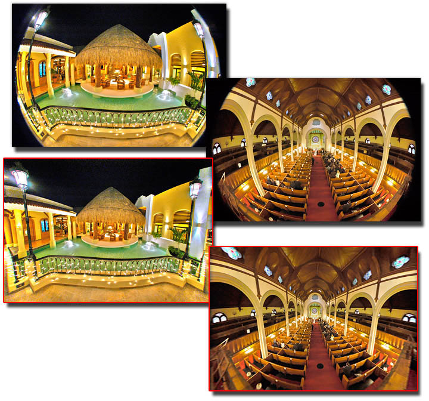

With the release of Aperture 2.1 Apple introduced a plugin architecture for adding third party image adjustment and export plugins. Now the first third party image adjustment plugins for Aperture 2.1 have arrived. And they can definitely make you stop roundtripping your pictures to Photoshop and back. For now a total of 14 plugins from 9 companys were announced which are waiting to help you with your Aperture 2 workflow.

<!-- more -->

# Dfx digital filters plugin from Tiffen

The first one is the [Dfx digital filters plug-in from Tiffen](http://www.tiffen.com/products.html?tablename=dfx) which was already available as an image editing plugin for Photoshop on Windows and Mac. It's an award winning set of [94 individual filters](http://www.tiffen.com/dfx_filter_effects_ig.html) for adjusting and altering your images in Aperture 2.1 and above.

Tiffen made the plugin available in May 2008. You can download a [free 15-day trial](http://www.tiffen.com/dfx_downloads.html) too or you can purchase it from the Tiffen-website for US$299. Also don't forget to have a look [at the user guide](http://www.tiffen.com/userimages/Dfx-v1-Photo-UserGuide.pdf) for this plugin.

A nice in-depth overview of this plugin [gives Dominique James over at Aperture Users Professional Network](http://www.apertureprofessional.com/showthread.php?t=15225).

# Digital Film Tools Aperture Plugins

Digital Film Tools [released three plugins](http://www.digitalfilmtools.com/apertureprods.htm) for Aperture 2.1 and above which were also already available for Photoshop:

[Power Stroke 1.0](http://www.digitalfilmtools.com/powerstroke/index.htm) is an image editing plugin for making targeted adjustments by intuitive handling with strokes. You can make multiple corrections and effects with one stroke such as color correction, recoloring or desaturation, colorization of black and white images, blur, fill light for dimly lit image areas and Diffusion/Glow.

[Light! 3.5](http://www.digitalfilmtools.com/light/) is a plugin for adding Light effects with defined patterns which are created by Gamproducts.

[Ozone 2.5](http://www.digitalfilmtools.com/ozone/) is an adjustment plugin for selective adjustments of colors. It' based on the Digital Zone System, which divides a picture into 11 discrete zones where you can adjust each zone separately.

All plugins are available now and can be [purchased fom the Digital Film Tools website](http://www.digitalfilmtools.com/buy/home.php?cat=38) as a Super Bundle with all three plugins included for US$ 175 or separately for US$ 50 (Light and Ozone) or US$ 120 (Power Stroke). There are also trial versions for the [Power Stroke](http://www.digitalfilmtools.com/powerstroke/media.htm), [Light](http://www.digitalfilmtools.com/light/media.htm) and [Ozone](http://www.digitalfilmtools.com/ozone/media.htm) plugin available from DFT's website which will watermark the edited images in demo mode.

# Nik Viveza

Nik Software [announced the availabilty of Viveza](http://www.niksoftware.com/viveza/usa/entry.php?view=intro/viveza_aperture_announcement.shtml), an image editing plugin based on the cool U-Point technology as known from [Nikon's Capture NX](http://imaging.nikon.com/products/imaging/lineup/software/capturenx/index.htm). You can select areas from your image and adjust them separately from the rest of the picture. It is long available as a plugin for Photoshop and is shipping in May for Aperture 2.1. It will cost US$249.95 but users who already purchased Viveza for Photoshop get it for free!

On May 7, 2008, Nik finally [shipped Viveza as the first availailabe plugin for Aperture 2.1](http://www.kremalicious.com/2008/05/nik-ships-viveza-as-the-first-available-aperture-editing-plugin/). You can grab a [15-day trial version](http://www.niksoftware.com/site/cont_index.php?nav_top=367&cms_child=__demo&productId=257) of the plugin too.

# dvGarage dpMatte & HDR Toner

[DpMatte](http://www.dvgarage.com/prod/prod.php?prod=dpmatte) is a plugin for greenscreen keying for photographers. You can easily composite two images together, like adding another background for a portrait. It is available since April 22 and costs you US$ 69.

The folks at dvGarage are also working on an Aperture plugin called HDRToner for high dynamic range images which will cost US$ 69 too and is expected to be available on June 15 2008.

# Image Trends Aperture plugins

Image Trends announced three plugins coming for Aperture 2.1. First one is the the anti-distortion plugin [Fisheye-Hemi](http://www.imagetrendsinc.com/products/prodpage_hemi.asp) which can remap images taken with fisheye lenses. If you're using a Fisheye lens you will love this plugin. According to Image Trends' Michael K. Conley the plugin should be available on May 19, 2008 and will cost US$ 29.95. But if you already purchased the Photoshop version Image Trends will give you 50% discount.

The [PearlyWhites](http://www.imagetrendsinc.com/products/prodpage_pearly.asp) plugin, which is intended to automatically whiten and brighten teeth in your images should be available within the next 60 days.

And the [ShineOff](http://www.imagetrendsinc.com/products/prodpage_shine.asp) plugin, which removes shine from faces and skin should be available within the next 60 days too.

# Picturecode Noise Ninja

Well known for it's awesome noise reduction capabilities, Picturecode's [Noise Ninja](http://www.picturecode.com/nn_overview.htm) will be available as an Aperture 2.1 plugin too.

According to Picturecode we can expect the plugin "sometimes next month" (June) and maybe there will be a beta version available before the final release. Definitely there will be a trial version of the plugin available from Picturecode's website.

You can have a first look at an early alpha version of the plugin running in Aperture 2.1 in an [in-depth article by Rob Galbraith](http://www.robgalbraith.com/bins/content_page.asp?cid=7-9308-9356).

# Creaceed Hydra + HDR Aperture Plugin

[Hydra](http://www.creaceed.com/hydra/) is a neat application for High Dynamic Range (HDR) image processing. With the release of Hydra 1.5, Creaceed made an Aperture plugin available with it too. It has a limited feature set compared to Photomatix or Photoshop but creating HDR images within Aperture is possible right now with this plugin. You can purchase Hydra for US$ 59.95 to get the included plugin or test it out by downloading the trial version (it will expire on July 1, 2008). But remember that the plugin is in beta stage at the moment.

# Kekus LensFix CI

The [LensFix](http://www.kekus.com/software/plugin.html) product from Kekus will help you to correct lens distortion automatically along with it's database of over 500 combinations of camera and lenses. It is also capable of reducing chromatic aberration in your images. Along with a standalone version and a Photoshop plugin the latest version will deliver you a plugin for Aperture in beta stage. The LensFix CI product with the Aperture plugin included will cost you US$ 30.

You can read a first review of the beta plugin for Aperture [over at trick77.com](http://www.trick77.com/2008/05/18/review-lens-correction-plug-in-kekus-lensfix-for-aperture-2/).

# Human Software ApertureEdit

This plugin is a whole bundle of 11 different modules for more than 4000 effects like denoising, lens fixing, framing, light effects and many more. All effects can be applied to one image at a time or to a whole set of images at once. Just head over to the [product page](http://www.humansoftware.com/pages1200/ApertureEdit/HSapertureedit11.html) to see all effects and features this plugin bundle is capable of. The whole bundle will cost you US$ 299.95 or US$ 69.95 for each module.

# More information

[Image editing plug-ins the centrepiece of Aperture 2.1 by Rob Galbraith](http://www.robgalbraith.com/bins/content_page.asp?cid=7-9308-9356): In-depth article about the plugin architecture of Aperture 2.1

Tiffen website
[www.tiffen.com](http://www.tiffen.com)

Digital Film Tools website
[www.digitalfilmtools.com ](http://www.digitalfilmtools.com)

Nik Software website
[www.niksoftware.com](http://www.niksoftware.com)

dvGarage website
[www.dvgarage.com](http://www.dvgarage.com)

Image Trends website
[www.imagetrendsinc.com](http://www.imagetrendsinc.com/)

Picturecode website
[www.picturecode.com](http://www.picturecode.com/)

Creaceed website
[www.creaceed.com](http://www.creaceed.com)

Kekus website
[www.kekus.com](http://www.kekus.com/)

Human Software website
[www.humansoftware.com](http://www.humansoftware.com)
