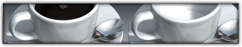
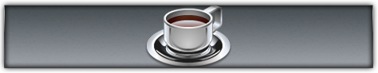
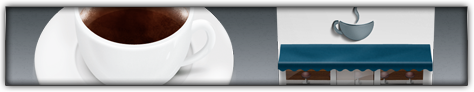

In this article I present you the finest icons of the fuel of a lot of designers and students (and other people too) available on the web. I've just released [my own coffee cup icon](/coffee-cup-icon) but this beverage seem to have inspired a lot of other beautiful icons especially for Mac OS X.

Now just get your next coffee, sit back and enjoy this little showcase. Just click on the images to get to the icon sources. At the end of the article you'll find links to some nice high quality coffee tutorials. And remember you will have more control over time itself if you [reach your 100th cup of coffee](http://en.wikipedia.org/wiki/Three_Hundred_Big_Boys).

## The Finest Coffee Cups

Please note that these icons are the property of their respective owners and you should always consult their copyright notice first before using these icons.

## Coffee Cup icons by Susumu Yoshida

A bunch of colorful cups of coffee.

## CoffeeCon icon by Vegrafik

A hyperrealistic icon from Vegrafik

## Coffee Cup Icon by kremalicious

In a fit of megalomania I declared my icon as incredible and included it here. Originally I've made the coffee cup for the donations button on kremalicious.com.

## Coffee folders from Agua Icons by David Lanham

The one and only Mac OS X system replacement icon set has some coffee folders too.

## Kaffe! icon from World of Aqua 3 icon set by Dave Brasgalla

Coffee in a metal cup. Sadly Dave didn't updated his World of Aqua icon pack with bigger sizes so it's just 128px.

## Starbucks coffee icon by Rok Benedik

## Coffee folders from the Maji sets by Jonas Rask

Also Jonas used coffee as the metaphor for the work folder (supposedly) and made clear he likes very big coffee cups.

## Espresso icon by MacRabbit

Does this application need any introduction? Although not released yet the new web-coding application from MacRabbit drew a lot of attention. The icon is one of the reasons for that.

## Coffee folders from the Pry system sets by Jonas Rask

Another folder-combined-with-coffee icon by Jonas.

## Coffee icons from Office Space icon set by VisualPharm

A glass coffee cup which is [wildly used](http://abduzeedo.com/amazing-photoshop-light-effect-10-steps) on the web. Created for Windows so the icons are just 256px in size.

## The Coffee Shop icon set by Alejandro Lopez & Sergio Ruiz

An icon set made in collaboration between [Alejandro Lopez](http://www.dimensionofdeskmod.net/medias/) & [Sergio Ruiz](http://www.camtessadesign.com/descargas/ver/the_coffee_shop) with icons related to a coffee shop.

## Espresso icon by Iiro Jäppinen

## Coffee Wallpaper by Michael Flarup

Not an icon but the coffee cup drawn in this wallpaper from Michael Flarup would make a good one. The detail of the cup is stunning.

## Bean icon by Laurent Baumann

Bean is a free word processor for Mac OS X and Laurent Baumann included a nice coffee cup in the application icon for it.

## Have A Break icons by mat-u

Nice shiny coffee cups with a lot of detail in the reflections. Sadly just in 128px size maximum. Maybe you can [persuade mat-u to update this icon with bigger sizes.](http://www.mat-u.com/)

## Java Application icons by Apple

Apple uses a nice coffee cup in their Java applications which can be found in the Utilities folder. Thanks to [David](http://dlanham.com/) for pointing this out.

## Caffeine icon by Trevor Kay

Trevor Kay made the new icon for Caffeine. This application prevents your Mac from automatically going to sleep. Trevor also made [some additional icons for Caffeine](http://God-X.deviantart.com/art/Caffeine-Replacement-Icons-75619389) although the coffee cup looks pretty much the same as the one from Apple's Java application icons.

## Coffee and Tea icons by Kate England

Some comic style icons which deviate from the realism of all the other coffee icons. Sadly just available in 128px size.

## Moon Coffee icon from Space: 1999 icon set by Dave Brasgalla

Dave made an icon set for the Iconfactory inspired by the classic sci-fi television series of the 70's and included a Moon Coffee cup. Also just in 128px size.

## Times Application Icon by Mikio Inose

Acrylic Software's "new type of newsreader for Mac OS X Leopard" called [Times](http://www.acrylicapps.com/times/) uses a gorgeous icon made by Mikio Inose.

## Do you love Cappuccino? by Creative 9 Design

One delicious full and one empty cappuccino cup re available in this icon set made by Creative 9 Design. Available just in 256px from their [blog](http://www.c9-d.com/blog/view/63).

## Cappuccino Framework Icon by Sofa

Not a coffee cup but also very coffee related is this awesome Cappuccino machine icon (although it shows an Espresso machine) made by [Sofa](http://www.madebysofa.com) for the Cappuccino framework.

## Coffee Tutorials

Finally here're some nice high quality tutorials for you to help you build your own coffee cup.

  * [Using Gradients to Make Light and Shadow - and a Coffee Cup!](http://psdtuts.com/tutorials-effects/using-gradients-to-make-light-and-shadow-and-a-coffee-cup/)
Collis from [psdtuts](http://psdtuts.com) made a nice tutorial with a similar perspective as found in [my Coffee Cup Icon](http://www.kremalicious.com/goodies/).

  * [Design A Coffee Mug Icon](http://www.myinkblog.com/2008/08/02/design-a-coffee-mug-icon/)
Photoshop tutorial by Andrew Houle for creating a coffee cup icon.

  * [Creating a Coffee Cup with Inkscape](http://vectortuts.com/illustration/creating-a-coffee-cup-with-inkscape/)
Peter Anglea with a nice vector tutorial using the open source vector app Inkscape.

  * [Amazing Photoshop Light Effect In 10 Steps](http://abduzeedo.com/amazing-photoshop-light-effect-10-steps)
Not an icon tutorial but Fabio Sasso achieves some awesome light effects combined with the coffee cup from the [Office Space icon set](http://www.visualpharm.com/office_space.html).

Did you made or found another incredible coffee icon I've not mentioned here? Feel free to post them in the comments. Also don't forget to spread the word about this article on [digg](http://digg.com/design/The_Finest_Coffee_Most_Incredible_Coffee_Icons_On_The_Web), [StumbleUpon](http://www.stumbleupon.com/url/www.kremalicious.com/2008/10/the-finest-coffee-cups-most-incredible-coffee-icons-on-the-web/) or in any other form you like.
