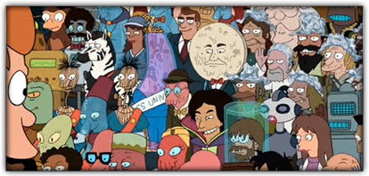

Time for some Mac Futurama crossover geekiness! In a fun watching process I've compiled a list of all the references to Apple's Macintosh and other Apple products. In Futurama we mainly see references to the old, classic Macs running [System 6](http://en.wikipedia.org/wiki/Apple_System_Software_6), [System 7](http://en.wikipedia.org/wiki/System_7) or [OS 9](http://en.wikipedia.org/wiki/Mac_OS_9) ending with the colorful iMac G3. This is likely caused by the timeframe in which Matt Groening and David X. Cohen developed the first season of Futurama (1997-1999).

The following screens from Futurama refer all to Macs available in or before 1999. Also you'll find some nice links to downloadable Futurama stuff for your Mac at the end of this article. And may the lawyers of Twentieth Century Fox now please stop reading.

For orientation: I've followed the original four season production cycle and not Fox's five seasons splitting. The "real" Season 5 are the recently released DVD movies/Episodes on Comedy Central.

_All screens (C) 1999 by Twentieth Century Fox Film Corp._

## Season 1

## 1ACV02 - The Series Has Landed

The moon farmer introduces his three robot daughters. One of them is named "Daisy May 128k" as a reference to the first [Macintosh 128k](http://en.wikipedia.org/wiki/Macintosh_128K).

## 1ACV05 - Fear Of A Bot Planet

Indeed the episode with the most Mac references. The Planet Express crew have to deliver a package to a planet settled by separatist robots. And guess what their favorite OS is?

The sound to start the daily human hunt is the [Mac startup chime](http://musicthing.blogspot.com/2005/05/tiny-music-makers-pt-4-mac-startup.html) composed by [Jim Reekes ](http://en.wikipedia.org/wiki/Jim_Reekes) and first used in 1991 on the [Macintosh Quadra 700](http://en.wikipedia.org/wiki/Macintosh_Quadra_700). Maybe the [Chime of Death](http://en.wikipedia.org/wiki/Chimes_of_Death) would be more suitable for that.

The judge is a not so friendly Macintosh 128k with a classic Mac OS Finder face. It uses Mac OS interface elements while judging and freezing at it.

But the robots have some cool computer voodoo to get him back judging without the need of a restart.

This one can be just coincidence or no Mac reference at all. The colors of the eyes and the mouths of the robot elders look pretty familiar to the [iMac G3 color flavors](http://www.apple.com/pr/photos/iMac/imaccolors.html) or the [original iBook colors](http://www.theapplecollection.com/iMac/iBook2.html) although there never was a yellow iMac (or iBook). 

## 1ACV10 A Flight to Remember

The robot guy on the bar mixes sad Bender a drink out of Jägermeister and some Pennzoil product. He is named iZac as a reference to the Apple iMac or more generally for the "i"-brand. Beside that iZac is written in kind of the same font (variant of [ITC Garamond](http://new.myfonts.com/fonts/itc/garamond/), thanks [Schoschie](http://www.kremalicious.com/2009/01/the-mac-in-futurama/#comment-48831)) as in [Apple's Think Different tagline and campaigns](http://web.archive.org/web/20010228171255/www.apple.com/thinkdifferent/). Furthermore (but non-Mac related) iZac is also a reference to Isaac the bartender from the TV series love boat from 1977, as ["yeah" pointed out in the comments](http://www.kremalicious.com/2009/01/the-mac-in-futurama/#comment-37416). Thanks yeah!

## 1ACV11 Mars University

The Robot House fraternity is spying at a Macintosh 128k in the girls bed rooms. 

## 1ACV12 - When Aliens Attack

The crew searches the Internet on a Mac OS system for facts about the TV series Single Female Lawyer. 

## Season 2

## 2ACV09 A Bicyclops Built For Two

Bender choses a disguise while being in the Internet. He does this with a Mac style menu. 

Alcasar submits Leela a video message which is played on Leelas display in a classic Mac OS styled window. 

## 2ACV15 The Problem With Popplers

Hermes finds the name Popplers while searching the Internet on an iBook G3 with a weird antenna on top of it. 

## 2ACV17 War Is The H-Word

Earth attacks the balls on Spheron 1 and a robot surgeon named iHawk operates the injured earthlings with a Martini in his hands. 

## Season 3

## 3ACV04 The Luck Of The Fryrish

Again the crew searches the Internet with a classic Mac OS interface. 

## 3ACV06 Bendless Love

The Bending School for robots seems to be running on Mac OS because it uses a Mac OS interface progress bar. 

## 3ACV15 I Dated A Robot

Sure enough, Prof. Farnsworth's blank robots are Mac formatted.

Billy starring the propaganda movie "I dated a robot!" downloads his Monroe-Bot with a classic Macintosh 128k. 

## Futurama 3ACV21 Future Stock

Planet Express is under new management of "that guy" from the 1980s. He shows the crew a new ad which is a parody of [Apple's legendary 1984 ad](http://www.youtube.com/watch?v=R706isyDrqI). 

## Season 4

## 4ACV06 Bender Should Not Be Allowed On TV

The president of the TV network (who seems to be just a plain non-Mac laptop), has some sort of QuickTime Player running on him.

## 4ACV08 Crimes Of The Hot

iZac again. 

## Season 5

## 5ACV01 Bender's Big Score Part 1

Bender is infected by the Scammers' obedience virus called iObey. 

## 5ACV15 Into The Wild Green Yonder Part 4

The audience in the violet dwarf star blowup or Encyclopod (or so) birth scene consists of many Futurama characters from all the Futurama series. If you look closely you can spot iZac again (upper left). In this screenshot there's also Matt Groening's head in the audience. 

## Futurama Stuff For Your Mac

[[Futurama Vol. 1-6](http://iconfactory.com/freeware/preview/fut1)
Amazing icons made by Iconfactory's [Gedeon Maheux](http://gedblog.com/). The recent [Volume 6 release](http://iconfactory.com/freeware/preview/fut6) also comes with some nice wallpapers showing silhouettes of the Planet Express crew members. [Vol.2](http://iconfactory.com/freeware/preview/fut2), [Vol.3](http://iconfactory.com/freeware/preview/fut3), [Vol.4](http://iconfactory.com/freeware/preview/fut4), [Vol.5](http://iconfactory.com/freeware/preview/fut5), [Vol.6](http://iconfactory.com/freeware/preview/fut6)
Also [a search for Futurama in the freeware section on Iconfactory.com](http://iconfactory.com/search/freeware/futurama) is always a good idea...

[What If? Machine Terminal Icon](http://scartissuemark.deviantart.com/art/What-If-Machine-Terminal-Icon-71455726)
A nice icon intended as a Terminal replacement icon made by [Mark Hawkins](http://scartissuemark.deviantart.com/).

[Futurama: Trash Replacement](http://scartissuemark.deviantart.com/art/Futurama-Trash-Replacement-71612045)
A nice icon showing a big bucket of Fishy Joe's Popplers. Made by [Mark Hawkins](http://scartissuemark.deviantart.com/) too.

[Futurama Random Quote Generator](http://www.apple.com/medias/dashboard/movie_tv/futuramarandomquotegenerator.html)
A Dashboard widget for Mac OS X giving you random quotes from Futurama. Made by [rawpixels](http://www.rawpixels.com/).

[Futurama Mars University Wallpaper](http://www.kremalicious.com/2008/09/new-goodie-futurama-mars-university-wallpaper/)
And there's my Futurama Mars University Wallpaper for Desktop and iPhone available in the [Goodies section](http://www.kremalicious.com/goodies) on this website.

[Futurama: Out Of Whale Oil Wallpaper Pack](http://www.kremalicious.com/2009/02/out-of-whale-oil/)
And finally there's my Futurama: Out Of Whale Oil Wallpaper pack for Desktop and iPhone also available in the [Goodies section](http://www.kremalicious.com/goodies) on this website. Vivid green and pink Feminista versions included.

And that's it folks. Hope you enjoyed this fun article. If you know of more Mac or Apple references in Futurama or links to nice Futurama icons, wallpapers or application resources feel free to post them in the comments.

As always: before making your next coffee you should share this article on your favorite social website. Your vote is highly appreciated! After you've finished voting and making your next coffee or tea you could subscribe to my [RSS-Feed](http://www.kremalicious.com/feed/), discuss this article or buy me my next coffee.
