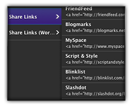

Ever wanted to include those sharing links to social or bookmarking sites so users can easily submit your content to these sites in a Wordpress site or any other platform? Then you might have experienced a rather time consuming search odyssey to get those links. But fear no more! In this article I've provided a huge collection of all the links to your favorite social sites compiled in two handy Coda Clip files in a plain and a Wordpress version. And the non-Coda users can download an html file with all the links included.

Additionally you'll find a huge list within this article with the separated links in two versions for each site. And finally I've put together a quick tutorial for using buttons or icons with these links. This way you can easily add content submit/sharing links to your sites in no time.


<!-- more -->

## Share Links Coda Clips Download

Also all links are plain html code and therefore the non-JavaScript versions of the various social sites' submit capabilities. While most social/bookmark sites have some kind of tool section where they explain the use of their API near all of them want you to use JavaScript to access their API and submit your content to them through the use of a link on your website.

But I think you don't want to load tons of scripts on your websites if you include links to tons of sharing sites. So mostly all links to submit your content to various social/bookmark sites can be realized in plain HTML as a generic a href link and that's what is provided here.

To make this a bit more straightforward I provide these links compiled within two Coda Clip files for use with [Panic's Coda](http://panic.com/coda). While the first clip group contains all the plain link snippets the second group includes those snippets for use with Wordpress. Just download and add them to your Coda Clips collection:

<a class="btn btn-primary icon icon-download" href="/media/share-link-bonanza-coda-clips.zip" title="Download Share Links Coda Clips">Download Share Links Coda Clips</a>

Included are a **total of 40 share links per clip group** for the following social/bookmark sites. This list uses the links provided in the Coda clips so you can test them out here with this article:

_
[Delicious](http://del.icio.us/post?url=http://www.kremalicious.com/2009/03/ultimate-coda-wordpress-share-link-bonanza/&title=Ultimate%20Share%20Link%20Bonanza%20For%20Coda%2C%20Wordpress%20And%20Everything%20Else), [StumbleUpon](http://www.stumbleupon.com/submit?url=http://www.kremalicious.com/2009/03/ultimate-coda-wordpress-share-link-bonanza/&title=Ultimate%20Share%20Link%20Bonanza%20For%20Coda%2C%20Wordpress%20And%20Everything%20Else), [Facebook](http://www.facebook.com/sharer.php?u=http://www.kremalicious.com/2009/03/ultimate-coda-wordpress-share-link-bonanza/?t=Ultimate%20Share%20Link%20Bonanza%20For%20Coda%2C%20Wordpress%20And%20Everything%20Else), [Twitter](http://twitter.com/home?status=Awesome Coda Clips collection! http://www.kremalicious.com/2009/03/ultimate-coda-wordpress-share-link-bonanza/), [Digg](http://digg.com/submit?url=http://www.kremalicious.com/2009/03/ultimate-coda-wordpress-share-link-bonanza/&title=Ultimate%20Share%20Link%20Bonanza%20For%20Coda%2C%20Wordpress%20And%20Everything%20Else&media=NEWS&thumbnails=1), [Design Float](http://www.designfloat.com/submit.php?url=http://www.kremalicious.com/2009/03/ultimate-coda-wordpress-share-link-bonanza/&title=Ultimate%20Share%20Link%20Bonanza%20For%20Coda%2C%20Wordpress%20And%20Everything%20Else), [Reddit](http://www.reddit.com/submit?url=http://www.kremalicious.com/2009/03/ultimate-coda-wordpress-share-link-bonanza/&title=Ultimate%20Share%20Link%20Bonanza%20For%20Coda%2C%20Wordpress%20And%20Everything%20Else), [Technorati](http://www.technorati.com/faves/?add=http://www.kremalicious.com/2009/03/ultimate-coda-wordpress-share-link-bonanza/), [Yahoo Buzz](http://buzz.yahoo.com/submit/?submitUrl=http://www.kremalicious.com/2009/03/ultimate-coda-wordpress-share-link-bonanza/&submitHeadline=Ultimate%20Share%20Link%20Bonanza%20For%20Coda%2C%20Wordpress%20And%20Everything%20Else), [Newsvine](http://www.newsvine.com/_tools/seed&save?u=http://www.kremalicious.com/2009/03/ultimate-coda-wordpress-share-link-bonanza/&h=Ultimate%20Share%20Link%20Bonanza%20For%20Coda%2C%20Wordpress%20And%20Everything%20Else), [Magnolia](http://ma.gnolia.com/bookmarklet/add?url=http://www.kremalicious.com/2009/03/ultimate-coda-wordpress-share-link-bonanza/&title=Ultimate%20Share%20Link%20Bonanza%20For%20Coda%2C%20Wordpress%20And%20Everything%20Else), [Google Bookmarks](http://www.google.com/bookmarks/mark?op=edit&bkmk=http://www.kremalicious.com/2009/03/ultimate-coda-wordpress-share-link-bonanza/&title=Ultimate%20Share%20Link%20Bonanza%20For%20Coda%2C%20Wordpress%20And%20Everything%20Else), [FriendFeed](http://friendfeed.com/share?url=http://www.kremalicious.com/2009/03/ultimate-coda-wordpress-share-link-bonanza/&title=Ultimate%20Share%20Link%20Bonanza%20For%20Coda%2C%20Wordpress%20And%20Everything%20Else), [Blogmarks](http://blogmarks.net/my/new.php?mini=1&url=http://www.kremalicious.com/2009/03/ultimate-coda-wordpress-share-link-bonanza/&title=Ultimate%20Share%20Link%20Bonanza%20For%20Coda%2C%20Wordpress%20And%20Everything%20Else), [MySpace](http://www.myspace.com/Modules/PostTo/Pages/?l=3&u=http://www.kremalicious.com/2009/03/ultimate-coda-wordpress-share-link-bonanza/&t=Ultimate%20Share%20Link%20Bonanza%20For%20Coda%2C%20Wordpress%20And%20Everything%20Else), [Script & Style](http://scriptandstyle.com/submit?url=http://www.kremalicious.com/2009/03/ultimate-coda-wordpress-share-link-bonanza/&title=Ultimate%20Share%20Link%20Bonanza%20For%20Coda%2C%20Wordpress%20And%20Everything%20Else), [Blinklist](http://blinklist.com/index.php?Action=Blink/addblink.php&Url=http://www.kremalicious.com/2009/03/ultimate-coda-wordpress-share-link-bonanza/&Title=Ultimate%20Share%20Link%20Bonanza%20For%20Coda%2C%20Wordpress%20And%20Everything%20Else), [Slashdot](http://slashdot.org/bookmark.pl?url=http://www.kremalicious.com/2009/03/ultimate-coda-wordpress-share-link-bonanza/&title=Ultimate%20Share%20Link%20Bonanza%20For%20Coda%2C%20Wordpress%20And%20Everything%20Else), [LinkedIn](http://www.linkedin.com/shareArticle?mini=true&url=http://www.kremalicious.com/2009/03/ultimate-coda-wordpress-share-link-bonanza/&title=Ultimate%20Share%20Link%20Bonanza%20For%20Coda%2C%20Wordpress%20And%20Everything%20Else&source=), [Windows Live](https://favorites.live.com/quickadd.aspx?marklet=1&mkt=en-us&url=http://www.kremalicious.com/2009/03/ultimate-coda-wordpress-share-link-bonanza/&title=Ultimate%20Share%20Link%20Bonanza%20For%20Coda%2C%20Wordpress%20And%20Everything%20Else&top=1), [Furl](http://furl.net/storeIt.jsp?u=http://www.kremalicious.com/2009/03/ultimate-coda-wordpress-share-link-bonanza/&t=Ultimate%20Share%20Link%20Bonanza%20For%20Coda%2C%20Wordpress%20And%20Everything%20Else), [Yahoo Bookmarks](http://bookmarks.yahoo.com/toolbar/savebm?opener=tb&u=http://www.kremalicious.com/2009/03/ultimate-coda-wordpress-share-link-bonanza/&t=Ultimate%20Share%20Link%20Bonanza%20For%20Coda%2C%20Wordpress%20And%20Everything%20Else), [Mixx](http://www.mixx.com/submit?page_url=http://www.kremalicious.com/2009/03/ultimate-coda-wordpress-share-link-bonanza/), [Propeller](http://www.propeller.com/submit/?U=http://www.kremalicious.com/2009/03/ultimate-coda-wordpress-share-link-bonanza/&T=Ultimate%20Share%20Link%20Bonanza%20For%20Coda%2C%20Wordpress%20And%20Everything%20Else), [Yigg](http://www.yigg.de/neu?exturl=http://www.kremalicious.com/2009/03/ultimate-coda-wordpress-share-link-bonanza/&exttitle=Ultimate%20Share%20Link%20Bonanza%20For%20Coda%2C%20Wordpress%20And%20Everything%20Else), [Mr Wong](http://www.mister-wong.com/index.php?action=addurl&bm_url=http://www.kremalicious.com/2009/03/ultimate-coda-wordpress-share-link-bonanza/&bm_description=Ultimate%20Share%20Link%20Bonanza%20For%20Coda%2C%20Wordpress%20And%20Everything%20Else), [Diigo](http://secure.diigo.com/post?url=http://www.kremalicious.com/2009/03/ultimate-coda-wordpress-share-link-bonanza/&title=Ultimate%20Share%20Link%20Bonanza%20For%20Coda%2C%20Wordpress%20And%20Everything%20Else), [N4G](http://www.n4g.com/tips.aspx?url=http://www.kremalicious.com/2009/03/ultimate-coda-wordpress-share-link-bonanza/&title=Ultimate%20Share%20Link%20Bonanza%20For%20Coda%2C%20Wordpress%20And%20Everything%20Else), [Current](http://current.com/clipper.htm?url=http://www.kremalicious.com/2009/03/ultimate-coda-wordpress-share-link-bonanza/&title=Ultimate%20Share%20Link%20Bonanza%20For%20Coda%2C%20Wordpress%20And%20Everything%20Else&src=st), [Simpy](http://www.simpy.com/simpy/LinkAdd.do?href=http://www.kremalicious.com/2009/03/ultimate-coda-wordpress-share-link-bonanza/&title=Ultimate%20Share%20Link%20Bonanza%20For%20Coda%2C%20Wordpress%20And%20Everything%20Else), [Oknotizie](http://oknotizie.alice.it/post?url=http://www.kremalicious.com/2009/03/ultimate-coda-wordpress-share-link-bonanza/&title=Ultimate%20Share%20Link%20Bonanza%20For%20Coda%2C%20Wordpress%20And%20Everything%20Else), [Care2](http://www.care2.com/news/compose?share[link_url]=http://www.kremalicious.com/2009/03/ultimate-coda-wordpress-share-link-bonanza/&share[title]=Ultimate%20Share%20Link%20Bonanza%20For%20Coda%2C%20Wordpress%20And%20Everything%20Else), [Faves](http://www.faves.com/Authoring.aspx?u=http://www.kremalicious.com/2009/03/ultimate-coda-wordpress-share-link-bonanza/&t=Ultimate%20Share%20Link%20Bonanza%20For%20Coda%2C%20Wordpress%20And%20Everything%20Else), [Meneame](http://meneame.net/submit.php?url=http://www.kremalicious.com/2009/03/ultimate-coda-wordpress-share-link-bonanza/), [Fresqui](http://ocio.fresqui.com/post?url=http://www.kremalicious.com/2009/03/ultimate-coda-wordpress-share-link-bonanza/&title=Ultimate%20Share%20Link%20Bonanza%20For%20Coda%2C%20Wordpress%20And%20Everything%20Else), [Funp](http://funp.com/pages/submit/add.php?title=Ultimate%20Share%20Link%20Bonanza%20For%20Coda%2C%20Wordpress%20And%20Everything%20Else&url=http://www.kremalicious.com/2009/03/ultimate-coda-wordpress-share-link-bonanza/&via=tools), [Kirtsy](http://www.kirtsy.com/submit.php?url=http://www.kremalicious.com/2009/03/ultimate-coda-wordpress-share-link-bonanza/), [Dealspl.us](http://dealspl.us/add.php?ibm=1&url=http://www.kremalicious.com/2009/03/ultimate-coda-wordpress-share-link-bonanza/), [Xanga](http://www.xanga.com/private/editorx.aspx?t=Ultimate%20Share%20Link%20Bonanza%20For%20Coda%2C%20Wordpress%20And%20Everything%20Else&u=http://www.kremalicious.com/2009/03/ultimate-coda-wordpress-share-link-bonanza/&s=), [Sphinn](http://sphinn.com/submit.php?url=http://www.kremalicious.com/2009/03/ultimate-coda-wordpress-share-link-bonanza/)_

## Bonus: Coda Clips Icon

There's no special icon for Coda Clips included in the recent Coda version (they use the blank one) so I quickly created one based on the other Coda file type icons. And the nice Panic guys allowed me to distribute this icon here. I've just made the 256px icon a bit sharper than the equivalent other coda file type icons.

If you download the above Coda Clip files this icon is already applied on the clip files but here're just the icon files (icns, folder, iContainer, PNGs):

<a class="btn btn-primary icon icon-download" href="http://www.kremalicious.com/media/coda-clips-icon-files.zip" title="Download Coda Clips Icon">Download Coda Clips Icon</a>

## 2. Usage

Just download and double click the Coda clip documents and two new clip groups will be created in your Coda Clips HUD with the various clips inside of them. All you have to do in Coda is inserting the clip by double clicking in the Coda Clips HUD and start typing your link text or type your link text first, select it and double click the clip in order to insert it.

That's because both collections have their placeholder selection (the ) located where the link text would be:

```html
<a href="" title=""></a>
```

As you can see I've also included the link title value usually with the name of the specific social site. Also I've already encoded all the entities so there shouldn't be any (X)HTML validation errors when using these links in your projects.

And depending on which collection you use additional steps need to be done:

## 2.1 Share Links

Everything you need to replace for yourself is written in capital letters:

**YOUR URL**
Here you have to provide the URL you want to have submitted when users use your share link.

**YOUR TITLE**
For all social sites this title has to be URL-encoded to work correctly. So be sure to replace everything like spaces, punctuation, etc. with their equivalent URL-encoding (e.g. %20 for a space). [Here's a reference for this](http://www.w3schools.com/TAGS/ref_urlencode.asp).

Apart from that some sites allow you to add and submit more informations than just the URL and the title and those things are also written in capital letters. Also I've included some usage comments where necessary like in the Digg link.

## 2.2 Share Links (Wordpress Edition)

The Wordpress edition of these share link collection includes some Wordpress php bits for dynamically creating the whole submit URL so there's no need to manually edit most of the links. The Wordpress template tags used are:

* `<?php the_permalink();?>` to create the URL dynamically depending on the article under which you have included the share and submit links.

* `<?php the_title(); ?>` to dynamically create the title which is used when your content gets submitted to one of the sites.

Anyway, as I've said above some sites allow more to submit here and you'll find this also in capital letters. You have to adjust them manually too.


## 3. Quick Tutorial For Using Icons With These Links

I've also written a quick tutorial in case you want to use little images as icons beside your links. To achieve this these two solution provided here should fit every need for this. You can do this by using one of these two techniques realized with HTML and CSS:

## 3.1 Use The &lt;img /&gt; Tag Element

Just include an img element wrapped inside the link tag, like so:

```html
<a href="http://del.icio.us/post?url=http://YOUR URL&amp;title=YOUR TITLE&amp;notes=YOUR NOTES" title="Save To Delicious"> Delicious</a>
```

And if you want to just use an icon with no text use just an img element without providing any link text:

```html
<a href="http://del.icio.us/post?url=http://YOUR URL&amp;title=YOUR TITLE&amp;notes=YOUR NOTES" title="Save To Delicious"></a>
```


## 3.2 Use CSS Background Images


To me a more cleaner solution is to use the css background-image property to include the icon images. Just add a class or an id to every share link like so:

```html
<a class="delicious" href="http://del.icio.us/post?url=http://YOUR URL&amp;title=YOUR TITLE&amp;notes=YOUR NOTES" title="Save To Delicious">Delicious</a>
```

And in your CSS select this class and style it with a background image. Assuming you want the site icon to appear left beside the link text you would also have to add some padding so the text won't overlap the icons:


```css
.delicious {
  background: url(delicious.png) no-repeat center center;
  padding-left: 20px;
}
```


If you want to use just icons and no text you should provide a link text anyway but hide it with css. This is a good practice for accessibility and search engine optimization. Also you would have to provide the dimensions of the icon:

```css
.delicious {
  width: 16px;
  height: 16px;
  background: url(delicious.png) no-repeat center center;
  text-indent: -999999px;
}
```

## 4. HTML File Download And All The Links Separated

Sadly Coda's clips aren't in a portable format ([Panic guys](http://panic.com), consider this is a feature request!) so here's a comprehensive list for the non-Coda users of all the links included in the above Coda Clips with plain and the Wordpress version for every site. This comes as a downloadable stripped-down HTML file (meaning there's no HTML site structure included) and as a long list within in this article. First, here's the HTML file download. Just open this locally in your browser or in your favorite editor:

<a class="btn btn-primary icon icon-download" href="http://www.kremalicious.com/media/share-link-bonanza-html.zip" title="Download Share Links HTML File">Download Share Links HTML File</a>

And here's the huge list with all the share links in case you quickly want to grab just one of them. But be warned that this is a huge list so this is hidden by default.

Just click the Toggle All Links button to reveal them and click it again to hide the whole list again. If you want to import one of these links into Coda you can just use the [Coda Clips bookmarklet created by kyle](http://www.rayogram.com/coda-clips-bookmarklet), as he points out [in the comments](http://www.kremalicious.com/2009/03/ultimate-coda-wordpress-share-link-bonanza/#comment-42084).

↓ Toggle All Links ↓

## Delicious

**Plain**
`<a href="http://del.icio.us/post?url=http://YOUR URL&amp;title=YOUR TITLE&amp;notes=YOUR NOTES" title="Save To Delicious"></a>`

**Wordpress**
`<a href="http://del.icio.us/post?url=<?php the_permalink();?>&amp;title=<?php the_title(); ?>&amp;notes=YOUR NOTES" title="Save To Delicious"></a>
`

## StumbleUpon


**Plain**
`<a href="http://www.stumbleupon.com/submit?url=http://YOUR URL&amp;title=YOUR TITLE" title="Stumble It!">StumbleUpon</a>`

**Wordpress**
`<a href="http://www.stumbleupon.com/submit?url=<?php the_permalink();?>&amp;title=<?php the_title(); ?>" title="Stumble It!">StumbleUpon</a>`


## Facebook


**Plain**
`<a href="http://www.facebook.com/sharer.php?u=http://YOUR URL?t=YOUR TITLE" title="Share On Facebook">Facebook</a>`

**Wordpress**
`<a href="http://www.facebook.com/sharer.php?u=<?php the_permalink();?>?t=<?php the_title(); ?>" title="Share On Facebook">Facebook</a>`


## Twitter


**Plain**
`<a href="http://twitter.com/home?status=YOUR MESSAGE ALONG WITH YOUR URL" title="Tweet This">Twitter</a>`

**Wordpress**
`<a href="http://twitter.com/home?status=YOUR MESSAGE <?php the_title(); ?> <?php the_permalink();?>" title="Tweet This">Twitter</a>`


## Digg


**Plain**


    <code class="html"><!-- Digg This Link

    	Usage:
    	--------------------------------------------------
    	url		: URL-encode all strings as appropriate.
    			  For example:
    			  http%3A%2F%2Fyourwebsite%2Fyourstoryurl.html
    			  Maximum length is 255 characters
    	title	: Also URL-encode the story title
    			  Maximum length 75 characters
    	bodytext	: Also URL-encode the body text
    			  Maximum length is 350 characters
    	media	: default is news, choices are news, video or image
    	topic	: only one category
    -->
    <a href="http://digg.com/submit?url=YOUR URL&
    title=YOUR TITLE&
    bodytext=YOUR DESCRIPTION&
    media=NEWS, VIDEO or IMAGES&
    topic=TOPIC&thumbnails=1" title="Digg This">Digg</a></code>


**Wordpress**
`<a href="http://digg.com/submit?url=<?php the_permalink();?>&title=<?php the_title(); ?>&amp;bodytext=YOUR DESCRIPTION&amp;media=NEWS, VIDEO or IMAGES&amp;topic=TOPIC&amp;thumbnails=1" title="Digg This">Digg</a>`


## Design Float


**Plain**
`<a href="http://www.designfloat.com/submit.php?url=http://YOUR URL&amp;title=YOUR TITLE" title="Float This!">Design Float</a>`

**Wordpress**
`<a href="http://www.designfloat.com/submit.php?url=<?php the_permalink();?>&amp;title=<?php the_title(); ?>" title="Float This!">Design Float</a>`


## Reddit


**Plain**
`<a href="http://www.reddit.com/submit?url=http://YOUR URL&amp;title=YOUR TITLE" title="Reddit">Reddit</a>`

**Wordpress**
`<a href="http://www.reddit.com/submit?url=<?php the_permalink();?>&amp;title=<?php the_title(); ?>" title="Reddit">Reddit</a>`


## Technorati


**Plain**
`<a href="http://www.technorati.com/faves/?add=http://YOUR URL" title="Technorati">Technorati</a>`

**Wordpress**
`<a href="http://www.technorati.com/faves/?add=<?php the_permalink();?>" title="Technorati">Technorati</a>`


## Yahoo Buzz


**Plain**
`<a href="http://buzz.yahoo.com/submit/?submitUrl=http://YOUR URL&amp;submitHeadline=YOUR TITLE" title="Buzz Up!">Yahoo Buzz</a>`

**Wordpress**
`<a href="http://buzz.yahoo.com/submit/?submitUrl=<?php the_permalink();?>&amp;submitHeadline=<?php the_title(); ?>" title="Buzz Up!">Yahoo Buzz</a>`


## Newsvine


**Plain**
`<a href="http://www.newsvine.com/_tools/seed&amp;save?u=http://YOUR URL&amp;h=YOUR TITLE" title="Newsvine">Newsvine</a>`

**Wordpress**
`<a href="http://www.newsvine.com/_tools/seed&amp;save?u=<?php the_permalink();?>&amp;h=<?php the_title(); ?>" title="Newsvine">Newsvine</a>`


## Magnolia


**Plain**
`<a href="http://ma.gnolia.com/bookmarklet/add?url=http://YOUR URL&amp;title=YOUR TITLE" title="Magnolia">Magnolia</a>`

**Wordpress**
`<a href="http://ma.gnolia.com/bookmarklet/add?url=<?php the_permalink();?>&amp;title=<?php the_title(); ?>" title="Magnolia">Magnolia</a>`


## Google Bookmarks


**Plain**
`<a href="http://www.google.com/bookmarks/mark?op=edit&bkmk=http://YOUR URL&amp;title=YOUR TITLE" title="Save To Google Bookmarks">Google Bookmarks</a>`

**Wordpress**
`<a href="http://www.google.com/bookmarks/mark?op=edit&bkmk=<?php the_permalink();?>&amp;title=<?php the_title(); ?>" title="Save To Google Bookmarks">Google Bookmarks</a>`


## FriendFeed


**Plain**
`<a href="http://friendfeed.com/share?url=http://YOUR URL&amp;title=YOUR TITLE" title="Share ON FriendFeed">FriendFeed</a>`

**Wordpress**
`<a href="http://friendfeed.com/share?url=<?php the_permalink();?>&amp;title=<?php the_title(); ?>" title="Share ON FriendFeed">FriendFeed</a>`


## Blogmarks


**Plain**
`<a href="http://blogmarks.net/my/new.php?mini=1&amp;url=http://YOUR URL&amp;title=YOUR TITLE" title="Save To Blogmarks">Blogmarks</a>`

**Wordpress**
`<a href="http://blogmarks.net/my/new.php?mini=1&amp;url=<?php the_permalink();?>&amp;title=<?php the_title(); ?>" title="Save To Blogmarks">Blogmarks</a>`


## MySpace


**Plain**
`<a href="http://www.myspace.com/Modules/PostTo/Pages/?l=3&amp;u=http://YOUR URL&amp;t=YOUR TITLE&amp;c=YOUR COMMENT" title="MySpace">MySpace</a>`

**Wordpress**
`<a href="http://www.myspace.com/Modules/PostTo/Pages/?l=3&amp;u=<?php the_permalink();?>&amp;t=<?php the_title(); ?>&amp;c=YOUR COMMENT" title="MySpace">MySpace</a>`


## Script & Style


**Plain**
`<a href="http://scriptandstyle.com/submit?url=http://>YOUR URL&amp;title=YOUR TITLE" title="Script &amp; Style">Script & Style</a>`

**Wordpress**
`<a href="http://scriptandstyle.com/submit?url=<?php the_permalink();?>&amp;title=<?php the_title(); ?>" title="Script &amp; Style">Script & Style</a>`


## Blinklist


**Plain**
`<a href="http://blinklist.com/index.php?Action=Blink/addblink.php&amp;Url=http://YOUR URL&amp;Title=YOUR TITLE" title="Blinklist">Blinklist</a>`

**Wordpress**
`<a href="http://blinklist.com/index.php?Action=Blink/addblink.php&amp;Url=<?php the_permalink();?>&amp;Title=<?php the_title(); ?>" title="Blinklist">Blinklist</a>`


## Slashdot


**Plain**
`<a href="http://slashdot.org/bookmark.pl?url=http://YOUR URL&amp;title=YOUR TITLE" title="Slashdot">Slashdot</a>`

**Wordpress**
`<a href="http://slashdot.org/bookmark.pl?url=<?php the_permalink();?>&amp;title=<?php the_title(); ?>" title="Slashdot">Slashdot</a>`


## LinkedIn


**Plain**
`<a href="http://www.linkedin.com/shareArticle?mini=true&amp;url=http://YOUR URL&amp;title=YOUR TITLE&amp;summary=YOUR SUMMARY&amp;source=" title="LinkedIn">LinkedIn</a>`

**Wordpress**
`<a href="http://www.linkedin.com/shareArticle?mini=true&amp;url=<?php the_permalink();?>&amp;title=<?php the_title(); ?>&amp;summary=YOUR SUMMARY&amp;source=" title="LinkedIn">LinkedIn</a>`


## Windows Live


**Plain**
`<a href="https://favorites.live.com/quickadd.aspx?marklet=1&amp;mkt=en-us&amp;url=http://YOUR URL&amp;title=YOUR TITLE&amp;top=1" title="Windows Live">Windows Live</a>`

**Wordpress**
`<a href="https://favorites.live.com/quickadd.aspx?marklet=1&amp;mkt=en-us&amp;url=<?php the_permalink();?>&amp;title=<?php the_title(); ?>&amp;top=1" title="Windows Live">Windows Live</a>`


## Furl


**Plain**
`<a href="http://furl.net/storeIt.jsp?u=http://YOUR URL&amp;t=YOUR TITLE" title="Furl">Furl</a>`

**Wordpress**
`<a href="http://furl.net/storeIt.jsp?u=<?php the_permalink();?>&amp;t=<?php the_title(); ?>" title="Furl">Furl</a>`


## Yahoo Bookmarks


**Plain**
`<a href="http://bookmarks.yahoo.com/toolbar/savebm?opener=tb&amp;u=http://YOUR URL&amp;t=YOUR TILE" title="Yahoo! Bookmarks">Yahoo Bookmarks</a>`

**Wordpress**
`<a href="http://bookmarks.yahoo.com/toolbar/savebm?opener=tb&amp;u=<?php the_permalink();?>&amp;t=<?php the_title(); ?>" title="Yahoo! Bookmarks">Yahoo Bookmarks</a>`


## Mixx


**Plain**
`<a href="http://www.mixx.com/submit?page_url=http://YOUR URL" title="Mixx">Mixx</a>`

**Wordpress**
`<a href="http://www.mixx.com/submit?page_url=<?php the_permalink();?>" title="Mixx">Mixx</a>`


## Propeller


**Plain**
`<a href="http://www.propeller.com/submit/?U=http://YOUR URL&amp;T=YOUR TITLE" title="Propeller">Propeller</a>`

**Wordpress**
`<a href="http://www.propeller.com/submit/?U=<?php the_permalink();?>&amp;T=<?php the_title(); ?>" title="Propeller">Propeller</a>`


## Yigg


**Plain**
`<a href="http://www.yigg.de/neu?exturl=http://YOUR URL&amp;exttitle=YOUR TITLE" title="Yigg">Yigg</a>`

**Wordpress**
`<a href="http://www.yigg.de/neu?exturl=<?php the_permalink();?>&amp;exttitle=<?php the_title(); ?>" title="Yigg">Yigg</a>`


## Mr Wong


**Plain**
`<a href="http://www.mister-wong.com/index.php?action=addurl&amp;bm_url=http://YOUR URL&amp;bm_description=YOUR TITLE" title="Mr Wong">Mr Wong</a>`

**Wordpress**
`<a href="http://www.mister-wong.com/index.php?action=addurl&amp;bm_url=<?php the_permalink();?>&amp;bm_description=<?php the_title(); ?>" title="Mr Wong">Mr Wong</a>`


## Diigo


**Plain**
`<a href="http://secure.diigo.com/post?url=http://YOUR URL&amp;title=YOUR TITLE" title="Diigo">Diigo</a>`

**Wordpress**
`<a href="http://secure.diigo.com/post?url=<?php the_permalink();?>&amp;title=<?php the_title(); ?>" title="Diigo">Diigo</a>`


## N4G


**Plain**
`<a href="http://www.n4g.com/tips.aspx?url=http://YOUR URL&amp;title=YOUR TITLE" title="N4G">N4G</a>`

**Wordpress**
`<a href="http://www.n4g.com/tips.aspx?url=<?php the_permalink();?>&amp;title=<?php the_title(); ?>" title="N4G">N4G</a>`


## Current


**Plain**
`<a href="http://current.com/clipper.htm?url=http://YOUR URL&amp;title=YOUR TITLE&amp;src=st" title="Current">Current</a>`

**Wordpress**
`<a href="http://current.com/clipper.htm?url=<?php the_permalink();?>&amp;title=<?php the_title(); ?>&amp;src=st" title="Current">Current</a>`


## Simpy


**Plain**
`<a href="http://www.simpy.com/simpy/LinkAdd.do?href=http://YOUR URL&amp;title=YOUR TITLE" title="Simpy">Simpy</a>`

**Wordpress**
`<a href="http://www.simpy.com/simpy/LinkAdd.do?href=<?php the_permalink();?>&amp;title=<?php the_title(); ?>" title="Simpy">Simpy</a>`


## Oknotizie


**Plain**
`<a href="http://oknotizie.alice.it/post?url=http://YOUR URL&amp;title=YOUR TITLE" title="Oknotizie">Oknotizie</a>`

**Wordpress**
`<a href="http://oknotizie.alice.it/post?url=<?php the_permalink();?>&amp;title=<?php the_title(); ?>" title="Oknotizie">Oknotizie</a>`


## Care2


**Plain**
`<a href="http://www.care2.com/news/compose?share[link_url]=http://YOUR URL&amp;share[title]=YOUR TITLE" title="Care2">Care2</a>`

**Wordpress**
`<a href="http://www.care2.com/news/compose?share[link_url]=<?php the_permalink();?>&amp;share[title]=<?php the_title(); ?>" title="Care2">Care2</a>`


## Faves


**Plain**
`<a href="http://www.faves.com/Authoring.aspx?u=http://YOUR URL&amp;t=YOUR TITLE" title="Faves">Faves</a>`

**Wordpress**
`<a href="http://www.faves.com/Authoring.aspx?u=<?php the_permalink();?>&amp;t=<?php the_title(); ?>" title="Faves">Faves</a>`


## Meneame


**Plain**
`<a href="http://meneame.net/submit.php?url=http://YOUR URL" title="Meneame">Meneame</a>`

**Wordpress**
`<a href="http://meneame.net/submit.php?url=<?php the_permalink();?>" title="Meneame">Meneame</a>`


## Fresqui


**Plain**
`<a href="http://ocio.fresqui.com/post?url=http://YOUR URL&amp;title=YOUR TITLE" title="Fresqui">Fresqui</a>`

**Wordpress**
`<a href="http://ocio.fresqui.com/post?url=<?php the_permalink();?>&amp;title=<?php the_title(); ?>" title="Fresqui">Fresqui</a>`


## Funp


**Plain**
`<a href="http://funp.com/pages/submit/add.php?title=YOUR TITLE&amp;url=http://YOUR URL&amp;via=tools" title="Funp">Funp</a>`

**Wordpress**
`<a href="http://funp.com/pages/submit/add.php?title=<?php the_title(); ?>&amp;url=<?php the_permalink();?>&amp;via=tools" title="Funp">Funp</a>`


## Kirtsy


**Plain**
`<a href="http://www.kirtsy.com/submit.php?url=http://YOUR URL" title="Kirtsy">Kirtsy</a>`

**Wordpress**
`<a href="http://www.kirtsy.com/submit.php?url=<?php the_permalink();?>" title="Kirtsy">Kirtsy</a>`


## Dealspl.us


**Plain**
`<a href="http://dealspl.us/add.php?ibm=1&amp;url=http://YOUR URL" title="Dealspl.us">Dealspl.us</a>`

**Wordpress**
`<a href="http://dealspl.us/add.php?ibm=1&amp;url=<?php the_permalink();?>" title="Dealspl.us">Dealspl.us</a>`


## Xanga


**Plain**
`<a href="http://www.xanga.com/private/editorx.aspx?t=YOUR TITLE&amp;u=http://YOUR URL&amp;s=" title="Xanga">Xanga</a>`

**Wordpress**
`<a href="http://www.xanga.com/private/editorx.aspx?t=<?php the_title(); ?>&amp;u=<?php the_permalink();?>&amp;s=" title="Xanga">Xanga</a>`


## Sphinn


**Plain**
`<a href="http://sphinn.com/submit.php?url=http://YOUR URL" title="Sphinn">Sphinn</a>`

**Wordpress**
`<a href="http://sphinn.com/submit.php?url=<?php the_permalink();?>" title="Sphinn">Sphinn</a>`

## 5. Please Jump Around, Then Spread The Word


If you ever wanted or had to include such sharing links manually in your sites and searched hours for those you should already have recognized the value of this article and if not already happened you can now jump around to express your enjoyment. After this you should immediately bookmark or share this site on your favorite social site. And while you're at it [I could use another coffee](https://www.paypal.com/cgi-bin/webscr?cmd=_donations&business=krema%40jpberlin%2ede&item_name=kremalicious%2ecom%20%2d%20Buy%20me%20a%20coffee%20or%20two%20or%20three%20or%20more&no_shipping=1&return=http%3a%2f%2fwww%2ekremalicious%2ecom%2fthank%2dyou%2f&tax=0&currency_code=EUR&lc=US&bn=PP%2dDonationsBF&charset=UTF%2d8).

And that's it. If you think there should be another site added feel free to post them in the comments or shoot me a note [via my contact form](http://www.kremalicious.com/about/contact). Also possible errors or any additions are much appreciated. If useful I will add your additions or more site links to the codaclips files and will update the article.

Also I would like to provide these links as [Espresso](http://macrabbit.com/espresso/) snippets probably as part of the HTML-(or PHP?)-Sugar but this seems to be rather complicated at the moment. As soon as this becomes more straightforward I will add these to this article. But if you're already advanced in creating Espresso sugars and would like to help me with this [please contact me!](http://www.kremalicious.com/about/contact)
