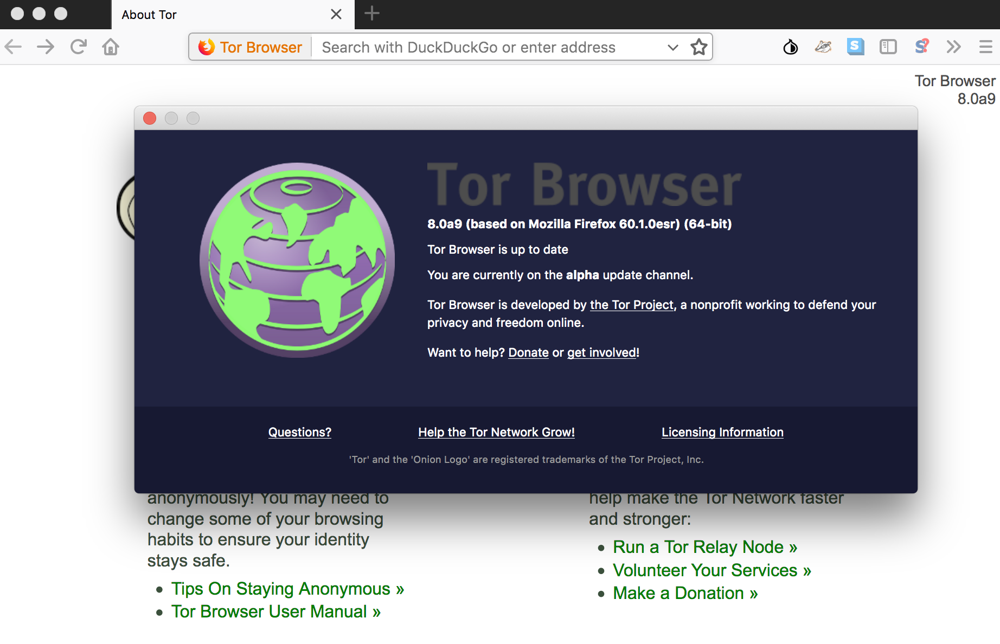

There are many reasons you might want to browse anonymously which can be accomplished by using [Tor](https://www.torproject.org). The setup instructions on Tor's website are quite scattered and outdated so here are some steps to setup Tor on macOS with a simple automated script at the end.

I'm using macOS High Sierra (10.13) for the following instructions but it should work on almost any macOS version.

## Table of Contents

  - [Tor Browser](#tor-browser)
  - [Install Tor](#install-tor)
  - [Set network proxy settings via System Preferences](#set-network-proxy-settings-via-system-preferences)
  - [All in one go: start Tor &amp; set network proxy settings automatically](#all-in-one-go-start-tor-set-network-proxy-settings-automatically)
  - [Non-standard apps](#non-standard-apps)

---

## Tor Browser



The most simple way to surf anonymously with Tor is to just grab [Tor Browser](https://www.torproject.org/projects/torbrowser.html.en). It's a modified version of [Firefox Extended Support Release (ESR)](https://www.mozilla.org/en-US/firefox/organizations/) with Tor and some extensions (Torbutton, TorLauncher, NoScript, and HTTPS-Everywhere) built right in. Upon start, Tor Browser automatically starts the required Tor background processes and routes traffic through the Tor network. That's the way to go if you want the highest level of protection without much further configuration.

But it's based on an old version of Firefox and there might be more you want to do anonymously on your machine than just browsing the web, like accessing resources via the Terminal or any other app. Or just use the browser you're used to.

For this you need to have Tor installed on your system and additionally set specific proxy values in your network preferences after you've started Tor.

<div class="alert alert-info">
    <p>Be aware that the instructions and the script mentioned below will not make whatever you do on the web anonymous. Much depends on your browsing habits, what apps you're using, and none of the methods below will offer the same level of protection than <a href="https://www.torproject.org/projects/torbrowser.html.en">Tor Browser</a> out of the box. You have been warned.</p>
</div>

## Install Tor

Contrary to the weirdly outdated [install instructions on Tor's website](https://www.torproject.org/docs/tor-doc-osx.html.en) (hey, remember Macports?), installing Tor on macOS is super simple with [Homebrew](http://brew.sh).

In your Terminal execute:

```bash
brew install tor
```

Then you can start it up by running:

```bash
tor
```

Congratulations, you now have Tor running on your system. But none of your network traffic is routed through it yet.

In order for all your system traffic being routed through Tor you need to adjust your system's network proxy settings which you can either do visually in the System Preferences or programmatically via macOS's builtin `networksetup`.

## Set network proxy settings via System Preferences

You can do this under *System Preferences > Network* by creating a specific Tor network location for it:

1. From Location dropdown at the top, select *Edit Locations...*
1. Create a new location by hitting the plus button and name it *Tor*. Hitting Done will select the new location which is now ready to be configured.
1. Go to *Advanced > Proxies* and activate *SOCKS Proxy* and add those values:

- *SOCKS proxy server*: `localhost`
- *Port*: `9050`


After hitting *OK* & *Apply* at the initial network screen, you can easily switch to this newly created location from your menu bar under * > Location* whenever you start up Tor.

Switching to the Tor location routes all network traffic on your system through Tor. Note that you have to repeat those steps for every other network interface if you use, say, Wi-Fi and Ethernet interchangeably.

## All in one go: start Tor & set network proxy settings automatically

When you're already in the Terminal to start up Tor, additionally setting the network settings involves a lot of fiddling around. Ain't nobody got time for that.

Thankfully macOS provides a way to programmatically set those proxy values via the `networksetup` utility. I've found a [nice script](http://leonid.shevtsov.me/en/an-easy-way-to-use-tor-on-os-x) for this but running it opened multiple admin password prompts. So I extended it a bit to make it more user friendly.

In a nutshell, this shell script asks you for your admin password upfront, starts up Tor, and sets all required proxy network settings automatically:

```bash
#!/usr/bin/env bash

# 'Wi-Fi' or 'Ethernet' or 'Display Ethernet'
INTERFACE=Wi-Fi

# Ask for the administrator password upfront
sudo -v

# Keep-alive: update existing `sudo` time stamp until finished
while true; do sudo -n true; sleep 60; kill -0 "$$" || exit; done 2>/dev/null &

# trap ctrl-c and call disable_proxy()
function disable_proxy() {
    sudo networksetup -setsocksfirewallproxystate $INTERFACE off
    echo "$(tput setaf 64)" #green
    echo "SOCKS proxy disabled."
    echo "$(tput sgr0)" # color reset
}
trap disable_proxy INT

# Let's roll
sudo networksetup -setsocksfirewallproxy $INTERFACE 127.0.0.1 9050 off
sudo networksetup -setsocksfirewallproxystate $INTERFACE on

echo "$(tput setaf 64)" # green
echo "SOCKS proxy 127.0.0.1:9050 enabled."
echo "$(tput setaf 136)" # orange
echo "Starting Tor..."
echo "$(tput sgr0)" # color reset

tor
```

Save this script under something like `tor.sh` in one of your sourced `bin` folders, make it executable with `chmod + x` and use it as a replacement for the general `tor` command. So you can just run

```bash
tor.sh
```

and Tor should run smoothly on your system without additional configuration:


Verify you're indeed browsing over the Tor network by going to [check.torproject.org](https://check.torproject.org).

When you're done, just exit the script with <kbd>ctrl</kbd> + <kbd>c</kbd> and the network settings will be reverted to their previous configuration.

## Non-standard apps

Some apps are just not good Mac citizens and use their own network settings, ignoring macOS system network proxy settings. E.g. older versions of Google Chrome were using their own custom network settings and therefore were not routing their web traffic through the proxy configured in System Preferences.

But the most recent Chrome version automatically picks up macOS's native proxy settings, as does the most recent version of Firefox.

Always [check](https://check.torproject.org) your Tor connection with whatever app you're using and if needed set the proxy preferences manually in the respective app with:

- *SOCKS proxy server*: `localhost`
- *Port*: `9050`

