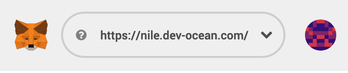

Explore, download, and publish 1000+ open data sets in Ocean’s Nile Network.

---

> This article was [originally posted on Medium in the Ocean Protocol blog](https://blog.oceanprotocol.com/the-commons-data-marketplace-c57a44288314).

---

At Ocean, we ourselves are a team of data scientists, AI researchers, and big data enthusiasts — so naturally in the spirit of eating our own sea food, we set out to build a marketplace around a narrow and clear use case.

We’ve created [Commons](https://commons.oceanprotocol.com/), a marketplace to explore, download, and publish open data sets! Commons is built on top of the [Ocean Nile beta network](https://medium.com/@TeamOcean/51afd6145b6c), which has just been released.

- [**Commons →**](https://commons.oceanprotocol.com)

## Explore, download, and publish open data sets

The primary target audience for our [Commons Marketplace](https://commons.oceanprotocol.com/) is enthusiastic & data-hungry data scientists with some crypto experience. It can be used with any Web3-capable browser, like Firefox with [MetaMask](https://metamask.io) installed.

All permissions are handled through your wallet account in MetaMask, there’s no login or password or any of that old-school Web 2.0 stuff. You unlock your MetaMask account, and you’re ready to go.

You can discover the open data sets in Ocean’s Nile network, even if you don’t use a Web3-capable browser.

While focusing on free data assets only, Commons has the full Ocean Protocol flow implemented for registering and consuming assets. All files attached to an asset have their URLs encrypted and when you want to consume a data asset, URLs are decrypted and the respective files are downloaded.

In its current state, the Commons marketplace is a minimum useful product to help you get a feel for what a data marketplace could look like in the future. Expect many more iterations in the next weeks and months. If you run into issues, or want to suggest new features, feel free to [report them on GitHub](https://github.com/oceanprotocol/commons/issues/new).

### What’s available?

Commons allows you to access thousands of datasets for free that have been registered on the Ocean network. Most of the data that is currently available is primarily tabular data in structured formats such as excel spreadsheets.

Currently many of the registered assets include datasets from The Hong Kong Office of the Government Chief Information Officer Of the Government of the Hong Kong Special Administrative Region. Hong Kong datasets represent 18 different categories including health, urban planning, education, housing, employment, population, transportation and more. These datasets are of particular value given their clear structure and domain focus.

Other datasets include some of the most popular datasets from OpenML an open, organized, online ecosystem for machine learning data.

A large portion of datasets currently on the Commons come from the Singapore Government and include public data from local municipalities related to transportation, weather and health. Ocean Protocol collaborates closely with the Government of Singapore on various data driven projects including special projects with the IMDA.

### What can you do on Commons?

If you are looking for quality data, you can easily use the Commons to search for and find publicly available datasets that are free of charge. Data formats include image, audio, deep learning weights, tabular, ARFF and notebook files.

If you are interested in sharing your data you can use the Commons to publish data into the Ocean Protocol Network. To publish data, start by adding a title and URL of the data set as well as essential metadata and a thorough description of the data set.

- [**Publish →**](https://commons.oceanprotocol.com/publish)

If you have large amounts of data that you are interested in sharing, please contact us about supporting you to perform bulk data registration.

### How does publishing data work?

When publishing or registering a dataset on to Ocean, first the metadata is collected and entered. The metadata is then sent to Aquarius, the off-chain database store for data assets metadata. In Aquarius, the metadata is validated. A checksum is created based on certain metadata fields. Finally, the assets get registered, returning the DID.

Check out the [OEP-11](https://github.com/oceanprotocol/OEPs/tree/master/11#publishing) to learn the details of this flow.

> Note: Datasets are NOT uploaded onto Ocean Protocol and the data owner retains full control of their data.

### What is the goal of Commons?

As the popular phrase goes, “Information wants to be free”, and this is especially true when applied to free data. In establishing the Commons Marketplace, Ocean Protocol aims to enable the safe and secure exchange of data and to grant individuals and organizations easier access to data that can be used to help solve pressing societal problems and develop valuable business solutions.

## Setup MetaMask and get some Ether for Nile

To publish and download assets, you must point MetaMask towards Ocean’s Nile network. You also need to have some Ether in your account to pay gas costs.

To connect to the Nile network:

1. select _Custom RPC_ in the network dropdown in MetaMask

2. under _New Network_, enter [https://nile.dev-ocean.com](https://nile.dev-ocean.com) as the custom RPC URL

3. Hit _Save_, and you’re now connected to Nile:

The Commons marketplace includes a faucet functionality under [https://commons.oceanprotocol.com/faucet](https://commons.oceanprotocol.com/faucet) from where you can easily request some Ether to be added to your account by clicking the _Request Ether_ button:

## Build on top of Commons

While focused on free data assets, Commons has the full Ocean Protocol flow implemented for registering and consuming assets. In other words, Commons can be seen as a basic reference marketplace that could be used as a boilerplate for creating other marketplaces on Ocean.

From a developer perspective, the Commons Marketplace is a more streamlined client than [Pleuston](https://github.com/oceanprotocol/pleuston). It’s a simple React app setup with [squid-js](https://github.com/oceanprotocol/squid-js), our JavaScript library to communicate against the various Ocean Protocol components. The marketplace is pointed towards Ocean’s Nile Test network with its own [Aquarius](https://github.com/oceanprotocol/aquarius) database.

Additionally, this client works in tandem with a small Node.js Express server providing various micro services, like remote url file checking.

Since the full payment flow is in there, it’s trivial to use the [Commons GitHub repository](https://github.com/oceanprotocol/commons) as a boilerplate for your own marketplace(s). We simply set the price of every published asset to 0, and only show assets with a price of 0, and charge 0 OCEAN when a user consumes an asset file, all of which can be easily modified for your own use case.

- [**GitHub: oceanprotocol/commons →**](https://github.com/oceanprotocol/commons)

In its current state, the Commons marketplace is a minimum viable product intended to help users get a feel for a basic data marketplace looks like. Moving forward the future commons will continue to evolve.

### Tell us what you think

The development team is eagerly awaiting feedback from the community about the commons marketplace and what new features would be helpful and add value so actively test the marketplace and give feedback (downloading assets, publishing assets, etc).

- [**GitHub Issues: oceanprotocol/commons →**](https://github.com/oceanprotocol/commons/issues)

We hope you dive in and start enjoying this vast (**over 1k!**) selection of free, open datasets — you are a pioneer in the New Data Economy!

---

> A follow up is available: [The Commons Marketplace in Pacific Network →](/the-commons-marketplace-in-pacific-network)

---
