We’ve been busy over the last few months, further developing the Commons Marketplace alongside creating the Pacific PoA Network.

---

> This article was originally posted [on Medium in the Ocean Protocol blog](https://blog.oceanprotocol.com/the-commons-marketplace-in-pacific-network-4bcf2f595721).

---

When [we started with the Commons Marketplace](https://blog.oceanprotocol.com/the-commons-data-marketplace-c57a44288314), we built it on top of our [Nile Testnet](https://blog.oceanprotocol.com/announcing-the-ocean-protocol-nile-beta-network-64b6c4d06120). Besides showcasing the technology behind Ocean Protocol, it helped us to verify what we had built as well as to further improve on the Ocean components. Building our own reference marketplace with a specific use case, combined with the latest developed underlying technology, proved to be valuable in spotting and fixing the issues we were running into in Nile while building the [Pacific Mainnet](https://blog.oceanprotocol.com/announcing-pacific-network-live-poa-mainnet-6c343f48e866).

Since then, we’ve had the chance to analyze real-world usage of the marketplace, giving us valuable insights into expectations of the users and developers that are utilizing Ocean Protocol technology.

## 🏄‍♀️ Consume Flow Improvements

Downloading an asset file, a process we call consuming, is at the heart of what Ocean Protocol offers to ensure control of a registered data set by the publisher. Only under the conditions set by the publisher, a consumer will be allowed to do so. Revealing those conditions requires entering a cryptographic signing process first, no matter the conditions.

When an asset is registered into Ocean Protocol, the file URLs are encrypted and the encrypted URLs are stored in the [data set metadata](https://blog.oceanprotocol.com/ocean-protocol-details-metadata-94723a728efa), the unencrypted URLs are never stored. Only entering the consume flow will decrypt and unveil these file URLs. This process proved to be unstable and often took a long time to complete in Nile.

We tweaked all of the relevant [Ocean Protocol components](https://docs.oceanprotocol.com/concepts/components/) in the background (Aquarius, Brizo, Secret Store, Squid-js) to be able to provide a faster consume flow. We also added more real-time feedback during the whole process in the UI. In combination, these steps introduced a much more stable consume flow and a dramatic decrease in real and perceived time required to download an asset in Pacific.

It is still not as fast as we would like it to be, and we will continue to make improvements on the speed over time.

## 🔥 Burner Wallets: Commons Without Any Setup

Since the launch of Commons, a Web3-capable browser with a wallet setup was required before full functionality became available. Without a wallet, and without a Web3-capable browser, the search feature *was *possible, but publishing or downloading data sets were not, because those processes require a cryptographic signing process — something which can only be done with a Web3 wallet.

We found this to be one of the main pain points users had when interacting with a marketplace providing free and publicly available data. Using the right browser, relying on a browser plugin, setting up a wallet, possibly managing crypto tokens, and connecting to the right network proved to be tricky for the target groups we’d like to have using Ocean.

We’ve started adding some improvements to remedy this, and so that Ocean developers will be able to debug more quickly:

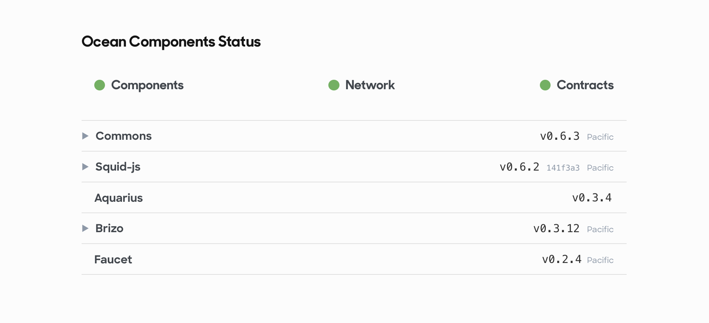

But telling users to read some version numbers and act on it can’t be the solution.

We went back to the drawing board, created some [concepts and prototypes](https://github.com/oceanprotocol/commons/issues/139), and in the end [built a solution](https://github.com/oceanprotocol/commons/pull/176) providing the smoothest user experience by eliminating any setup: introducing the so-called [burner wallet concept](https://medium.com/gitcoin/ethereum-in-emerging-economies-b235f8dac2f2). If you just want to browse and download some assets, this solution is all you need and you don’t even have to think about it.

### What Is a Burner Wallet

A burner wallet is a frictionless but disposable wallet, often used for signing transactions only, or to move small amounts of tokens around. They are usually [hierarchical deterministic wallets (HD wallet)](https://en.bitcoinwiki.org/wiki/Deterministic_wallet), generating a set of public/private keys from a random seed phrase. But the keys are not protected as much as in a “normal” wallet, and in our case the seed phrase is stored in your browser’s cache, hence the low-security aspect.

Luckily, this doesn’t matter for interactions in the Commons Marketplace, where all assets are free and don’t require any transfer of tokens. All that is required to interact with all Ocean Protocol features in Commons is a wallet for signing during the register & consume requests.

Conceptually, a burner wallet’s private keys are supposed to be destroyed (“burned”) after the task the wallet has been created for is finished, hence the name burner wallet. Technically, we do not use the [original burner wallet concept](https://medium.com/gitcoin/ethereum-in-emerging-economies-b235f8dac2f2) (that is, running against the xDai sidechain), but make use of the excellent principle: a disposable auto-generated wallet, ready to go without any user interaction.

### Meet The New Default

Any visitor to the Commons Marketplace will be switched to a burner wallet by default. In the background, we create a wallet in your browser from a random mnemonic with [Truffle’s HD Wallet](https://github.com/trufflesuite/truffle/tree/develop/packages/hdwallet-provider) and pass that wallet to Web3 as the provider. We then load its first generated account and also send some Pacific ETH (not to be confused with Ethereum Mainnet ETH) from our [Faucet](https://github.com/oceanprotocol/faucet) to that account, in order to cover eventual Gas costs for publishing and consuming.

We try to give you some persistence across sessions though, by storing that seed phrase in your browser’s _localStorage_, and on next visit we’ll generate your wallet again from this seed phrase, so you’ll get the same account again. This persistence is needed so we can provide you with some basic level of personalization, e.g. the _History_ page will show the assets published by you, meaning by the Web3 account you are using.

Phew, that’s a lot of tech going on in the background — so let’s get back to the UI! All those tasks are moved aside and are not visible to end users. They essentially transform the previous view where consuming was not possible without a Web3 browser or MetaMask:

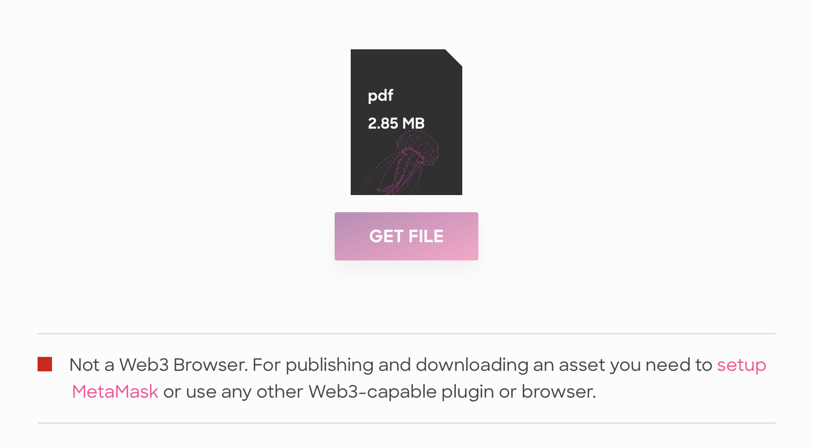

Into this view, unlocking the consume flow even for non-Web3 capable browsers without any user action required:

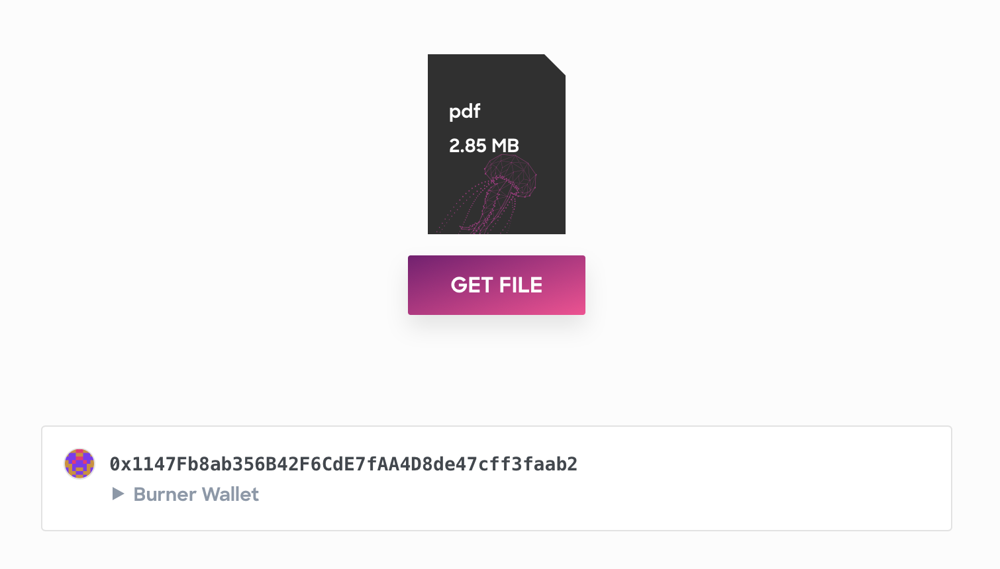

> **Disclaimer:**
> Being low-security and disposable by design, a burner wallet should not be used if you want to keep track of all your published and downloaded assets, or if you want to hold tokens in it. We strongly suggest not using any burner wallet generated in Commons to move or hold any tokens. The burner wallet only exists in your browser and is geared towards usage in Commons only. We don’t ever store any account information so we are not able to restore a lost burner wallet.

### MetaMask for the Pros

If you require more security, you can optionally switch to [using MetaMask](https://docs.oceanprotocol.com/tutorials/metamask-setup/) with an account that only you control. If we detect your browser is able to use MetaMask (i.e. is Web3-capable), we show an action for switching the wallet you’re using in Commons:

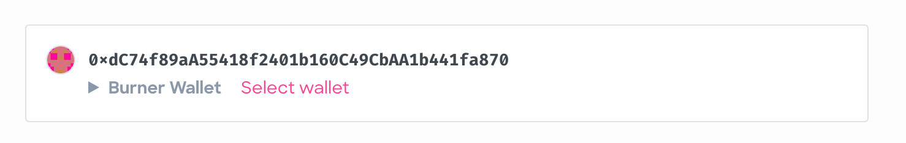

In the wallet selector you can switch to MetaMask:

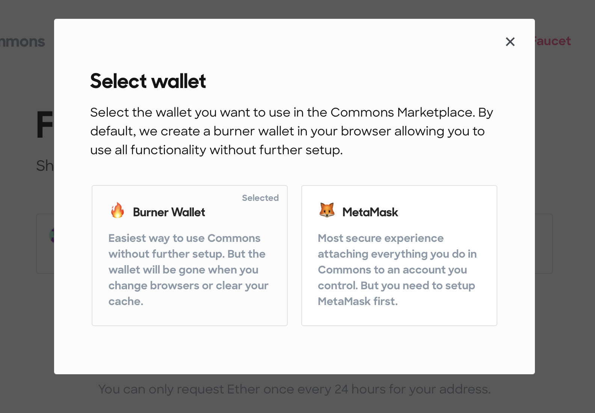

After selecting MetaMask, the UI switches to your first account in it. If you use MetaMask for the first time with Commons, you will be prompted by MetaMask to approve reading access to your accounts:

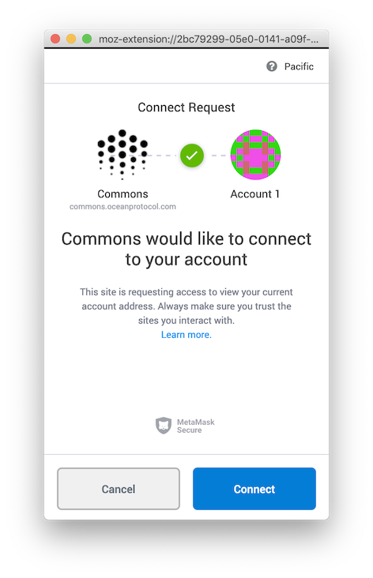

Approving this request results in your first MetaMask account being selected, displayed and ready to use in Commons:

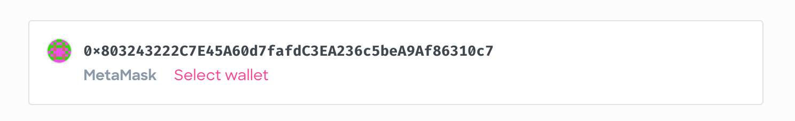

We also store your selection and, on your next visit, we switch to MetaMask automatically.

Additionally, we allow you to export your burner wallet by providing the seed phrase you can use to import the wallet into MetaMask:

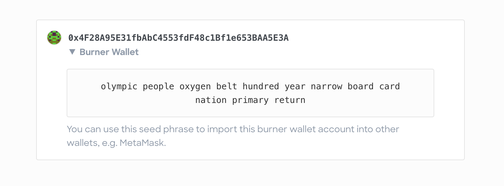

This is helpful if you have already made some interactions in Commons, published and consumed some assets, and now want to keep your history and transactions in an account you control.

## 🌊 From Nile Testnet to Pacific Mainnet

Since its launch, the [commons.oceanprotocol.com](http://commons.oceanprotocol.com) interface was pointed towards Nile components so all assets registered through it were living in Nile. But there is no way to simply move a whole data catalogue (which is a combination of metadata stored in Aquarius & Brizo) from one Ocean network to the other.

So we had no other choice other than re-seeding all existing assets stored in Nile into Pacific. This means all assets got a new [DID](https://blog.oceanprotocol.com/protocol-details-decentralized-identifiers-346d1de666e0), and some assets might have been lost in the transition. But the old data catalogue in Nile is still accessible under [https://commons.nile.dev-ocean.com](https://commons.nile.dev-ocean.com).

After we registered all Commons assets again in Pacific, we switched the commons.oceanprotocol.com interface to point to Pacific, showing the new data catalogue.

## 🧪 Commons In Multiple Networks

With [Pacific](https://docs.oceanprotocol.com/concepts/pacific-network/) running alongside our [Testnets](https://docs.oceanprotocol.com/concepts/testnets/), we needed to add changes so we could deploy the Commons front-end in any of our networks, and everything would just work as intended without further configuration or introduction of a whole bunch of environment variables. The interaction and feedback when using MetaMask needed an overhaul for that, and we also improved our Ocean network detection, now properly differentiating between them and adopting UI copy accordingly.

This all provides much more helpful feedback in case of network & account misconfigurations, e.g. if you use MetaMask and are connected to the wrong network:

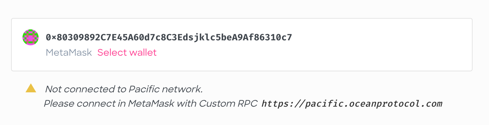

For this check we fetch the network from the Brizo endpoint configured in Commons client, then check that against the network you’re connected to in MetaMask. This allows Ocean devs to deploy the front-end into any network, and it will figure out the correct network combination automatically, and show relevant help messages.

**We consider the Pacific installation to be the main live environment**, but have Commons deployed in our Testnets as well for, well, testing purposes:

- [Pacific](https://docs.oceanprotocol.com/concepts/pacific-network/) Mainnet: [**commons.oceanprotocol.com**](https://commons.oceanprotocol.com)

- [Nile](https://docs.oceanprotocol.com/concepts/testnets/#the-nile-testnet) Testnet: [**commons.nile.dev-ocean.com**](https://commons.nile.dev-ocean.com)

- [Duero](https://docs.oceanprotocol.com/concepts/testnets/#the-duero-testnet) Testnet: [**commons.duero.dev-ocean.com**](https://commons.duero.dev-ocean.com)

They all use a different Aquarius & Brizo instance in different networks in the background, so they all have a different data catalogue.

As a developer, this also means you can use the Nile & Duero installations as a front-end for testing asset registering. You can register assets programmatically with our Squid libraries pointed at the respective Aquarius & Brizo instances in those networks. Then check out the registered asset in Commons in the respective network. Note that all Commons installations are restricted to free assets, assets with a set prize are filtered out and won’t be displayed.

The Ocean Versions component in those Commons installations under their _About_ pages allows you to see which endpoints are in use:

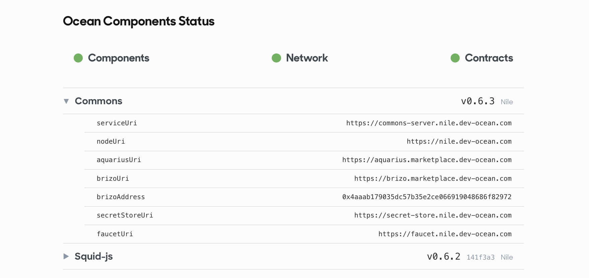

And you can use the [Commons client & server](https://github.com/oceanprotocol/commons) locally on your machine to fully customize it for your Ocean testing purposes, and as a blueprint to build your own marketplace on top of Ocean Protocol.

- [**GitHub: oceanprotocol/commons**](https://github.com/oceanprotocol/commons)

## 📡 Channels: AI for Good

A feature to enhance data discoverability and introduce a first basic curation mechanism. Channels are curated collections of existing data sets from multiple categories, showing them in one prominent view.

Our first channel is AI For Good, created as part of the [AI for Good Global Summit 2019](https://aiforgood.itu.int) in Geneva. [AI for Good](https://blog.oceanprotocol.com/ai-for-good-at-scale-7bc65b51d764) is an initiative to promote the use of artificial intelligence for taking action on the [United Nations Sustainable Development Goals (SDGs)](https://www.un.org/sustainabledevelopment/sustainable-development-goals/) such as fighting poverty, climate change, improving healthcare, etc. The AI for Good Commons channel is aimed at helping scale AI for Good by enabling relevant open datasets to be published and shared and connecting AI problem owners with problem solvers. All curated by the Ocean Protocol team.

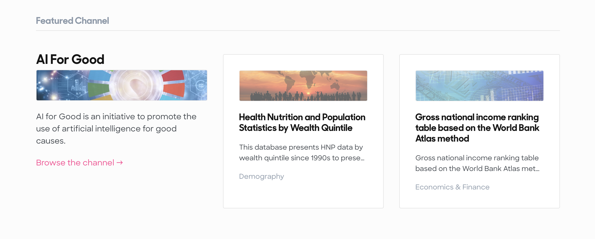

- [**Channel: AI For Good →**](https://commons.oceanprotocol.com/channels/ai-for-good)

Think you have an asset which would fit here? Let us know [@oceanprotocol](https://twitter.com/intent/tweet?text=%40oceanprotocol%20Hey%2C%20I%20have%20an%20asset%20I%20would%20like%20to%20add%20to%20the%20AI%20for%20Good%20Channel%20on%20Commons%20https%3A%2F%2Fcommons.oceanprotocol.com%2Fchannels%2Fai-for-good).

In the background the feature works with tags, which are part of [asset metadata](https://blog.oceanprotocol.com/ocean-protocol-details-metadata-94723a728efa) defined in [OEP-8](https://github.com/oceanprotocol/OEPs/tree/master/8). But they are not exposed in the UI yet, making adding the required tag a manual process.

## ⛲️ All of the Features From Before

With all those described changes above, we’ve made Ocean Protocol easier and more reliable to use. Commons allows you to access **thousands of datasets for free** that have been registered on the Ocean network. If you are looking for quality data, you can easily use the Commons to search for and find publicly available datasets that are free of charge.

If you are interested in sharing your data, you can use the Commons to publish data into the Ocean Protocol Network.

- [**Publish →**](https://commons.oceanprotocol.com/publish)

If you have large amounts of data that you are interested in sharing, please contact us about supporting you to perform bulk data registration.

---

## Learn more about the Commons Marketplace

- [**Ocean Protocol and IPFS, Sitting In The Merkle Tree**](/ocean-protocol-and-ipfs-sitting-in-the-merkle-tree)
- [**The Commons Data Marketplace**](/the-commons-data-marketplace)

---

> This article was originally posted [on Medium in the Ocean Protocol blog](https://blog.oceanprotocol.com/the-commons-marketplace-in-pacific-network-4bcf2f595721).

---
