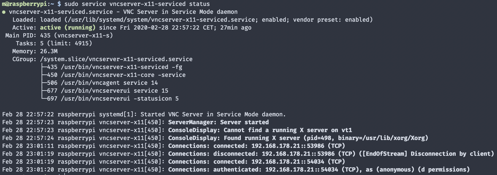
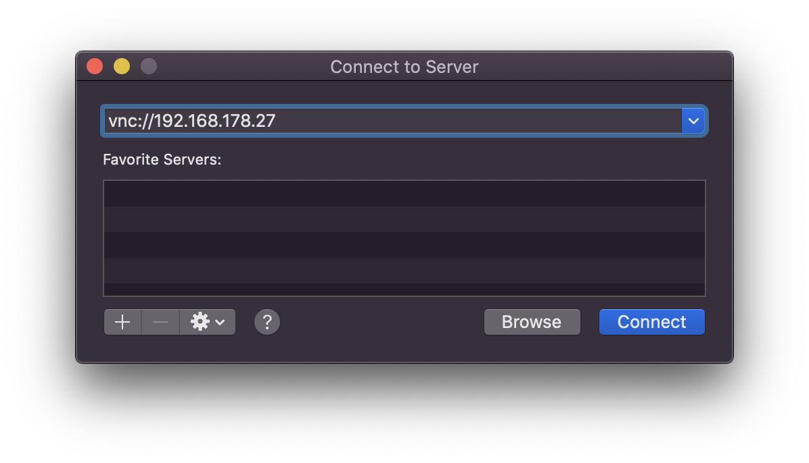
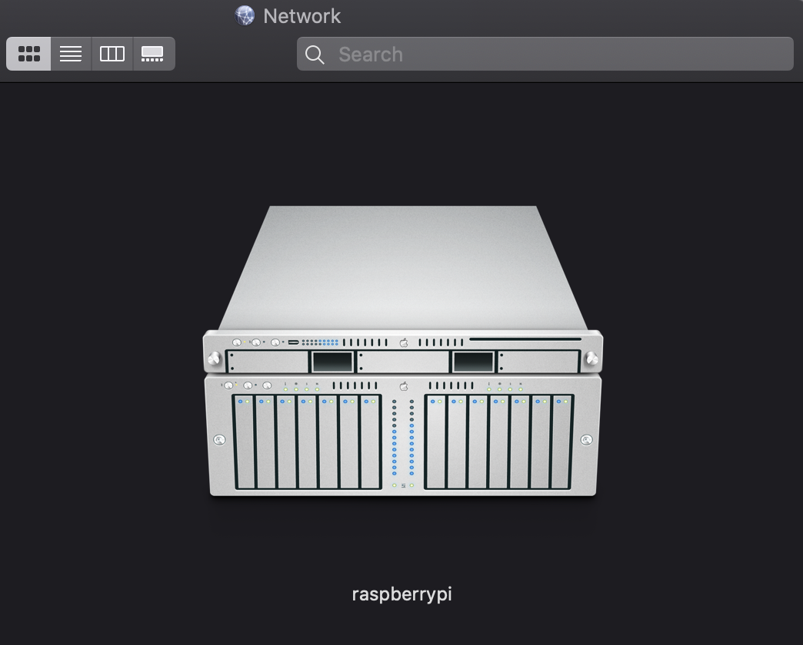
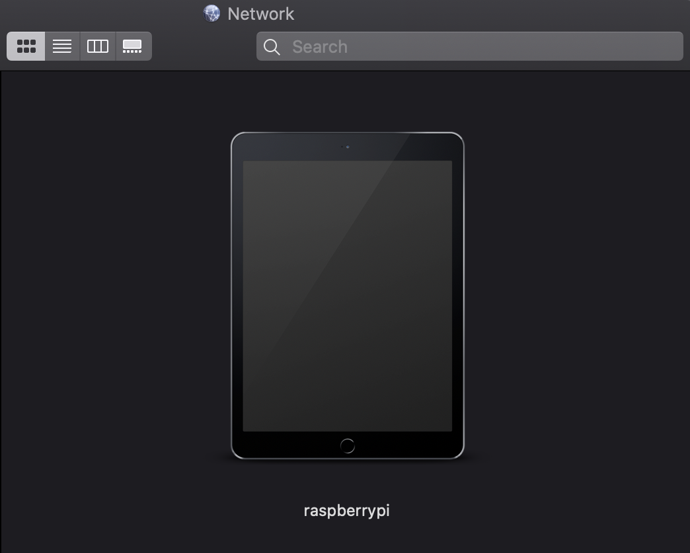
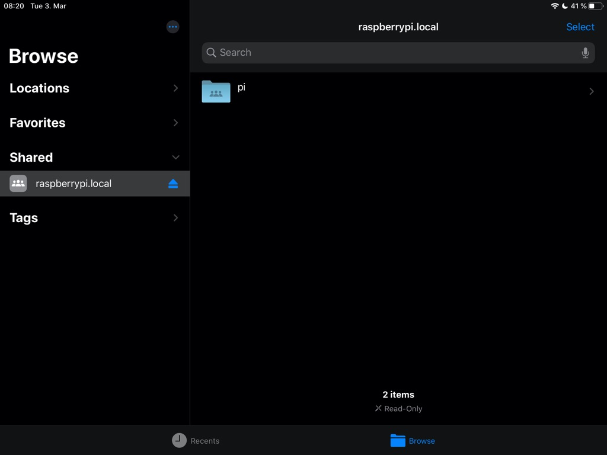

As any Linux server, a Raspberry Pi can be integrated into macOS and the Finder sidebar for easy visual access to file and screen sharing in your local network. And with macOS and Raspbian in place, almost all components are already installed.

To make this work, macOS requires each service to be running and advertised to the local network via Bonjour. On the Raspberry Pi this means we need to configure the default VNC server [RealVNC](https://www.realvnc.com), install [Samba](https://www.samba.org) for file sharing, and advertise both services across the local network with [Avahi](https://avahi.org), the Bonjour implementation on Linux. Onwards!

## System Setup

This guide assumes your Raspberry Pi is already setup and connected to your local network. All command line instructions can either be executed directly on the Raspberry Pi, or remotely via SSH which you can achieve by simply following the [official SSH guide](https://www.raspberrypi.org/documentation/remote-access/ssh/README.md).

I'm using a Rasperry Pi 4, Model B, running [Raspbian Buster with desktop](https://www.raspberrypi.org/downloads/raspbian/), and macOS Catalina. The Raspberry model shouldn't matter for the scope of this guide, and the instructions should also work some macOS versions down.

Furthermore, this guide should also work on any Linux distribution like Ubuntu or Debian itself. The principals to make a Raspberry Pi show up in macOS are applicable to any Linux distribution capable of running a VNC server, Samba, and Avahi.

## Screen Sharing with VNC

Screen sharing using the default VNC server included in Raspbian called RealVNC is sufficient to make it work with the default macOS Screen Sharing app. Only the user authentication mechanism has to be changed in RealVNC.

Depending on your Raspbian image the RealVNC server is already installed and configured. For getting it installed, you can follow [the official guide](https://www.raspberrypi.org/documentation/remote-access/vnc/README.md) where you end up activating the VNC server either:

- graphically in _Raspberry Pi Configuration > Interfaces_
- on command line via `sudo raspi-config` _> Interfacing Options_

You can check the status of the VNC server with:

```bash
sudo service vncserver-x11-serviced status
```

Which should give you something like this:



The important part is `Found running X server` cause that's the graphical interface we are going to connect to. This will only be present if your Raspberry Pi is set to boot up into a desktop GUI which can be configured under `sudo raspi-config` _> Boot Options > Desktop / CLI_. If you use your Raspberry Pi with a display attached, this should be the default.

To be able to connect from macOS without additional software, you have to change the authentication mode. By default, RealVNC uses the system accounts to authenticate but for whatever reason this is not supported by macOS. But VNC password authentication is, so let's switch to that.

If you have GUI access to your Raspberry Pi you will find the RealVNC icon at the top right in your menubar, and in the app's options under _Security_ you can switch the _Authentication_ to _VNC Password_. This will prompt you to enter and confirm a new password which we are going to use to connect from macOS.


Hit _Apply & OK_ and reboot your Raspberry Pi. To test the connection, you should make note of your local network IP address. To do so on your Raspberry Pi:

```bash
ifconfig

# will give you e.g. `inet 192.168.178.27`
```

Now we can verify the connection from macOS by selecting from the menubar in Finder _Go > Connect to Server..._ and use the above IP as the host:



You should be prompted for the VNC password setup in RealVNC in the step above and afterwards should see your Raspberry Pi desktop from macOS:


Now, keeping track of IP addresses is not fun at all so we still need to make the _Screen sharing_ button appear in Finder with Avahi. But first, file sharing.

## File Sharing with Samba

By now, macOS uses Samba as its default network sharing protocol. So you can install it on the Raspberry Pi and macOS will handle it:

```bash
sudo apt update && sudo apt upgrade
sudo apt install samba samba-common-bin
```

By default, Samba allows access to the home folder of the logged in user so no further shares need to be configured if you just want access to your home folder. Again, macOS does not like using standard UNIX accounts for authenticating with Samba, so we need to set a dedicated Samba password.

To do so:

```bash
sudo smbpasswd -a pi
```

Where `pi` refers to the user account on the Raspberry Pi you want to connect to. After setting a new password, restart the Samba service:

```bash
sudo service smbd restart
```

After finishing these steps, your Raspberry Pi should already show up in Finder, ready for file sharing. Clicking on _Connect_ in Finder will prompt for the just created Samba password and upon entering it you should see your home folder listed and browsable in Finder.

We still want that _Share Screen_ button though, and the Finder representation looks a bit shitty. Bonjour and Avahi to the rescue.

## Bonjour Server Discovery and Icon with Avahi

As you probably have noticed, Samba is advertised by default via Bonjour without defining an Avahi service for it. But it advertises the hostname in screaming ALL CAPS sometimes, and the device icon is just a question mark. We can change all that by defining dedicated service files for everything we want to advertise in the local network.

For VNC we need to create and define a dedicated `rfb.service`:

```bash
sudo nano /etc/avahi/services/rfb.service
```

And fill it with an Avahi service description for VNC:

```xml
<?xml version="1.0" standalone='no'?>
<!DOCTYPE service-group SYSTEM "avahi-service.dtd">
<service-group>
  <name replace-wildcards="yes">%h</name>
  <service>
    <type>_rfb._tcp</type>
    <port>5900</port>
  </service>
</service-group>
```

The `%h` in the `<name replace-wildcards="yes">%h</name>` line will simply be substituted by the global hostname setup in your Raspberry Pi config. Make sure to use always the same name line in each service, so macOS will attach all the advertised services to one server. Alternatively, you could also setup different servers to show up in Finder sidebar for different services, e.g. `VNC on %h` and `SMB on %h`.

And with all that you should end up in macOS Finder with the buttons we wanted for file and screen sharing:


But nobody can live with that default question mark as the device icon and the name still sometimes switches between the actual hostname, and a nasty SHOUTING DEVICE NAME in all caps.

To optimize all that, we have to add a dedicated Samba service, despite it already being advertised by default. But macOS uses most information from this service to represent the server in Finder so we can use it to customize that.

Create and open the new `smb.service`:

```bash
sudo nano /etc/avahi/services/smb.service
```

And fill it with:

```xml
<?xml version="1.0" standalone='no'?>
<!DOCTYPE service-group SYSTEM "avahi-service.dtd">
<service-group>
  <name replace-wildcards="yes">%h</name>
  <service>
    <type>_smb._tcp</type>
    <port>445</port>
  </service>
  <service>
    <type>_device-info._tcp</type>
    <port>0</port>
    <txt-record>model=Xserve</txt-record>
  </service>
</service-group>
```

You see that `model=Xserve` service part? That will make your Raspberry Pi show up with a [Xserve](https://en.wikipedia.org/wiki/Xserve) icon in Finder for some nostalgia feeling.



You can use any Mac, iPhone, iPad, or other Apple device model string, like `model=MacPro7,1` or `model=iPad6,12`.




Using the model string essentially works for any device which has an icon in macOS, which you can check out in Finder with, referring to the `com.apple.*` named icons:

```bash
open /System/Library/CoreServices/CoreTypes.bundle/Contents/Resources/
```

Now restart the `avahi-daemon` to pick up the changes:

```bash
sudo service avahi-daemon restart
```

And with all that you should end up in macOS Finder with the buttons we wanted for file and screen sharing, along with a nice hostname and icon for it:


On the macOS side, sometimes Finder does not pick up changes in Bonjour/Avahi services right away. In that case, a `killall Finder` helps to force them.

As a bonus you should also add services for SFTP & SSH so your server will show up in dedicated apps on macOS and iOS making use of Bonjour to discover and list servers they can connect to. Any macOS device does this in a local network too.

For SFTP:

```bash
sudo nano /etc/avahi/services/sftp.service
```

```xml
<?xml version="1.0" standalone='no'?>
 <!DOCTYPE service-group SYSTEM "avahi-service.dtd">
 <service-group>
   <name replace-wildcards="yes">%h</name>
   <service>
     <type>_sftp-ssh._tcp</type>
     <port>22</port>
   </service>
</service-group>
```

For SSH:

```bash
sudo nano /etc/avahi/services/ssh.service
```

```xml
<?xml version="1.0" standalone='no'?>
 <!DOCTYPE service-group SYSTEM "avahi-service.dtd">
 <service-group>
   <name replace-wildcards="yes">%h</name>
   <service>
     <type>_ssh._tcp</type>
     <port>22</port>
   </service>
</service-group>
```

Make sure to use the port you use for SSH access on your server if you are not using the default one. All changes to Avahi services require a restart of the daemon:

```bash
sudo service avahi-daemon restart
```

But to be absolutely sure, you should reboot your Rasperry Pi with:

```bash
sudo reboot
```

You can verify all the services advertised via Bonjour/Avahi with this handy macOS app called [Discovery](http://www.tildesoft.com):


## Connect from iOS & iPadOS

With the Raspberry Pi setup for macOS connection, you can now connect to your Raspberry Pi's file system from within the iOS Files app too.

Since Raspbian is configured to advertise the `raspberrypi.local` hostname by default, you can use that name from any device to connect to it without figuring out IP addresses. So from Files, hit the three dots in the upper right corner and tap _Connect to Server_, and use `raspberrypi.local` or whatever hostname you use. Enter your user account credentials and you should see your home folder in the Files app.



As for screen sharing, you can use any VNC app on iPhone or iPad and it should work the same way as on macOS with using the VNC password. For me, [Edovia's Screens app](https://edovia.com/en/screens-ios/) works pretty well.


There is also a way to make the Rasperry Pi available via [AirDrop](https://support.apple.com/en-us/HT204144). The [Open Wireless Link (OWL) project](https://owlink.org) set out to reverse engineer the protocol used for AirDrop, Apple Wireless Direct Link (AWDL). The setup is rather hacky and unstable but they provide a [tutorial for the Rasperry Pi 3](https://owlink.org/2019/05/16/howto-use-airdrop-on-raspberry-pi-3.html) if you want to try.
