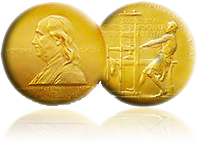

The Columbia University has announced the winners for 2008 of the 92nd annual Pulitzer Price. The Pulitzer Price itself is often cited as the highest honor for american journalists. Among the various categories there are two winning entries for [Breaking News Photography](http://www.pulitzer.org/year/2008/breaking-news-photography) and [Feature Photography](http://www.pulitzer.org/year/2008/feature-photography).

<!-- more -->

In the Breaking News Photography the price was won by Adrees Latif of Reuters [for his picture of the japanese videographer Kenji Nagai shot down during riots in Myanmar in 2007](http://www.pulitzer.org/year/2008/breaking-news-photography/works/).

In the Feature Photography category wins Preston Gannaway of the Concord (N.H.) Monitor "[for her intimate chronicle of a family coping with a parent's terminal illness.](http://www.pulitzer.org/year/2008/feature-photography/works/)"

Finally photographer Michel du Cille is a member of the Washington Post staff, which [was awarded in the Public Service category](http://www.pulitzer.org/year/2008/public-service/) for their work about "mistreatment of wounded veterans at Walter Reed Hospital, evoking a national outcry and producing reforms by federal officials."

You can also [have a look at the other winners on the website of the Pulitzer Board](http://www.pulitzer.org/2008/2008.html) or [grab the press-release](http://www.pulitzer.org/2008/Press%2520Release%2520-%25202008%2520Pulitzer%2520Prizes.pdf) where you'll also find [Bob Dylan awarded in the Special Citation](http://www.pulitzer.org/year/2008/special-citation) category.
