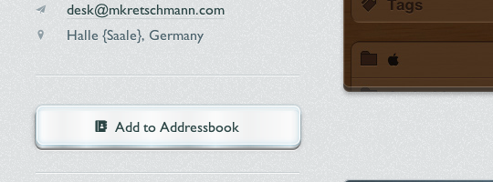
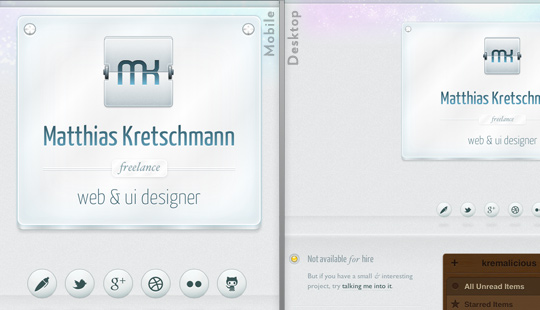
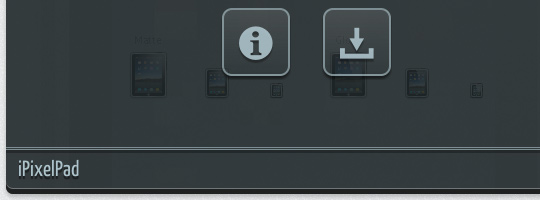
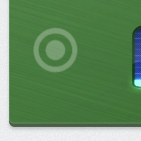

Today I finally launched v2 of my personal site, still following the concept of a business card web site but with a portfolio added to it. You should totally [have a look](http://matthiaskretschmann.com).

## Who needs images anyway

One goal was to use as less images as possible. Yes, it would have been easier to just use images instead of like 10 box-shadows on one element but this wouldn't have been any fun. And no matter what retina/high dpi devices come up next all interface elements will look just as sharp without any additional work.

Apart from the colored top background, the logo and the subtle background texture there're no background images in use. All the other visuals were created with a lot of CSS3 & pseudo elements. Pseudo elements were the perfect technology so the markup doesn't get cluttered with dozens of empty divs, spans etc. which would only serve a styling purpose.

All icons on the site are coming from an icon font (the wonderful [IcoMoon](http://keyamoon.com/icomoon)) embedded with @font-face.

## Mobile & Modern First

For the front-end development I've followed a mobile devices & modern browsers first approach. Therefore the site should look great on many different devices & screen sizes. As a starting point I used a combination of the [1140grid](http://cssgrid.net) and [320 and up](http://www.stuffandnonsense.co.uk/projects/320andup/).

That's of course all done by media queries with breakpoints at 600px, 768px and 992px. During my testing those rather weird values turned out to work best for this simple layout. The layout only changes at 600px & 768px, the 992px is just used for some different css animations. And yes, I'm aware of the irony targeting fixed values here although everything else uses relative values.

But it's interesting to see how different the rendering of the site is in some mobile browsers. Here're some unmodified screenshots of the site in various mobile browsers on iOS 5 & Android 4:

- [iOS - Mobile Safari (iPhone 4S)](../media/mkv2-iphone.png)
- [iOS - Mobile Safari (iPad)](../media/mkv2-ipad.png)
- [Android - Android Browser (Nexus S)](../media/mkv2-android.png)
- [Android - Chrome beta (Nexus S)](../media/mkv2-android-chrome.png)
- [Android - Firefox (Nexus S)](../media/mkv2-android-firefox.png)

Notice the weird banding of the gradients in Firefox. And Android either ignores the min-device-pixel-ratio media query altogether or has just problems with the background-size css property.

## Animations

All animations were written as CSS animations/transitions first. So in modern browsers you can disable JavaScript without losing most of the animations. And those animations are buttery smooth because they're hardware accelerated. You wouldn't notice the difference between a CSS- and jQuery-based animation on a desktop device (except if you're on a shitty netbook) but it makes a great difference on all those ARM devices. For not so cool browsers [Modernizr](http://www.modernizr.com/) & [jQuery](http://jquery.com/) are kicking in to compensate for the lack of css animation support.

Except for the standard Android browser. Although the current version supports css transitions & animations it just wasn't possible to animate something smoothly here. I suspect this is caused by all the portfolio images on one page. Many images on a site always let this Browser capitulate, even on Android 4.0. So I'm being totally bad here, sniff for that particular browser and disable the animations for it. Please address your anger towards Google for that. Or just use the [Chrome beta](https://market.android.com/details?id=com.android.chrome) which works perfectly fine with images on a website.

Interesting side note: while Webkit-based browsers are usually the best bet to fully render all the effects on the site, they still lack css-animating pseudo elements. That's why the shine animation of the top plate on start and the drop shadow change of the social network "balls" are only smoothly animated in Firefox.

If you're interested, here're the non-minified versions of the main [css file](http://matthiaskretschmann.com/style/css/style.css) & [javascript file](http://matthiaskretschmann.com/style/js/script.js).

## The touch hover problem

A common pattern for stuff which can be revealed by hovering over something on desktop devices is to just make everything visible by default on touch devices. But I didn't wanted to clutter the portfolio items by adding buttons/text links or whatever around them.

So this led to a problem for touch users because it isn't immediately obvious how to reveal the overlays housing additional actions for each item. Approximately half of my beta testers found out about tapping a portfolio item to reveal the actions which is obviously not enough.

So I incorporated a visual hint for the other half: If a user on a touch device hasn't tapped on an item yet a subtle touch indicator starts pulsating over each item after 30 seconds.

## One More Thing

If you get bored, shake your Post-PC device. On Desktops, try entering Twitter's first prototype SMS shortcode on the keyboard. Nuff' said. (could be a bit rough at the moment, be warned)

Finally many thanks to all my beta testers, you greatly helped in finding all the small quirks so the site got more usable in the end.

If you're interested in all the other components used on the site just open up the Colophon at the end of the site. And did I mention you should have a look?

[http://matthiaskretschmann.com](http://matthiaskretschmann.com)
