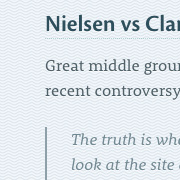
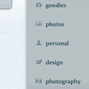
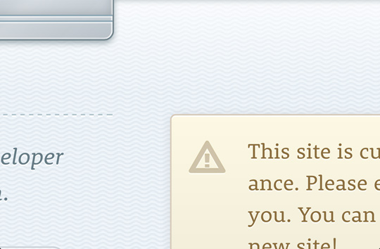
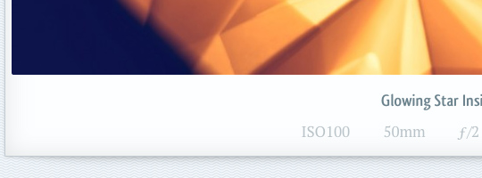
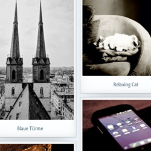

It finally happened. After so many rejected revisions, so many pauses, so much coffee: kremalicious2 is here.

## Reduction & Addition

Instead of a full site with the blog as one part, this is now a simple blog. No weird pages with subpages anymore. Just a blog with some topic archives.

The development process was and is a very agile one, so new features and changes will be incorporated as they happen. If it's in the [master branch](https://github.com/kremalicious/kremalicious2), it's live.

## Mobile & Content First, Retinasized

The blog theme was designed from the inside out with a [responsive](http://www.alistapart.com/articles/responsive-web-design/), [mobile first](http://www.lukew.com/ff/entry.asp?933) approach. I’ve gone from small screens first to bigger screens and started by designing the article single view before anything else. This is usually the moment where you may resize your browser window if you're a design geek.

To make future maintenance a bit easier, I’m using the simple [HS Responsive](http://kremalicious.github.com/hsresponsive/) HTML/CSS framework I’ve recently created for a university but with some modifications. For instance, iPad users will get two different layouts in portrait and landscape mode easily by kind of misusing the iOS rotation scale bug and using a media query breakpoint of 769px. Yes, I know, this breaks the no-single-device-targeting approach but by now there’re more readers visiting this site from an iPad than with Internet Explorer or Linux so this seemed appropriate.

## Typography

After much experimentation, all fonts (that is, those for texts) on this blog are now coming from TypeKit. The body text is set in [Rooney Web](http://www.janfromm.de/typefaces/rooney/overview/) from [Jan Fromm](https://twitter.com/janfromm) which looks just gorgeous on Retina screens. All headings & buttons use Adobe's [Cronos Pro](https://typekit.com/fonts/cronos-pro).

Sadly, Typekit [only works in webkit based mobile browsers](http://help.typekit.com/customer/portal/articles/6786) which is a real bummer. Sorry Firefox & Opera users on mobile devices.

## Icons

All icons on the site are coming from the awesome icon font [Font Awesome](http://fortawesome.github.com/Font-Awesome/) made by Dave Gandy. But the original font was missing some needed glyphs so I’m using a fork called [Font Awesome More](http://gregoryloucas.github.com/Font-Awesome-More/) from Gregory Loucas ([@gregoryLpaul](https://twitter.com/gregoryLpaul)). This makes things like changing icon colors so much easier but using icon fonts still has the problem of small icons not rendering super crisp, although `font-smoothing: antialiased` helps a bit.

## CSS beats Images

The whole interface is mostly CSS based, only the logo typeface with the cloud and the body background texture are images. Embedded in the css file as data-URIs to save server requests. Those 2 images have their Retina sized equivalent on high-dpi devices (everything above factor of 1.5).

But even those @2x assets are just blurry when the user zooms into the interface. But with most interface elements being css or font based you can zoom in ridiculously without anything becoming blurry. That's actually a scaled down full size screenshot of a zoom in on the 3rd generation iPad:

Needless to say this introduces new problems, especially for performance on mobile devices. As we know, current mobile devices and their browsers come into memory problems when told to render a lot of css box-shadows or css gradients. This all isn't noticeable on Desktop devices or an iPad 1, but it's quite noticeable in the Android stock browser on a Nexus S for instance.

For the content images I currently have no special technique in place except for WordPress creating a lot of different image sizes. And I make bad stuff like letting the browser resize bigger images on the fly. I value image quality over bandwidth savings and this way images look super crisp on high-dpi displays.

## Fuck Yeah, WordPress

In the backend this is all still running on WordPress. For the WordPress theme I used [roots](http://www.rootstheme.com/) as a starting point but reduced everything in it dramatically. And my theme includes numerous tricks to make my blogging life easier. Depending on the content type a lot of different featured image sizes are being generated in the background and displayed throughout the different views. For the link & photo posts I’m using WordPress’ built-in Post Formats feature, greatly enhanced by the [Post Formats Admin UI](http://alexking.org/blog/2011/10/25/wordpress-post-formats-admin-ui) from Alex King.

If you want to peek around in the theme files, you can head over to the kremalicious2 github repository:

[kremalicious2 repository](https://github.com/kremalicious/kremalicious2)

The blog stream got more content types. Apart from normal posts, links and photos will be added to it.

### Link posts

Link post means a short comment from me to a valuable or interesting resource where the post title is linked to the original source. I put them in topics just like all the other articles.

### Photo posts

[Photo posts](/photos) are my new favorite: beside selected images from my Flickr and 500px profiles, they include automatic posting of my Instagram images. After being taken, a new Instagram image is posted immediately as a special styled photo post in this blog.

And I didn’t wanted to clutter the blog stream in times when there’re a lot of photo-only posts between text based posts.

So all photo posts which immediately follow one another are grouped together in a grid, nicely laid out by [jQuery Masonry](http://masonry.desandro.com/). I couldn't figure out a way to make this filtering on the WordPress loop level for now so this grouping is done with jQuery after page load.

### Topics

The navigational concept only includes filtering of the stream by topic and those categories are greatly reduced compared to before. Some topic pages are styled differently, like the [goodies](/goodies) and the [photos](/photos) archives.

### Dates are so 2004

I saw no reason to include a prominent date along with a post title. Besides, I use my blog posts in a more wiki-like style, adding to them and updating them long after they have been published. That’s why I’ve banned the date for a post to the very bottom of it. AI also removed all date references from the post URLs.

### Comments

I’ve decided to keep this functionality intact but hide the whole comment section under each post by default. This is a compromise between those users seeing comments as interface clutter and those valuing comments in blogs. The whole comment section is even taken completely off the DOM on page load with jQuery's detach(), only clicking/tapping the comment section heading will bring them back.

## Subscriptions

### RSS Feeds

The RSS feeds for posts and comments have been moved to Feedburner. You can just use kremalicious.com/feed.xml.

Currently it looks like Google has some problems recognizing kremalicious.com/feed as the replacement for www.kremalicious.com/feed so it may show you multiple entries if you search for it in Google Reader.

### Twitter & Google+

I’ve created a special Twitter account where only posts from the blog get tweeted. So in case you think I’m blabbering too much over my [personal Twitter account](https://twitter.com/kremalicious) but still want to be one of the first to know about new blog posts on Twitter, this new Twitter account is the perfect solution. And the same goes for the new Google+ page:

[@kremaliciouscom](https://twitter.com/kremaliciouscom) [+kremalicious](https://plus.google.com/100015950464424503954)

Please be aware that it’s not possible to follow the Google+ profile link on mobile devices. But you can just search for kremalicious in your Google+ app.

The Twitter account or the RSS feed are also perfect for adding to Flipboard, all the new photo posts look amazing in Flipboard.

### Google Currents

I’ve submitted the blog as a Google Currents Edition. If you’re using the Google Currents app for your reading pleasure, I would be happy if you subscribe to the kremalicious Edition over there:

[kremalicious Currents Edition](https://www.google.com/producer/editions/CAowx93oAQ/kremalicious)

And that's it. If you find any quirks or bugs drop me a note in the comments, [@kremalicious](http://twitter.com/kremalicious) or [file an issue on github](https://github.com/kremalicious/kremalicious2/issues).
