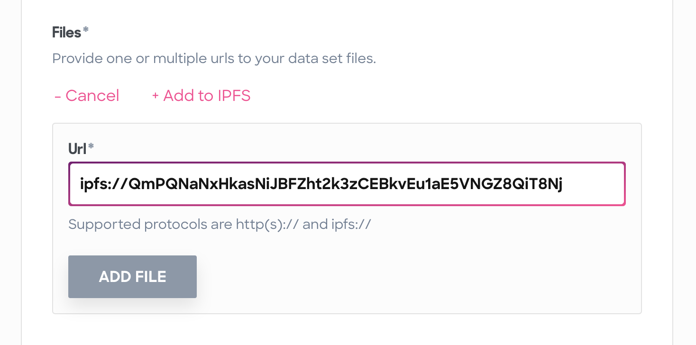
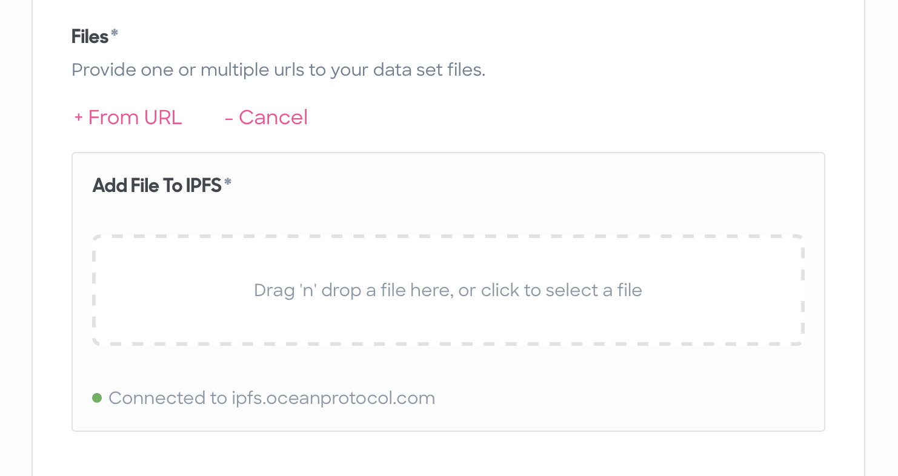
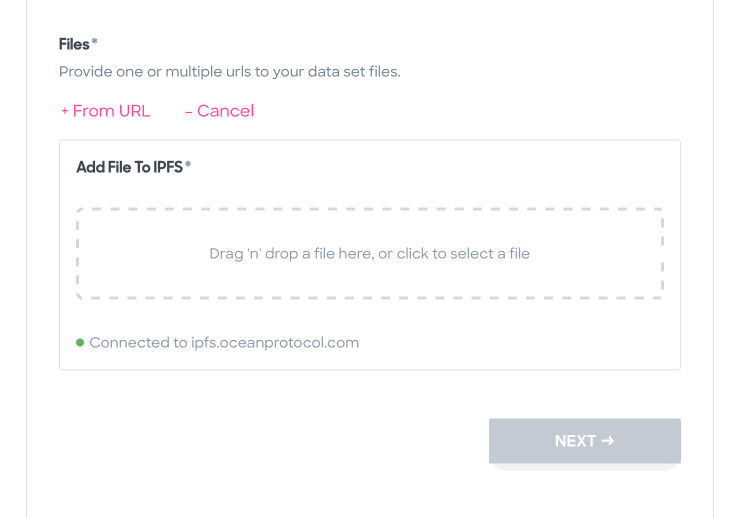
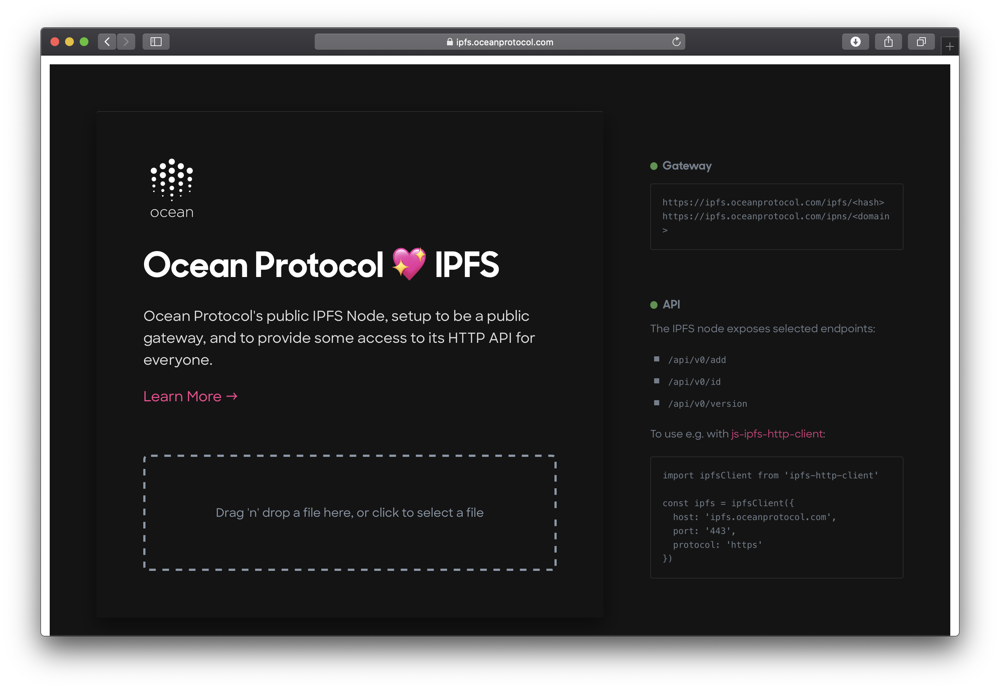

IPFS is now integrated into the Ocean Protocol stack, allowing you to take advantage of decentralized asset file hosting.

---

> This article was originally posted [on Medium in the Ocean Protocol blog](https://blog.oceanprotocol.com/ocean-ipfs-integration-store-asset-files-43c623c356d7).

---

## ✨ Going Decentralized

With Ocean Protocol, you can use centralized storage services like S3, Azure Storage, or your own On-Premise storage to store and retrieve your asset files through [Osmosis drivers in Brizo](https://docs.oceanprotocol.com/concepts/components/#osmosis-drivers).

But storing asset files in a centralized service poses multiple problems:

- one entity controls the data
- one entity is legally responsible for all stored data
- creates a single point of failure
- if service goes offline, asset files can’t be consumed
- opening up possibilities of censorship by the entity running the service, or the service itself
- if files are moved to another location within the same service, existing URLs break

Initially created to store and efficiently move scientific data sets, the [InterPlanetary File System (IPFS)](https://ipfs.io/) solves all those issues with its goal of transforming the vastly centralized web into a distributed peer-to-peer network.

Files are distributed among multiple nodes, eliminating the single point of failure, legal, and censorship issues. By using content-based instead of location-based addressing of files, URLs won’t break if files are moved.

So we defined [OEP-15](https://github.com/oceanprotocol/OEPs/tree/master/15) to make the `ipfs://` protocol a first-class citizen in the Ocean Protocol stack, allowing you to store asset files on IPFS, and use their native IPFS URLs during the publish process.

- [**OEP-15: oceanprotocol/OEPs**](https://github.com/oceanprotocol/OEPs/tree/master/15)

In short, every component in the Ocean Protocol stack now supports publishing and consuming of asset files stored in IPFS which includes support for native IPFS URLs, referencing files with their Content Identifiers (CIDs).

## ⛲️ IPFS in Commons Marketplace

Every file stored on IPFS is public by default, so it made perfect sense using this in our [Commons Marketplace](https://commons.oceanprotocol.com) first. We went through [multiple prototypes](https://github.com/oceanprotocol/commons/pull/191) to end up with our final setup.

During the publish flow you will find an extended _Files_ section for adding a file from an existing URL, and for adding a local file from your device to IPFS.

The existing URL field now supports `ipfs://` in addition to `http(s)://` so if you have an existing asset on IPFS, you can add it here and everything works as before. With the exception that the asset files will be registered with this native IPFS URL.

The new IPFS drop zone provides a convenient way to add and register unpublished asset files.

That drop zone allows you to add a file from your local machine and add it to IPFS during the asset publish flow in a snap:

### The Tech Details

First, opening up the drop zone area will ping the IPFS node & gateway to check connectivity. Dropping or selecting a file from your device onto that area does a bunch of things in the background:

1. Will add that file to an IPFS node with [js-ipfs-http-client](https://github.com/ipfs/js-ipfs-http-client), and pin the file so it stays on our node during garbage collection. We wrapped the HTTP client into our own [custom React Hook](https://github.com/oceanprotocol/commons/tree/master/client/src/hooks/use-ipfs-api.tsx).

2. The file will be wrapped into a directory to preserve the original file name, so we end up with a URL like `ipfs://QmX5LRpEVocfks9FNDnRoK2imf2fy9mPpP4wfgaDVXWfYD/video.mp4`.

3. The returned CID is used to ping that file over an IPFS gateway to make it globally available.

4. The IPFS gateway URL is passed to our Commons Server file checker, extracting some file metadata and checking for availability of the file.

5. The native IPFS url is passed to the list of asset files, and it will show up in the file list.

6. Upon final asset publishing, the native IPFS URL is stored encrypted in the asset DID Descriptor Object (DDO) as defined in [OEP-8](https://github.com/oceanprotocol/OEPs/blob/master/8).

All these steps are required because of how files in IPFS are distributed among its nodes. When adding a file to a node (note how it’s not called “uploading”) it is only available on that node. Requesting that file from another node will start the distribution process of the file from the initial IPFS node, making it globally available.

Also the consume flow required some changes. Whenever an asset file stored on IPFS is requested to be downloaded, multiple things related to IPFS are happening in Brizo with its shiny new [osmosis-ipfs-driver](https://github.com/oceanprotocol/osmosis-ipfs-driver):

1. The file URLs are decrypted upon successful fulfilling of all conditions.
1. The native `ipfs://` url is mapped to its `https://` gateway URL.
1. File is downloaded from that gateway URL.
1. In case a direct file URL was used instead of being folder-wrapped (e.g. `ipfs://QmPQNaNxHkasNiJBFZht2k3zCEBkvEu1aE5VNGZ8QiT8Nj`), the proper file ending will be added automatically at the end of the download process, based on detected MIME type.

## 🏄‍♀️ Ocean Protocol’s Public IPFS Node & Gateway

While developing this feature, it became clear we need to run our own IPFS node & gateway to have better control over the whole experience. And donating a node instead of taking away bandwidth from the main IPFS gateway (gateway.ipfs.io) felt like the right thing to do to make Juan happy.

So we created **ipfs.oceanprotocol.com**, run by us (that is, legally speaking, BigchainDB GmbH).

It is setup to be a public gateway, and provide some access to its node HTTP API for everyone. This means you can use it to address any content in the IPFS network, like:

- [https://ipfs.oceanprotocol.com/ipfs/QmX5LRpEVocfks9FNDnRoK2imf2fy9mPpP4wfgaDVXWfYD/video.mp4](https://ipfs.oceanprotocol.com/ipfs/QmX5LRpEVocfks9FNDnRoK2imf2fy9mPpP4wfgaDVXWfYD/video.mp4)

- [https://ipfs.oceanprotocol.com/ipfs/QmPQNaNxHkasNiJBFZht2k3zCEBkvEu1aE5VNGZ8QiT8Nj](https://ipfs.oceanprotocol.com/ipfs/QmPQNaNxHkasNiJBFZht2k3zCEBkvEu1aE5VNGZ8QiT8Nj)

At the same time all node API functionality required by Commons is open to the world, so those endpoints can be used by anyone to add files to IPFS:

- `/api/v0/add`
- `/api/v0/version`
- `/api/v0/id`

As a start, this is a simple single node but we plan to gradually upgrade ipfs.oceanprotocol.com to a full [IPFS Cluster](https://cluster.ipfs.io/) of multiple nodes for best data availability.

- [**GitHub: oceanprotocol/ipfs**](https://github.com/oceanprotocol/ipfs)

## ⛴ Next Possible Iterations

Beside upgrading to an IPFS Cluster there are many ways the process will be improved over time. At the moment the drop zone in Commons only supports single file uploads, so a quick win improvement would be to allow dropping multiple files at once. Likewise, the drop zone using [js-ipfs-http-client](https://github.com/ipfs/js-ipfs-http-client) comes with some bugs when trying to upload larger files.

To make the process of adding files to the IPFS node less dependent on the client browser, it could be moved into a background task in the Commons Server. This should also give more control and feedback for the process of distributing a file from the initial node to other nodes.

And finally, further work may be done to store files encrypted on IPFS and implement a way to decrypt them in an Ocean Protocol network.

---

## Learn more about the Commons Marketplace

- [**The Commons Marketplace in Pacific Network**](/the-commons-marketplace-in-pacific-network)
- [**The Commons Marketplace**](/the-commons-marketplace)

---

> This article was originally posted [on Medium in the Ocean Protocol blog](https://blog.oceanprotocol.com/ocean-ipfs-integration-store-asset-files-43c623c356d7).

---
